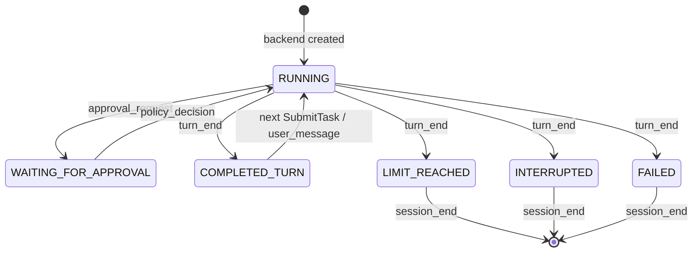

# CodingAgentNeo Agent 后端接口规范

> 规范版本：1.1
> 事件 schema：1
> 基线日期：2026-08-31
> 适用范围：AgentBackend 应用端口及其规范语义
> 规范来源：`backend.py`、`models.py`、`agent_loop.py`、`executor.py`、`assembly.py` 与 adapter 契约测试

本文定义 Agent 后端提供给适配层的应用端口，是共享 Backend Service 实现和 In-process、HTTP/SSE 及未来适配器共同遵守的内部权威规范。它不规定任何前端如何直接接入；CLI、Web 或其他前端只应参考自己所使用的适配层接口规范。

文中的“必须”“不得”“应当”是规范性要求；示例只说明结构，不保证 ID、时间戳或具体文案固定。适配层不得通过翻译、缓存或传输机制改变本文的命令、事件、游标、状态、授权和生命周期语义。

baseline 1.0 交付的是同进程 Python 实现；该历史事实仍成立。后续增量会先把其中的共享 Backend Service/Runtime 与端口定义分离，再在该端口之上提供并列的 In-process 和 HTTP/SSE Adapter。两种 adapter 都依赖 `AgentBackend` Port，互不依赖。

> [Agent 适配层接口规范](agent-transport-interface.md) 是前端接入的唯一权威文档。前端只参考其中对应的 In-process 或 HTTP/SSE binding，不需要阅读本文；只有 Backend Service 与 adapter 实现者需要本文定义的内部 Port 语义。

## 1. 后端端口边界与职责

任何适配层只能通过 AgentBackend Port：

- 用 `send(command)` 发送命令；
- 用 `events(since=sequence)` 拉取事件；
- 读取 `last_state`；
- 在结束时调用 `close()`。

适配层负责把特定调用方式映射到上述端口，并保持命令、事件、错误和生命周期语义。适配层不得持有或直接调用 `AgentLoop`、`AgentRuntime`、`SessionStore`、`ExecutionEnvironment`、`ModelClient`、`ToolRegistry`，也不得复制工具策略、路径安全、Agent 决策或持久化逻辑。

Agent 后端负责 turn 串行化、模型和工具执行、策略判断、授权等待、取消、事件持久化和状态推导。具体 Backend Service/Runtime 可以内部拥有 worker、事件缓冲和授权通道，但它不得读取终端/HTTP 输入、写终端/HTTP 输出或回调具体前端对象。

## 2. `AgentBackend` Port

```python
class AgentBackend(Protocol):
    @property
    def last_state(self) -> RuntimeState: ...

    def send(self, command: AgentCommand) -> None: ...

    def events(self, *, since: int = 0) -> Iterator[EventEnvelope]: ...

    def close(self) -> None: ...
```

### 2.1 `send(command)`

- 接受且仅接受第 3 节的四种命令。
- 调用是线程安全、非阻塞的；成功返回只表示命令已被接受或信号已送达，不表示 turn 已完成。
- `SubmitTask` 被唯一执行通道接受；同一时刻最多执行一个 turn。
- `ApprovalResponse` 和 `Interrupt` 必须在当前 turn 结束前及时生效，不能排队等待该 turn 结束。
- `CloseSession` 立即关闭命令入口并请求有序停机。

| 异常 | 条件 | Adapter 映射义务 |
| --- | --- | --- |
| `TypeError` | 命令不是公开 `AgentCommand` | 编程错误；不得重试原对象 |
| `TurnInProgressError` | turn 执行中再次发送 `SubmitTask` | 保留输入或提示用户稍后重试；不得当作后台排队成功 |
| `BackendClosedError` | 后端关闭后发送任何命令 | 停止发送并结束该后端实例 |

命令构造器还会对非法字段抛出 `TypeError` 或 `ValueError`，见第 3 节。

### 2.2 `events(since=n)`

- `n` 必须是非负整数且不能是 `bool`。
- 返回所有 `sequence > n` 的缓冲事件，然后等待后续事件。
- 每次成功交付事件后，adapter/消费者才可把游标更新为该事件的 `sequence`。
- 后端关闭且缓冲已排空时，迭代器正常结束。
- 同一后端可多次调用；重新 attach 时传最后成功处理的 sequence。
- 慢消费者不会阻塞 Agent 执行或 JSONL 落盘。

`events()` 是长事件流，不是“一次调用一个批次”。适配层需要停止消费时可以结束自身订阅；需要停止 Agent 时必须另发 `Interrupt` 或 `CloseSession`。

### 2.3 `last_state`

`last_state` 是事件流派生的只读快照，不是独立事实源。初始值为 `RUNNING`；收到 `approval_request` 后为 `WAITING_FOR_APPROVAL`，对应 `policy_decision` 后回到 `RUNNING`；结束类事件中的合法 `payload.state` 会更新它。

适配层和其调用者必须以 `turn_end` 作为一个 turn 的完成边界，以 `session_end` 或事件流结束作为会话生命周期结束边界。不能只靠轮询 `last_state` 判断某个事件是否已经处理。

| 状态 | 含义 | 是否可提交 follow-up |
| --- | --- | --- |
| `RUNNING` | turn 正在运行或后端等待新 turn 的初始态 | 仅在没有 turn 执行时可提交 |
| `WAITING_FOR_APPROVAL` | 后端正等待一个授权响应 | 否；只能响应授权、中断或关闭 |
| `COMPLETED_TURN` | 最近 turn 正常完成，session 仍保持打开 | 是 |
| `LIMIT_REACHED` | 达到预算或上下文限制 | 否，终止态 |
| `INTERRUPTED` | 用户或 adapter 调用取消 | 否，终止态 |
| `FAILED` | 不可恢复系统错误 | 否，终止态 |

### 2.4 `close()`

`close()` 是幂等清理操作：请求执行停止、在有界时间内等待，并关闭 Loop、Session Store 和事件流。拥有后端实例生命周期的 adapter 或 composition root 必须在结束时调用它。具体 worker、poll 和 shutdown timeout 属于 Backend Service/Runtime 实现配置，如何对前端暴露则由各 adapter binding 规定。

## 3. 命令规范

命令对象不可变、可 JSON 化且不得携带 callback、UI 句柄或其他可调用对象。`to_dict()` 的 `type` 使用下列区分大小写的名称。

### 3.1 `SubmitTask`

```json
{"type":"SubmitTask","text":"检查并修复失败的测试"}
```

- `text`：必填字符串；去除空白后不得为空。
- 只允许在没有 turn 执行时发送。
- 成功 turn 结束后可再次发送，形成同一 session 的线性 follow-up。
- baseline 不支持运行中 steering、消息排队、并行 turn 或后台任务。

### 3.2 `ApprovalResponse`

```json
{"type":"ApprovalResponse","request_id":"correlation_ab12","approved":true}
```

- `request_id`：必填非空字符串，必须原样复制 `approval_request.payload.request_id`。
- `approved`：必须是 JSON boolean，不能用 `0`、`1`、`"yes"` 等代替。
- 没有待处理授权时发送该命令不会产生批准效果。
- ID 不匹配时，当前待处理授权按 fail-closed 拒绝；adapter 及其调用者不得猜测、缓存复用或改写 request ID。

### 3.3 `Interrupt`

```json
{"type":"Interrupt","reason":"user_cancelled"}
```

- `reason`：非空字符串，默认 `interrupted`。
- 立即设置当前 Runtime 的协作式取消信号，并使挂起授权按拒绝处理。
- 中断是 session 的终止路径，不是暂停；通常会依次看到 `turn_end(INTERRUPTED)`、`agent_end`、`session_end`。

### 3.4 `CloseSession`

```json
{"type":"CloseSession","reason":"frontend_exit"}
```

- `reason`：非空字符串，默认 `session_closed`。
- 立即拒绝后续命令；若 turn 正在运行，同时请求取消。
- 该命令本身不等待完整清理；随后仍须调用 `close()`。

## 4. 事件信封

```json
{
  "schema_version": 1,
  "session_id": "session_...",
  "event_id": "event_...",
  "agent_id": "agent_...",
  "parent_agent_id": null,
  "sequence": 7,
  "type": "assistant_message",
  "correlation_id": null,
  "provider_tool_call_id": null,
  "timestamp": "2026-08-31T08:00:00.123456Z",
  "payload": {}
}
```

| 字段 | v1 约束 |
| --- | --- |
| `schema_version` | 当前固定为 `1` |
| `session_id` | 同一线性 session 内稳定 |
| `event_id` | session 内唯一 |
| `agent_id` | 事件所属 Agent；baseline 只有 root Agent |
| `parent_agent_id` | root Agent 为 `null`；保留给未来层级，不代表 baseline 支持子 Agent |
| `sequence` | Store 分配，从 1 开始严格递增且不重复；游标比较使用 `>` |
| `type` | 第 5 节事件名；消费者应忽略未知事件类型 |
| `correlation_id` | 一次工具生命周期的内部关联 ID，否则通常为 `null` |
| `provider_tool_call_id` | 模型供应方的不透明调用 ID；不得与 correlation ID 混用 |
| `timestamp` | UTC ISO 8601，使用 `Z` 后缀 |
| `payload` | JSON object；按事件类型解释 |

事件采用 Store-first 语义：只有成功分配 sequence 并写入 JSONL 的 canonical event 才会进入 adapter 事件流。因此任何前端最终看到的事实与审计轨迹一致。

### 4.1 payload 截断与兼容性

事件进入 Store 前会递归安全 JSON 化并脱敏常见凭据字段和内联 secret。若整个 payload 超过 `session_output_limit`，payload 会被整体替换成以下预览对象：

```json
{
  "truncated": true,
  "original_length": 123456,
  "limit": 1000000,
  "encoding": "utf-8",
  "head": "...",
  "tail": "..."
}
```

因此 adapter 和其调用者必须容忍 payload 内的业务字段缺失、为 `null`，或因整体截断而不可按原事件结构解析；任何展示层不得因为单个未知/不完整 payload 崩溃。envelope 的 `payload` 本身始终是 JSON object。`tool_result.result.truncated` 只表示工具文本投影截断，与上述“整个事件 payload 截断”是两个层次。

## 5. 标准事件目录

表中 `?` 表示字段可能缺省或为 `null`。消费者应读取所需字段并忽略新增字段。

| `type` | payload v1 | 消费者语义 |
| --- | --- | --- |
| `session_start` | `state` | 标记后端运行环境已启动 |
| `agent_start` | `state`, `active_tools[]` | 展示 Agent 和可用工具 |
| `user_message` | `text` | 回显/记录本 turn 输入 |
| `assistant_message` | `text`, `finish_reason?`, `usage?`, `diagnostics[]`, `tool_calls[]` | 增量展示一次完整模型响应；当前不是 token streaming |
| `tool_call` | `tool_name`, `name`, `argument_keys[]`, `arguments`, `arguments_length?` | 展示工具即将进入执行生命周期；参数值已替换为 `<redacted>` |
| `approval_request` | `request_id`, `tool_name`, `arguments_summary`, `timeout_seconds` | 向用户请求授权并回送 `ApprovalResponse` |
| `policy_decision` | `tool_name`, `name`, `requested`, `requested_decision`, `decision`, `action`, `approved?`, `reason` | 展示最终 allow/deny 审计结果 |
| `tool_result` | `tool_name`, `name`, `status`, `text`, `truncated`, `original_length?`, `result`, `tool_result` | 展示结构化工具结果；`result` 与 `tool_result` 当前为同一投影的兼容别名 |
| `compaction` | `status`, `forced`, `source_start_sequence`, `source_end_sequence`, `covered_through_sequence`, `degraded_through_sequence?`, `summary?`, `error_type?`, `reason?` | 展示上下文压缩或退化 |
| `retry` | 见 5.5 | 展示模型传输重试或 context overflow 强制压缩重试 |
| `turn_end` | `state`, `reason`, `limit_reason?`, `assistant_text`, `budget` | **唯一 turn 完成边界** |
| `error` | 见 5.6 | 展示可恢复协议错误或不可恢复系统错误 |
| `agent_end` | `state`, `reason`, `budget` | Agent 生命周期结束 |
| `session_end` | `state`, `reason`, `budget` | session 生命周期结束 |

### 5.1 `assistant_message.tool_calls[]`

```json
{
  "correlation_id": "correlation_...",
  "provider_tool_call_id": "call_...",
  "name": "read_file",
  "raw_arguments": "{\"path\":\"README.md\"}",
  "diagnostics": []
}
```

`raw_arguments` 是经过模型边界脱敏的 JSON 文本，不保证可解析；无效工具名对消费者投影为 `<invalid-tool-name>`。Adapter 和调用者不得依据这里的参数自行执行工具。

### 5.2 授权事件

```json
{
  "type": "approval_request",
  "correlation_id": "correlation_...",
  "payload": {
    "request_id": "correlation_...",
    "tool_name": "bash",
    "arguments_summary": "\"python -m pytest\"",
    "timeout_seconds": 120.0
  }
}
```

必须满足：

```text
payload.request_id == envelope.correlation_id
```

`arguments_summary` 是已脱敏、最多约 300 字符的展示字符串；对 `bash`，它是命令字符串的 JSON 编码，而不是可执行参数。Adapter 只能转交它，任何调用者都不能将其当作可信命令重新解析或执行。

同一工具调用的 `tool_call`、可选 `approval_request`、`policy_decision` 和 `tool_result` 使用同一 `correlation_id`。`policy_decision.requested` 是策略初始答案，`decision` 是授权后最终答案，枚举为 `allow | ask | deny`；最终 `decision` 不会保持 `ask`。`approved` 在发生用户授权时为 boolean，未发生授权时通常为 `null`。

非交互后端遇到 `ask` 会直接产生 deny 的 `policy_decision`，不会产生 `approval_request`。

### 5.3 `tool_result.result`

```json
{
  "correlation_id": "correlation_...",
  "provider_tool_call_id": "call_...",
  "status": "success",
  "text": "...",
  "metadata": {},
  "truncated": false,
  "original_length": null,
  "duration_seconds": 0.012,
  "exit_code": 0,
  "timed_out": false,
  "path": null
}
```

`status` 枚举：`success | error | denied | invalid | cancelled | timeout`。普通工具失败仍是 `tool_result`，不会直接结束 Loop；adapter 不得仅因 status 非 success 就把整个 session 映射成 `FAILED`。

### 5.4 `budget`

`turn_end`、`agent_end` 和 `session_end` 的 `budget` 结构为：

```json
{
  "model_steps": 3,
  "tool_calls": 2,
  "protocol_errors": 0,
  "input_tokens": 1200,
  "output_tokens": 240,
  "started_at": 12345.0,
  "deadline": 12465.0,
  "max_steps": 20,
  "max_tool_calls": 40,
  "max_protocol_errors": 3,
  "max_wall_seconds": 120.0,
  "elapsed_seconds": 4.2
}
```

`started_at` 和 `deadline` 是进程内单调时钟值，只适合计算和诊断，不能当作墙钟时间、跨进程时间戳或跨 adapter 倒计时的持久基准。

### 5.5 `retry`

模型传输重试：

```json
{"reason":"rate_limit","category":"retryable","status_code":429,"attempt":1,"max_attempts":3,"delay_seconds":0.5}
```

context overflow 强制压缩重试：

```json
{"reason":"context_overflow","forced_compaction":true,"attempt":1,"max_attempts":1}
```

Adapter 应原样保留两种结构；消费者按 `reason` 分支时不能假定所有 retry 都有 `delay_seconds` 或 `category`。

### 5.6 `error`

可恢复协议错误包含：`state=RUNNING`、`recoverable=true`、`reason=empty_assistant_response`、`diagnostics[]`、`consecutive_protocol_errors`。它只是过程事件，后端会要求模型自行修正。

不可恢复错误包含：`state=FAILED`、`error_type`、安全化 `message`、不含局部变量的 `stack[]`，模型错误时还可含 `model_error`。最终状态仍以随后的 `turn_end` / `session_end` 为准。

## 6. 状态机与事件顺序



典型成功 turn：

```text
首次 turn: session_start → agent_start
每个 turn: user_message
           → assistant_message
           → [tool_call → (approval_request)? → policy_decision → tool_result] × N
           → [assistant_message → ...] × N
           → turn_end(COMPLETED_TURN)
关闭 session: agent_end → session_end
```

- 同一次模型响应中的多个工具严格串行，每个声明调用恰好对应一个 `tool_result`。
- `approval_request` 在等待用户前已经持久化。
- 成功 `turn_end` 不会自动关闭 session，adapter 可以接受调用者的 follow-up。
- `LIMIT_REACHED`、`INTERRUPTED`、`FAILED` 会结束 turn，并尽最大努力追加 `agent_end`、`session_end`。
- resume 进入同一 session 并接续 sequence，但新进程首次 follow-up 会再产生一组 `session_start`、`agent_start`；adapter/消费者不得假定二者在一个 session 中只出现一次。

## 7. Adapter 必须保持的后端事实

本节只规定 adapter 不得改写的后端语义，不规定前端如何持久 cursor 或展示 UI：

- `events(since=n)` 产生的 canonical envelope 是事实；adapter 不得重新编号、伪造事件或改写 payload 业务含义。
- 未知 event type、payload 字段和截断标记必须能被 binding 保留或安全透传，不能被误解为新命令。
- `approval_request.request_id` 是后续 `ApprovalResponse` 的唯一关联事实；adapter 不得从 summary 或其他字段重建 ID。
- `turn_end.payload.assistant_text` 是最终文本事实；具体展示回退策略属于前端消费规则。
- `assistant_message.tool_calls`、`tool_call` 和 `arguments_summary` 只是事件事实，不构成 adapter 或前端执行副作用的授权。

具体 Python 调用循环、恢复元数据、HTTP 状态和 SSE frame 不属于本文，见 Agent 适配层接口规范。

## 8. 兼容性与变更规则

- 在 schema 1 内新增 event type、payload 可选字段或展示值时，既有 adapter 应保留未知内容并允许消费者继续处理。
- 删除字段、改变既有字段类型/语义、改变命令名称、游标比较规则、授权关联规则或事件顺序保证，属于破坏性变更。
- 破坏性事件变更必须提升 `schema_version`，并同步更新本规范、架构基线和契约测试。
- 适配层不得借自己的 wire/version 静默改变本文 JSON 表示的既有结构；HTTP binding 的版本协商由适配层规范定义。

以下能力不属于本规范：HTTP 路由、WebSocket 帧、认证、跨源策略、网络重连、服务发现、并发 session 控制、运行中 steering、子 Agent、MCP、Skill 或远程代码执行。实现这些能力时必须另写传输或产品层规范，并保持本文件定义的后端语义。

## 9. 实现与验证索引

| 主题 | 实现/证据 |
| --- | --- |
| 命令与 `AgentBackend` Port | 当前 `src/coding_agent_neo/backend.py`；T01 后保持在该模块 |
| 共享 `AgentBackendService`、worker、事件缓冲、授权通道 | `src/coding_agent_neo/backend_service.py` |
| In-process Python binding | `src/coding_agent_neo/transports/in_process.py` (`InProcessAdapter`) |
| 后端组装与 resume | `src/coding_agent_neo/assembly.py` (`build_agent_backend`, `build_in_process_adapter`) |
| EventEnvelope、事件名、状态枚举 | `src/coding_agent_neo/models.py` |
| Store-first、脱敏与安全 JSON | `src/coding_agent_neo/events.py`, `src/coding_agent_neo/session.py` |
| turn 生命周期和事件 payload | `src/coding_agent_neo/agent_loop.py` |
| 工具/策略/结果事件 | `src/coding_agent_neo/executor.py` |
| 当前 In-process 调用者 | `src/coding_agent_neo/cli.py`, `src/coding_agent_neo/renderer.py` |
| 契约测试 | `tests/unit/test_backend.py`, `tests/unit/test_backend_service.py`, `tests/unit/test_in_process_transport.py`, `tests/transports/test_adapter_conformance.py`, `tests/integration/test_frontend_contract.py` |
