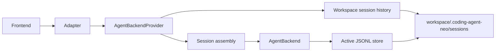

# Backend History Discover Architecture

## 1. Goals and boundaries

This workflow adds a backend-owned, workspace-scoped session-history capability. Every adapter can list historical sessions, show bounded canonical events, and create a resumed session without knowing JSONL paths or persistence internals.

Success means:

- production sessions are written only below `<workspace>/.coding-agent-neo/sessions/`;
- history summaries expose a session ID and bounded first user message;
- history events are read through the backend boundary with sequence pagination;
- new and resumed sessions are created through the same backend provider;
- In-process and HTTP bindings preserve equivalent semantics.

Out of scope are Web UI changes, raw file access/download, history mutation, multi-workspace service operation, authentication, JSONL format migration, and changes to Agent reasoning or tool execution.

## 2. Quality attributes and technology choices

| Area | Choice | Responsibility / rationale |
| --- | --- | --- |
| Backend boundary | Workspace-scoped `AgentBackendProvider` plus per-session `AgentBackend` | Avoids a second persistence path while preserving the existing linear session handle. |
| Persistence | Fixed `workspace / ".coding-agent-neo" / "sessions"` | Gives every workspace one unambiguous history repository. |
| Discovery | Backend parses canonical JSONL through session-domain readers | Adapters never infer session facts or touch files. |
| History reads | Finite, bounded pages ordered by canonical sequence | Historical display is not a second live SSE stream and cannot exhaust responses. |
| Compatibility | Existing `{}` session creation and CLI `--resume SESSION_ID` remain | Adds discovery and HTTP resume without breaking new-session clients. |
| Failure isolation | Per-file safe diagnostics | One invalid record does not hide healthy workspace history. |

## 3. System context and data flows



### 3.1 History and resume flow

1. Composition resolves and validates `workspace`; the production session path is derived and is not independently configurable.
2. An adapter asks `AgentBackendProvider.list_sessions()` for a bounded page. The provider enumerates only direct regular `session_*.jsonl` candidates, parses each independently, and projects safe summaries.
3. An adapter asks `read_session_events(session_id, since, limit)` for display. The provider validates the opaque ID, re-resolves the fixed path, parses canonical envelopes, and returns only `sequence > since` up to the limit.
4. To resume, the adapter calls `create_session(resume_session_id=...)`. Assembly revalidates and recovers the file before returning a per-session `AgentBackend`.
5. Live commands and SSE continue through the existing `AgentBackend`; historical event pagination never executes commands or tool side effects.

### 3.2 Failure and concurrency rules

- Listing is best effort per candidate. Invalid, unreadable, empty, unsupported, or incomplete candidates yield a bounded summary diagnostic when an ID can be safely derived; they do not fail the page.
- Direct lookup of an unknown session returns `SessionHistoryNotFoundError`; malformed IDs return `InvalidSessionHistoryIdError`; invalid history returns `SessionHistoryUnavailableError` with a stable safe reason.
- Resume is a fresh validation operation and uses existing recovery exceptions mapped to stable adapter errors.
- The HTTP registry retains at most one active transport session. `POST /sessions` returns `session_exists` before constructing either a new or resumed backend when one is active.
- Historical pages are snapshots of completed records at read time. Concurrent append can make `has_more` or summary metadata stale; sequence cursors remain safe and clients may request again.

## 4. Module boundaries

| Module | Owns | Must not own |
| --- | --- | --- |
| `config.py` | Resolved workspace and non-persistence production configuration | Public `session_dir` field or override |
| `session.py` | Canonical JSONL parsing, fixed-path repository primitives, safe ID/path validation | HTTP, CLI, frontend DTOs, Runtime reconstruction |
| `backend.py` / provider module | Public history/provider port, DTOs, stable history exceptions | Filesystem implementation, transport status codes |
| `assembly.py` | Concrete provider composition, fixed store path, resume plan and backend construction | CLI/HTTP rendering or routes |
| `backend_service.py` | One active Agent backend's worker/event semantics | Workspace history enumeration |
| `transports/in_process.py` | Python binding over the provider and session backend | Direct session-file access |
| `transports/http/` | JSON DTO mapping, finite history routes, SSE and session registry | `SessionStore`, workspace paths, history parsing |
| `cli.py` | CLI arguments and existing direct `--resume SESSION_ID` consumption | `--session-dir`, file discovery, persistence policy |
| `web/` | Unchanged in this workflow | History implementation or new UI |

## 5. Data model and invariants

| Entity | Key fields | Constraints and lifecycle |
| --- | --- | --- |
| `SessionHistoryItem` | `session_id`, `first_user_message`, `created_at`, `updated_at`, `last_sequence`, `last_state`, `resumable`, `diagnostics[]` | No filesystem path. Text is bounded with explicit truncation metadata. |
| `SessionHistoryPage` | `sessions[]`, `next_cursor?` | Bounded `limit`; deterministic newest-first ordering by `(updated_at, session_id)`. Cursor is opaque to frontends. |
| `SessionEventPage` | `session_id`, `events[]`, `next_cursor`, `has_more`, `diagnostics[]` | Contains canonical envelopes with `sequence > since`; limit is bounded. |
| `AgentBackendProvider` | resolved workspace and fixed repository | Exists before a session is selected; creates at most the adapter-permitted active backend. |
| `AgentBackend` | one Agent session | Existing `send/events/last_state/close` contract remains unchanged. |

Production invariants:

1. `session_path == resolved_workspace / ".coding-agent-neo" / "sessions" / f"{session_id}.jsonl"`.
2. A public session ID matches the existing generated `session_` identifier grammar and contains no slash, separator, dot suffix, NUL, or traversal component.
3. Enumeration does not recurse and does not follow symlinks.
4. First user message is the first canonical root-session `user_message.payload.text`; missing or invalid text becomes `null` plus a safe diagnostic.
5. No history API returns raw paths. Existing historical files outside the fixed directory are not migrated or discovered.

## 6. Public contracts

### 6.1 Backend provider

The exact Python types, size limits, stable exceptions, and concurrency semantics are authoritative in `docs/agent-backend-interface.md`. The intended shape is:

```python
class AgentBackendProvider(Protocol):
    def list_sessions(self, *, cursor: str | None = None, limit: int = 50) -> SessionHistoryPage: ...
    def read_session_events(self, session_id: str, *, since: int = 0, limit: int = 200) -> SessionEventPage: ...
    def create_session(self, *, resume_session_id: str | None = None) -> AgentBackend: ...
```

Adapters depend on this provider rather than separately importing a repository and a factory. The concrete provider may delegate session construction to existing assembly helpers internally.

### 6.2 In-process binding

The In-process workspace adapter exposes provider history methods and `create_session`. The returned session binding retains `send`, `events`, `last_state`, `close`, and resume diagnostics. Ordinary callers cannot inject paths, stores, environments, model clients, or timeouts.

### 6.3 HTTP binding

The exact wire schema is authoritative in `docs/agent-transport-interface.md`. Routes are:

| Method and path | Request | Success |
| --- | --- | --- |
| `GET /api/v1/session-history?limit=n&cursor=...` | bounded query | `200 SessionHistoryPage` |
| `GET /api/v1/session-history/{session_id}/events?since=n&limit=m` | opaque ID and bounds | `200 SessionEventPage` |
| `POST /api/v1/sessions` | `{}` or `{"resume_session_id":"session_..."}` | existing `201` response, with cursor set to recovered last sequence |

History reads use finite JSON, not SSE. Existing live session status, command, event, and close routes remain unchanged. Stable errors distinguish invalid ID/cursor/limit, not found, unavailable history, active-session conflict, and invalid resume.

## 7. Security and privacy

- The local Host/Origin restrictions remain unchanged and cover new routes.
- Frontend input never selects a directory or filename. IDs are validated before path construction, and the resolved regular file must remain directly under the fixed directory.
- Symlinks, directories, non-JSONL names, hidden temporary files, and recursive descendants are not candidates.
- First user messages and event payloads are private local content; responses are bounded and only available through the loopback adapter. They are never logged by new code.
- Error messages do not include paths, task text, record content, traceback, configuration, provider payloads, or secrets.
- Resume does not trust listing metadata and never replays historical tool side effects.

## 8. Deployment, configuration, and verification

Production configuration has no `session_dir` field, environment override, TOML key, or CLI flag. Unknown `session_dir` TOML/config input and `--session-dir` fail through the normal unknown-option/config validation path. The fixed directory is created lazily when a session first persists.

Existing custom session directories are not migrated. Operators must manually move compatible records into the fixed workspace directory if desired; this workflow performs no destructive filesystem operation.

Verification includes:

- configuration and CLI tests proving `session_dir` is removed and the fixed path is used;
- repository unit tests for ordering, first-message projection, bounds, corruption, incomplete tails, symlinks, traversal, and concurrent append snapshots;
- backend/provider and resume tests proving sequence continuation and no side-effect replay;
- shared adapter conformance scenarios;
- HTTP route, error, Host/Origin, response-bound, and real-service integration tests;
- architecture forbidden-dependency tests;
- full Pytest, Ruff check/format, build, workflow validation, and acceptance aggregate.

Mocks prove mapping and local application behavior only; they do not prove public-network safety, remote authentication, or real model-provider compatibility.
