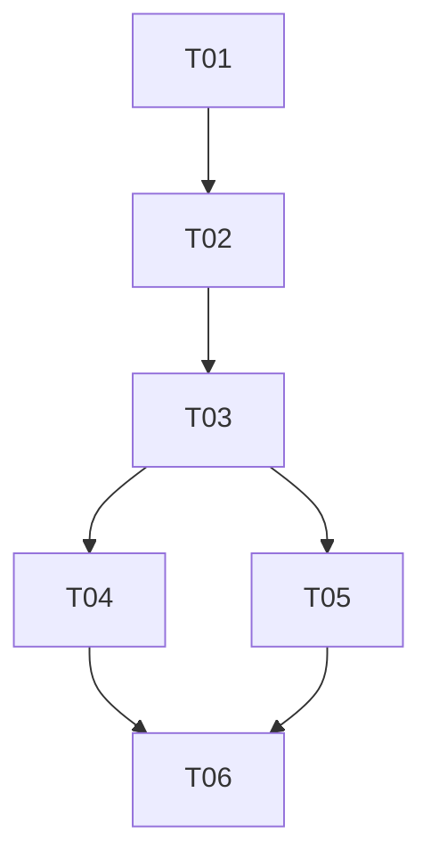

# Backend History Discover Task Breakdown

This file turns `ARCHITECTURE.md` into serial, independently acceptable delivery tasks. Each task is implemented by a fresh `luna_worker`; the main agent independently reviews, verifies, checks off, and commits each accepted task before dispatching the next.

## Collaboration rules

- Claim one unchecked task at a time and modify only its scope.
- Read completed dependencies before implementation.
- Update architecture and affected cards before changing a public contract.
- Check a task only after all acceptance criteria and verification evidence exist.

## Dependency overview

## Stage A: Contract authority

### [x] T01 — Version the backend and adapter contracts

**Dependencies:** None  
**Scope:** Update only `docs/agent-backend-interface.md`, `docs/agent-transport-interface.md`, and directly necessary contract fixtures/tests so the provider, DTOs, fixed path, finite history reads, In-process binding, HTTP routes, resume request, errors, bounds, and security/lifecycle behavior are completely specified before product implementation. Do not implement product behavior.  
**Acceptance:**

- Backend specification defines a workspace-scoped provider as the adapter's single backend dependency while preserving the per-session `AgentBackend` contract.
- Transport specification defines equivalent In-process and HTTP history/list/read/resume behavior, exact JSON fields, bounds, ordering, errors, cursor rules, Host/Origin coverage, and no-path security rules.
- The specifications explicitly remove production `session_dir`/`--session-dir`, define the fixed directory, retain the single-active-session rule, and state that historical reads are finite JSON rather than SSE.
- Contract fixtures or schema assertions are updated only where needed to keep the documented v1 extension executable; no Python implementation is claimed complete.

**Verification:** `python /Users/jay/.codex/skills/orchestrate-spec-driven-development/scripts/validate_workflow.py --repo docs/backed-history-discover`; `python -m pytest tests/architecture tests/transports -q` (existing behavior may remain unchanged, but failures must be reported); manual cross-document contract review.

**Completed 2026-09-01:** Versioned the workspace-scoped provider, bounded history DTOs, fixed persistence path, opaque-ID resume, canonical In-process workspace binding, finite HTTP history routes, stable errors, and security/lifecycle rules without product-code changes. Main-agent verification: workflow validator passed; `.venv/bin/python -m pytest tests/architecture tests/transports -q` reported 23 passed with one third-party Starlette deprecation warning; `git diff --check` passed; manual cross-document review resolved the legacy In-process entry-point contradiction.

## Stage B: Persistence and provider

### [ ] T02 — Fix production session storage to the workspace

**Dependencies:** T01  
**Scope:** Remove production `session_dir` from configuration, environment/TOML/CLI handling, formatting, help, assembly call sites, examples, and tests. Derive the store directory only from the resolved workspace. Preserve explicit internal test seams only when they cannot be mistaken for production configuration. Do not implement history routes.  
**Acceptance:**

- New sessions persist below `<resolved workspace>/.coding-agent-neo/sessions/` in CLI, In-process, and HTTP composition.
- `AppConfig`, config example, CLI help, and production entrypoints expose no `session_dir` or `--session-dir`; legacy input fails safely rather than being silently honored.
- Existing resume by opaque session ID resolves only in the fixed directory; arbitrary explicit JSONL paths are no longer a public CLI or production binding input.
- Configuration, CLI, session recovery, backend, and HTTP integration tests cover the new invariant without weakening unrelated behavior.

**Verification:** `python -m pytest tests/unit/test_config.py tests/integration/test_cli.py tests/integration/test_resume_cli.py tests/unit/test_session_recovery.py tests/unit/test_backend.py tests/transports/test_http_transport.py -q`; `python -m ruff check src tests`; `python -m ruff format --check src tests`.

### [ ] T03 — Provide backend-owned history discovery and resume creation

**Dependencies:** T02  
**Scope:** Implement the public workspace-scoped provider/DTO/exception contract, fixed-directory history repository, bounded summary projection including the first user message, bounded canonical event pages, and new/resumed session creation. Reuse canonical session parsing and recovery. Do not add HTTP routes, CLI UI, or Web UI.  
**Acceptance:**

- `AgentBackendProvider` is the single application dependency used by adapters for history and backend creation; adapters need not and cannot import filesystem/session-store internals.
- Listing is deterministic and bounded, returns safe per-file diagnostics, extracts the first canonical root user message, ignores recursion/symlinks/non-candidates, and exposes no paths.
- Event reads validate opaque IDs and bounds, preserve canonical envelopes and `sequence > since`, and report `next_cursor`/`has_more` correctly.
- Resume revalidates the selected ID, continues the original sequence/context/budget, reports recovery diagnostics, and does not replay historical file or shell effects.
- Unit, security, backend, recovery, and architecture tests cover healthy, empty, malformed, incomplete-tail, traversal, symlink, oversized text, unknown ID, and append-snapshot cases.

**Verification:** `python -m pytest tests/unit/test_session_history.py tests/unit/test_backend_provider.py tests/unit/test_session_recovery.py tests/security tests/architecture -q`; `python -m ruff check src tests`; `python -m ruff format --check src tests`.

## Stage C: Adapter bindings

### [ ] T04 — Expose history through the In-process binding

**Dependencies:** T03  
**Scope:** Adapt the In-process composition/binding so controlled Python frontends can list history, read event pages, and create a new or resumed per-session adapter exclusively through the provider contract. Preserve existing direct CLI resume behavior after the removed path/config options. Do not add an interactive CLI picker or modify Web code.  
**Acceptance:**

- In-process callers can exercise all provider history and create/resume operations without importing backend implementation or persistence modules.
- Existing `send/events/last_state/close` semantics and resume metadata remain intact for the returned session adapter.
- Shared conformance cases prove bounded listing/read behavior, invalid IDs/bounds, and resume sequence continuation through the binding.
- CLI subprocess tests prove existing `--resume SESSION_ID` still works and explicit paths/removed `--session-dir` are rejected.

**Verification:** `python -m pytest tests/unit/test_in_process_transport.py tests/transports/test_adapter_conformance.py tests/integration/test_cli.py tests/integration/test_resume_cli.py -q`; `python -m ruff check src tests`; `python -m ruff format --check src tests`.

### [ ] T05 — Expose finite history and resume through HTTP

**Dependencies:** T03  
**Scope:** Add documented history DTO/query decoding, finite JSON routes, stable error mappings, and `resume_session_id` session creation to the HTTP adapter and registry. Preserve live SSE and command behavior. Do not serve raw files, disclose paths, or modify Web UI/API client code.  
**Acceptance:**

- Both history endpoints return the exact bounded v1 DTOs and map invalid IDs/cursors/limits, missing/unavailable sessions, and safe internal failures to documented stable codes.
- `POST /api/v1/sessions` accepts exactly `{}` or one valid `resume_session_id`, returns the recovered cursor, rejects extra/path fields, and preserves the active-session conflict without constructing a second backend.
- Host/Origin middleware, response-size/text truncation, no-path/no-traceback behavior, finite response lifecycle, and SSE non-regression are tested.
- Fake mapping tests and real-provider integration tests distinguish transport conformance from runtime evidence.

**Verification:** `python -m pytest tests/transports/test_http_transport.py tests/integration/test_http_history.py tests/security -q`; `python -m ruff check src tests`; `python -m ruff format --check src tests`.

## Stage D: Integrated acceptance

### [ ] T06 — Reconcile contracts and pass the repository quality gate

**Dependencies:** T04, T05  
**Scope:** Reconcile implementation indexes, README/configuration guidance, workflow evidence, and aggregate tests with the accepted behavior. Fix only integration defects attributable to T01–T05. Do not implement Web UI, migrations, history mutation, or unrelated cleanup.  
**Acceptance:**

- Both authoritative interface documents, implementation, README/config example, tests, workflow progress, and decision records describe the same fixed-path/provider/history/resume system.
- No production `session_dir`, `--session-dir`, arbitrary resume path, adapter `SessionStore` import, raw history file endpoint, or Web source modification remains.
- Full tests, acceptance aggregate, Ruff lint/format, build, and workflow validation pass, or any environment-only limitation is reported exactly and is not mislabeled as success.
- The milestone report identifies accepted commits, compatibility impact (legacy custom session directories are not migrated), and the intentionally deferred Web UI work.

**Verification:** `python -m pytest`; `python -m pytest tests/acceptance -m acceptance`; `python -m ruff check .`; `python -m ruff format --check .`; `python -m build`; `python /Users/jay/.codex/skills/orchestrate-spec-driven-development/scripts/validate_workflow.py --repo docs/backed-history-discover`.

## Recommended order

1. T01 → T02 → T03.
2. Complete T04, then T05; only one worker may be active even though both depend on T03.
3. Complete T06 after both adapter tasks are accepted.
