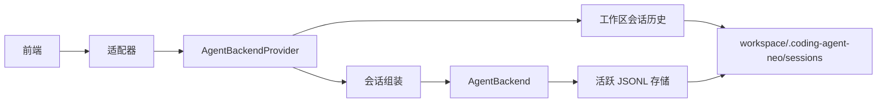

# 后端历史发现架构

## 1. 目标与边界

本工作流新增由后端拥有、限定于工作区范围的会话历史能力。每种适配器都可以列出历史会话、展示有界的规范事件并创建恢复会话，而无需了解 JSONL 路径或持久化内部实现。

成功意味着：

- 生产会话只写入 `<workspace>/.coding-agent-neo/sessions/` 之下；
- 历史摘要暴露会话 ID 和有界的首条用户消息；
- 历史事件通过后端边界以序列分页方式读取；
- 新建会话和恢复会话通过同一个后端提供者创建；
- In-process 和 HTTP 绑定保持等价语义。

范围外事项包括 Web UI 变更、原始文件访问/下载、历史修改、多工作区服务运行、认证、JSONL 格式迁移以及 Agent 推理或工具执行变更。

## 2. 质量属性与技术选择

| 领域 | 选择 | 职责/理由 |
| --- | --- | --- |
| 后端边界 | 工作区范围的 `AgentBackendProvider` 加单会话 `AgentBackend` | 在保留现有线性会话句柄的同时，避免出现第二条持久化路径。 |
| 持久化 | 固定的 `workspace / ".coding-agent-neo" / "sessions"` | 为每个工作区提供一个无歧义的历史仓库。 |
| 发现 | 后端通过会话领域读取器解析规范 JSONL | 适配器绝不推导会话事实或接触文件。 |
| 历史读取 | 按规范序列排序的有限、有界分页 | 历史展示不是第二条实时 SSE 流，也不会产生无界响应。 |
| 兼容性 | 保留现有 `{}` 会话创建和 CLI `--resume SESSION_ID` | 在不破坏新会话客户端的情况下增加发现和 HTTP 恢复。 |
| 故障隔离 | 每文件安全诊断 | 一条无效记录不会隐藏健康的工作区历史。 |

## 3. 系统上下文与数据流



### 3.1 历史与恢复流程

1. 组装层解析并校验 `workspace`；生产会话路径由此派生，不能单独配置。
2. 适配器向 `AgentBackendProvider.list_sessions()` 请求有界分页。提供者只枚举直接的常规 `session_*.jsonl` 候选项，独立解析每个候选项，并投影安全摘要。
3. 适配器调用 `read_session_events(session_id, since, limit)` 以供展示。提供者校验不透明 ID、重新解析固定路径、解析规范信封，并在限制范围内只返回 `sequence > since` 的事件。
4. 恢复时，适配器调用 `create_session(resume_session_id=...)`。组装层重新校验并恢复文件，然后返回单会话 `AgentBackend`。
5. 实时命令和 SSE 继续通过现有 `AgentBackend` 工作；历史事件分页绝不执行命令或工具副作用。

### 3.2 故障与并发规则

- 列表对每个候选项尽力处理。如果可以安全派生 ID，无效、不可读、为空、不受支持或不完整的候选项会生成有界摘要诊断；它们不会导致整个分页失败。
- 直接查找未知会话时返回 `SessionHistoryNotFoundError`；格式错误的 ID 返回 `InvalidSessionHistoryIdError`；无效历史返回带有稳定安全原因的 `SessionHistoryUnavailableError`。
- 恢复是一次全新的校验操作，并使用映射到稳定适配器错误的现有恢复异常。
- HTTP 注册表最多保留一个活跃传输会话。存在活跃会话时，`POST /sessions` 在构造新后端或恢复后端之前返回 `session_exists`。
- 历史分页是读取时已完成记录的快照。并发追加可能使 `has_more` 或摘要元数据过时；序列游标仍然安全，客户端可以再次请求。

## 4. 模块边界

| 模块 | 拥有 | 不得拥有 |
| --- | --- | --- |
| `config.py` | 解析后的工作区及非持久化生产配置 | 公开 `session_dir` 字段或覆盖项 |
| `session.py` | 规范 JSONL 解析、固定路径仓库原语、安全 ID/路径校验 | HTTP、CLI、前端 DTO、Runtime 重建 |
| `backend.py`/提供者模块 | 公开历史/提供者端口、DTO、稳定历史异常 | 文件系统实现、传输状态码 |
| `assembly.py` | 具体提供者组装、固定存储路径、恢复计划及后端构造 | CLI/HTTP 渲染或路由 |
| `backend_service.py` | 一个活跃 Agent 后端的工作线程/事件语义 | 工作区历史枚举 |
| `transports/in_process.py` | 提供者和会话后端之上的 Python 绑定 | 直接访问会话文件 |
| `transports/http/` | JSON DTO 映射、有限历史路由、SSE 和会话注册表 | `SessionStore`、工作区路径、历史解析 |
| `cli.py` | CLI 参数和现有直接 `--resume SESSION_ID` 消费 | `--session-dir`、文件发现、持久化策略 |
| `web/` | 在本工作流中保持不变 | 历史实现或新 UI |

## 5. 数据模型与不变量

| 实体 | 关键字段 | 约束与生命周期 |
| --- | --- | --- |
| `SessionHistoryItem` | `session_id`、`first_user_message`、`created_at`、`updated_at`、`last_sequence`、`last_state`、`resumable`、`diagnostics[]` | 不包含文件系统路径。文本有界并带有明确的截断元数据。 |
| `SessionHistoryPage` | `sessions[]`、`next_cursor?` | `limit` 有界；按 `(updated_at, session_id)` 确定性地采用最新优先顺序。游标对前端不透明。 |
| `SessionEventPage` | `session_id`、`events[]`、`next_cursor`、`has_more`、`diagnostics[]` | 包含 `sequence > since` 的规范信封；限制有界。 |
| `AgentBackendProvider` | 解析后的工作区和固定仓库 | 在选择会话前已经存在；最多创建适配器允许的活跃后端。 |
| `AgentBackend` | 一个 Agent 会话 | 现有 `send/events/last_state/close` 契约保持不变。 |

生产不变量：

1. `session_path == resolved_workspace / ".coding-agent-neo" / "sessions" / f"{session_id}.jsonl"`.
2. 公开会话 ID 符合现有生成的 `session_` 标识符语法，且不包含斜杠、分隔符、点后缀、NUL 或穿越组件。
3. 枚举不递归，也不跟随符号链接。
4. 首条用户消息是规范根会话的第一条 `user_message.payload.text`；缺失或无效文本变为 `null` 并附带安全诊断。
5. 历史 API 不返回原始路径。固定目录之外的现有历史文件不会被迁移或发现。

## 6. 公开契约

### 6.1 后端提供者

准确的 Python 类型、大小限制、稳定异常和并发语义以 `docs/agent-backend-interface.md` 为权威。预期形式如下：

```python
class AgentBackendProvider(Protocol):
    def list_sessions(
        self, *, cursor: str | None = None, limit: int = 50
    ) -> SessionHistoryPage: ...
    def read_session_events(
        self, session_id: str, *, since: int = 0, limit: int = 200
    ) -> SessionEventPage: ...
    def create_session(self, *, resume_session_id: str | None = None) -> AgentBackend: ...
```

适配器依赖该提供者，而不是分别导入仓库和工厂。具体提供者可以在内部将会话构造委托给现有组装辅助函数。

### 6.2 In-process 绑定

In-process 工作区适配器暴露提供者历史方法和 `create_session`。返回的会话绑定保留 `send`、`events`、`last_state`、`close` 和恢复诊断。普通调用方不能注入路径、存储、环境、模型客户端或超时。

### 6.3 HTTP 绑定

准确的线协议模式以 `docs/agent-transport-interface.md` 为权威。路由如下：

| 方法与路径 | 请求 | 成功响应 |
| --- | --- | --- |
| `GET /api/v1/session-history?limit=n&cursor=...` | 有界查询 | `200 SessionHistoryPage` |
| `GET /api/v1/session-history/{session_id}/events?since=n&limit=m` | 不透明 ID 和边界 | `200 SessionEventPage` |
| `POST /api/v1/sessions` | `{}` 或 `{"resume_session_id":"session_..."}` | 现有 `201` 响应，游标设为恢复得到的最后序列号 |

历史读取使用有限 JSON，而非 SSE。现有实时会话状态、命令、事件和关闭路由保持不变。稳定错误可区分无效 ID/游标/限制、未找到、历史不可用、活跃会话冲突和无效恢复。

## 7. 安全与隐私

- 本地 Host/Origin 限制保持不变，并覆盖新增路由。
- 前端输入绝不选择目录或文件名。ID 在构造路径前校验，解析后的常规文件必须仍直接位于固定目录之下。
- 符号链接、目录、非 JSONL 名称、隐藏临时文件和递归后代均不是候选项。
- 首条用户消息和事件载荷属于本地私有内容；响应有界，且只能通过环回适配器获取。新增代码绝不记录这些内容。
- 错误消息不包含路径、任务文本、记录内容、回溯、配置、提供者载荷或密钥。
- 恢复不信任列表元数据，也绝不重放历史工具副作用。

## 8. 部署、配置与验证

生产配置没有 `session_dir` 字段、环境覆盖项、TOML 键或 CLI 标志。未知的 `session_dir` TOML/配置输入和 `--session-dir` 通过正常的未知选项/配置校验路径失败。固定目录在首次持久化会话时延迟创建。

现有自定义会话目录不会迁移。如有需要，操作人员必须手动将兼容记录移动到固定工作区目录；本工作流不执行破坏性文件系统操作。

验证包括：

- 配置和 CLI 测试，证明 `session_dir` 已移除且使用固定路径；
- 仓库单元测试，覆盖排序、首条消息投影、边界、损坏、不完整尾部、符号链接、穿越和并发追加快照；
- 后端/提供者和恢复测试，证明序列延续且不重放副作用；
- 共享适配器一致性场景；
- HTTP 路由、错误、Host/Origin、响应边界和真实服务集成测试；
- 架构禁止依赖测试；
- 完整 Pytest、Ruff 检查/格式检查、构建、工作流校验和聚合验收。

模拟对象只能证明映射和本地应用行为；不能证明公网安全、远程认证或真实模型提供者兼容性。
