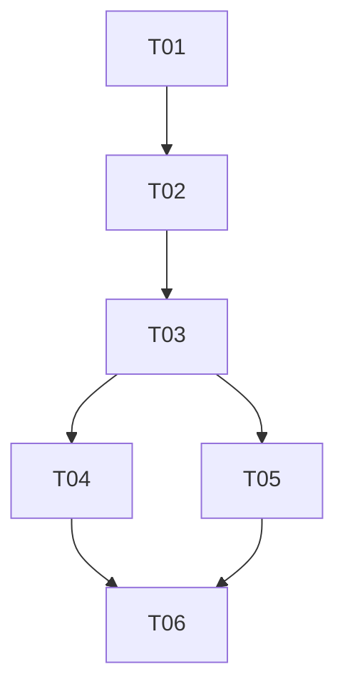

# 后端历史发现任务拆分

本文件将 `ARCHITECTURE.md` 转化为可串行执行、可独立验收的交付任务。每个任务由一个全新的 `luna_worker` 实现；主代理在派发下一任务前，独立审查、验证、勾选并提交每个已验收任务。

## 协作规则

- 一次只领取一个未勾选任务，且只修改其范围内内容。
- 实现前阅读已完成的依赖。
- 修改公开契约前，先更新架构和受影响的任务卡。
- 只有全部验收标准和验证证据均已具备后，才能勾选任务。

## 依赖概览

## 阶段 A：契约权威

### [x] T01 — 对后端和适配器契约进行版本化

**依赖：** 无  
**范围：** 只更新 `docs/agent-backend-interface.md`、`docs/agent-transport-interface.md` 以及直接必需的契约测试夹具/测试，使提供者、DTO、固定路径、有限历史读取、In-process 绑定、HTTP 路由、恢复请求、错误、边界及安全/生命周期行为在产品实现前得到完整规定。不得实现产品行为。  
**验收：**

- 后端规范将工作区范围的提供者定义为适配器唯一的后端依赖，同时保留单会话 `AgentBackend` 契约。
- 传输规范定义等价的 In-process 和 HTTP 历史列表/读取/恢复行为、准确 JSON 字段、边界、顺序、错误、游标规则、Host/Origin 覆盖及无路径安全规则。
- 规范明确移除生产环境的 `session_dir`/`--session-dir`，定义固定目录，保留单活跃会话规则，并声明历史读取使用有限 JSON 而不是 SSE。
- 只在保持已记录的 v1 扩展可执行所需之处更新契约测试夹具或模式断言；不声称任何 Python 实现已经完成。

**验证：** `python /Users/jay/.codex/skills/orchestrate-spec-driven-development/scripts/validate_workflow.py --repo docs/backend-history-discover`；`python -m pytest tests/architecture tests/transports -q`（现有行为可以保持不变，但必须报告失败）；手工跨文档契约审查。

**已于 2026-09-01 完成：** 在不修改产品代码的情况下，对工作区范围的提供者、有界历史 DTO、固定持久化路径、不透明 ID 恢复、规范 In-process 工作区绑定、有限 HTTP 历史路由、稳定错误以及安全/生命周期规则进行了版本化。主代理验证：工作流校验器通过；`.venv/bin/python -m pytest tests/architecture tests/transports -q` 报告 23 项通过，并有一条第三方 Starlette 弃用警告；`git diff --check` 通过；手工跨文档审查解决了旧版 In-process 入口点矛盾。

## 阶段 B：持久化与提供者

### [x] T02 — 将生产会话存储固定到工作区

**依赖：** T01  
**范围：** 从配置、环境/TOML/CLI 处理、格式化、帮助、组装调用点、示例和测试中移除生产 `session_dir`。存储目录只能从解析后的工作区派生。只有在明确的内部测试接缝不会被误认为生产配置时才保留它们。不得实现历史路由。  
**验收：**

- CLI、In-process 和 HTTP 组装中的新会话均持久化在 `<resolved workspace>/.coding-agent-neo/sessions/` 之下。
- `AppConfig`、配置示例、CLI 帮助和生产入口点均不暴露 `session_dir` 或 `--session-dir`；旧版输入安全失败，而不是被静默接受。
- 现有基于不透明会话 ID 的恢复只能在固定目录中解析；任意显式 JSONL 路径不再是公开 CLI 或生产绑定输入。
- 配置、CLI、会话恢复、后端和 HTTP 集成测试覆盖新不变量，且不削弱无关行为。

**验证：** `python -m pytest tests/unit/test_config.py tests/integration/test_cli.py tests/integration/test_resume_cli.py tests/unit/test_session_recovery.py tests/unit/test_backend.py tests/transports/test_http_transport.py -q`；`python -m ruff check src tests`；`python -m ruff format --check src tests`。

**已于 2026-09-01 完成：** 移除生产 `session_dir` 和 `--session-dir`，仅从 `<resolved workspace>/.coding-agent-neo/sessions/` 派生新建/恢复记录，将恢复限制为不透明 ID，并在不写入工作区之外的前提下拒绝已有符号链接组件/包含关系逃逸。主代理验证：聚焦矩阵报告 65 项通过，并有一条第三方 Starlette 警告；Ruff 检查和格式检查通过；`git diff --check` 通过。工作代理完整测试套件证据报告 297 项通过，并有相同警告。

### [x] T03 — 提供后端拥有的历史发现与恢复创建能力

**依赖：** T02  
**范围：** 实现公开的工作区范围提供者/DTO/异常契约、固定目录历史仓库、包含首条用户消息的有界摘要投影、有界规范事件分页及新建/恢复会话创建。复用规范会话解析和恢复。不得添加 HTTP 路由、CLI UI 或 Web UI。  
**验收：**

- `AgentBackendProvider` 是适配器用于历史和后端创建的唯一应用依赖；适配器无需且不能导入文件系统/会话存储内部实现。
- 列表具有确定性且有界，返回安全的每文件诊断，提取第一条规范根用户消息，忽略递归项/符号链接/非候选项，并且不暴露路径。
- 事件读取校验不透明 ID 和边界，保留规范信封及 `sequence > since`，并正确报告 `next_cursor`/`has_more`。
- 恢复重新校验所选 ID，延续原始序列/上下文/预算，报告恢复诊断，并且不重放历史文件或 shell 副作用。
- 单元、安全、后端、恢复和架构测试覆盖健康、空、格式错误、不完整尾部、穿越、符号链接、超大文本、未知 ID 和追加快照场景。

**验证：** `python -m pytest tests/unit/test_session_history.py tests/unit/test_backend_provider.py tests/unit/test_session_recovery.py tests/security tests/architecture -q`；`python -m ruff check src tests`；`python -m ruff format --check src tests`。

**已于 2026-09-01 完成：** 实现公开提供者/DTO/错误端口、私有固定目录仓库、确定性快照分页、有界首条根用户消息和规范事件投影、安全候选项隔离、严格身份重新校验，以及由提供者控制且不重放的新建/恢复后端。主代理验证：T03 矩阵报告 57 项通过；Ruff 检查/格式检查、工作流校验器和 `git diff --check` 均通过。工作代理完整测试套件证据报告 322 项通过。验收修正移除了仓库重新导出旁路，并覆盖追加快照、根节点过滤、200 个大型事件的聚合边界、符号链接根目录、替换竞态及组装后的恢复序列/副作用行为。

## 阶段 C：适配器绑定

### [x] T04 — 通过 In-process 绑定暴露历史能力

**依赖：** T03  
**范围：** 调整 In-process 组装/绑定，使受控 Python 前端只能通过提供者契约列出历史、读取事件分页并创建新建或恢复的单会话适配器。在移除路径/配置选项后，保留现有直接 CLI 恢复行为。不得添加交互式 CLI 选择器或修改 Web 代码。  
**验收：**

- In-process 调用方无需导入后端实现或持久化模块，即可使用全部提供者历史及创建/恢复操作。
- 返回的会话适配器保持现有 `send/events/last_state/close` 语义和恢复元数据完整不变。
- 共享一致性场景证明通过该绑定实现的有界列表/读取行为、无效 ID/边界以及恢复序列延续。
- CLI 子进程测试证明现有 `--resume SESSION_ID` 仍可工作，并拒绝显式路径和已移除的 `--session-dir`。

**验证：** `python -m pytest tests/unit/test_in_process_transport.py tests/transports/test_adapter_conformance.py tests/integration/test_cli.py tests/integration/test_resume_cli.py -q`；`python -m ruff check src tests`；`python -m ruff format --check src tests`。

**已于 2026-09-01 完成：** 新增规范的会话创建前 `InProcessWorkspaceBinding`、仅依赖提供者的历史/读取/创建委托、经提供者路由的兼容构建器，并保留单会话生命周期/恢复元数据和 CLI 不透明 ID 行为。主代理验证：聚焦矩阵报告 30 项通过；Ruff 检查/格式检查、工作流校验器和 `git diff --check` 均通过。可复用一致性测试覆盖真实固定 JSONL 列表/事件边界、带类型的无效输入、恢复游标/序列延续以及不重放历史消息；组装监视器证明恰好只有一条提供者/创建路径。工作代理完整测试套件证据报告 325 项通过，并有一条第三方 Starlette 警告。

### [x] T05 — 通过 HTTP 暴露有限历史与恢复能力

**依赖：** T03  
**范围：** 向 HTTP 适配器和注册表添加已记录的历史 DTO/查询解码、有限 JSON 路由、稳定错误映射及 `resume_session_id` 会话创建。保留实时 SSE 和命令行为。不得提供原始文件、披露路径或修改 Web UI/API 客户端代码。  
**验收：**

- 两个历史端点均返回准确的有界 v1 DTO，并将无效 ID/游标/限制、缺失/不可用会话及安全内部失败映射到已记录的稳定代码。
- `POST /api/v1/sessions` 只接受 `{}` 或一个有效 `resume_session_id`，返回恢复得到的游标，拒绝额外字段/路径字段，并在不构造第二个后端的情况下保留活跃会话冲突。
- 已测试 Host/Origin 中间件、响应大小/文本截断、无路径/无回溯行为、有限响应生命周期及 SSE 无回归。
- 模拟映射测试和真实提供者集成测试区分传输一致性与运行时证据。

**验证：** `python -m pytest tests/transports/test_http_transport.py tests/integration/test_http_history.py tests/security -q`；`python -m ruff check src tests`；`python -m ruff format --check src tests`。

**已于 2026-09-01 完成：** 新增仅依赖提供者的有限 HTTP 历史列表/事件路由、严格有界的查询/请求体解码、稳定安全的历史/恢复错误，以及携带恢复游标的恢复会话创建，同时保留单活跃会话、实时 SSE/命令、Host/Origin 和关闭行为。主代理验证：聚焦 HTTP/历史/安全矩阵报告 34 项通过，并有一条第三方 Starlette 警告；共享适配器一致性测试报告 5 项通过；Web 启动器/验收回归报告 11 项通过，并有相同警告；Ruff 检查/格式检查、工作流校验器和 `git diff --check` 均通过。工作代理完整测试套件证据报告 340 项通过。

## 阶段 D：集成验收

### [x] T06 — 对齐契约并通过仓库质量门禁

**依赖：** T04、T05  
**范围：** 将实现索引、README/配置指南、工作流证据和聚合测试与已验收行为对齐。只修复可归因于 T01–T05 的集成缺陷。不得实现 Web UI、迁移、历史修改或无关清理。  
**验收：**

- 两份权威接口文档、实现、README/配置示例、测试、工作流进度和决策记录描述同一套固定路径/提供者/历史/恢复系统。
- 不再存在生产 `session_dir`、`--session-dir`、任意恢复路径、适配器 `SessionStore` 导入、原始历史文件端点或 Web 源码修改。
- 完整测试、聚合验收、Ruff 静态检查/格式检查、构建和工作流校验均通过；或者准确报告任何仅由环境导致的限制，且不得错误标记为成功。
- 里程碑报告指出已验收提交、兼容性影响（不迁移旧版自定义会话目录）以及被有意延期的 Web UI 工作。

**验证：** `python -m pytest`；`python -m pytest tests/acceptance -m acceptance`；`python -m ruff check .`；`python -m ruff format --check .`；`python -m build`；`python /Users/jay/.codex/skills/orchestrate-spec-driven-development/scripts/validate_workflow.py --repo docs/backend-history-discover`。

**已于 2026-09-01 完成：** 将权威接口索引、README/配置指南、工作流架构/证据和仅依赖提供者的适配器边界测试与已验收的固定路径历史/恢复实现对齐。主代理在项目 `.venv` 中验证：完整 Pytest 报告 342 项通过；聚合验收报告 56 项通过；两者都只有同一条第三方 Starlette/httpx 弃用警告；Ruff 检查/格式检查通过；sdist 和 wheel 构建成功；工作流校验和 `git diff --check` 通过。该里程碑保留“不迁移旧版自定义会话目录”这一明确兼容性影响，并在没有 `web/` 变更的情况下继续延期 Web UI 消费。

## 推荐顺序

1. T01 → T02 → T03.
2. 完成 T04，然后完成 T05；虽然两者都依赖 T03，但同一时间只能有一个工作代理处于活跃状态。
3. 两个适配器任务均验收后完成 T06。
