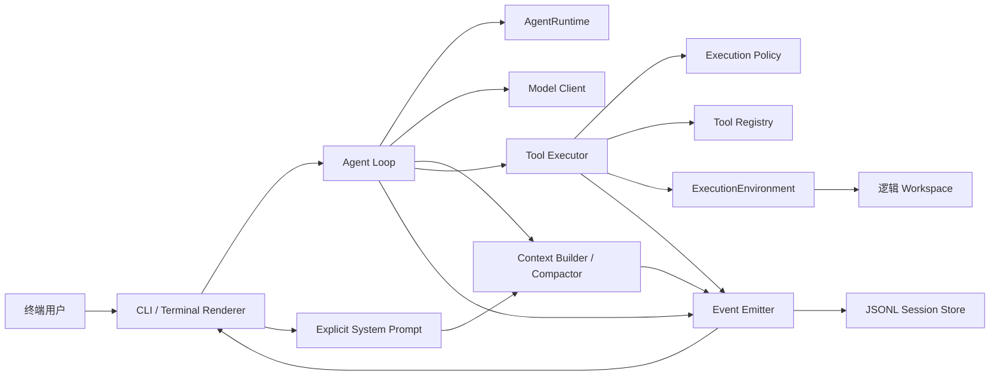

# CodingAgentNeo 架构基线

> 状态：已于 2026-08-28 通过用户变更审阅，可按任务 DAG 串行实施
> 架构基线版本：0.2
> 日期：2026-08-28
> 需求入口：[requirement.md](requirement.md)

本文把需求基线转化为可实施的模块边界、公开契约和验证策略。实际已实现能力和命令证据以 `TASKS.md` 的完成摘要与 `PROGRESS.md` 为准。公开接口、数据模型、状态机、安全边界或部署契约变更时，必须先更新本文和受影响的任务卡。

## 1. 目标、用户与边界

### 1.1 目标用户和成功行为

CodingAgentNeo 面向需要在本地工作区完成编程任务的单个终端用户，以及需要审阅其设计和运行轨迹的评委或开发者。首个可提交版本成功时，用户能够：

1. 在交互式或非交互式 CLI 中提交一个真实编程任务；
2. 让 root Agent 通过模型原生 tool calling 探索、修改并验证工作区；
3. 看到模型、工具、授权、重试、压缩和终止状态；
4. 在中断后保留可解析轨迹，并从线性 session 继续 follow-up；
5. 用测试证明 Runtime 隔离、Environment 替换、路径边界和事件关联契约成立。

### 1.2 强制约束

- Python 3.12；单 Agent、单前台任务、单进程、工具串行执行。
- 只接入一种 OpenAI-compatible Chat Completions 原生 tool calling 协议。
- 不使用 Agent 框架或 Agent SDK；Agent Loop、工具、上下文、持久化、权限和错误处理由本项目实现。
- 内置及其他工作区工具的文件、搜索和通用命令副作用全部经 `ExecutionEnvironment`；每个 Agent 的可变状态全部归属显式 `AgentRuntime`。
- system prompt 由组装层显式传入；`ToolRegistry`/`ToolExecutor`/Agent Loop 只依赖通用 Tool 协议，不区分工具来源。
- API Key 只从环境变量或未入库本地配置取得，不进入代码、轨迹、错误或交付物。

### 1.3 首版明确排除

Session tree/branch/fork、MCP 客户端及传输、Skill 发现/解析/加载、RAG/向量库、动态插件、子 Agent、并行工具、后台命令、运行中异步 steering、Plan/Todo 模式、Docker 环境实现、多厂商适配、完整 TUI、服务端代码执行，以及以命令黑名单冒充沙箱，均不在首版范围。架构只保留 Docker、子 Agent、外部上下文与外部 Tool 的低成本扩展边界，不实现其具体行为。

## 2. 质量属性与技术选择

| 领域      | 基线选择                                                     | 责任与理由                             |
| ------- | -------------------------------------------------------- | --------------------------------- |
| 语言与打包   | Python 3.12、`pyproject.toml`、`src/coding_agent_neo/` 布局  | 保持安装、测试和模块边界明确；由 T01 落地并验证        |
| 模型协议    | OpenAI-compatible Chat Completions + 原生 tools/tool calls | 兼容常见网关；禁止用 Markdown/正则作为主要工具协议    |
| API 客户端 | 官方 `openai` Python 客户端，仅作为传输客户端                          | 需求允许厂商客户端；重试、归一化和 Agent 语义仍由本项目负责 |
| 执行模型    | 同步 Agent Loop，串行 tool calls，协作式取消和有界超时                   | 符合首版单前台任务范围，同时在接口保留未来异步可能性        |
| 持久化     | 每个 session 一个 append-only UTF-8 JSONL 文件                 | 逐事件刷新，便于审计、异常恢复和手工检查              |
| 配置      | CLI > 环境变量 > 未入库 TOML 配置 > 内置默认值                         | 覆盖顺序唯一且可解释；凭据不允许写入已跟踪配置           |
| 测试      | pytest；fake model 与 fake environment 为核心测试替身             | 单元/集成测试不依赖真实 API 或宿主机副作用          |
| 质量门     | Ruff lint/format check、pytest、Python build               | 已由 T01 建立并在 Python 3.12 环境验证              |

关键质量不变量：核心循环可解释；关键事件尽快落盘；错误有界；安全声明真实；共享服务与每 Agent 可变状态分离；任何 mock 结果不得被表述为真实外部集成通过。

## 3. 系统上下文与数据流

### 3.1 启动与单个 turn

1. CLI 作为组装层，解析配置、构建显式 system prompt，并创建共享服务、root `AgentRuntime` 和 `LocalExecutionEnvironment`。
2. Environment `start()` 成功后发布 `session_start`、`agent_start`；用户输入形成 `user_message` 并立即持久化。
3. Context Builder 使用显式传入的 system prompt，且只投影当前 `agent_id` 的有效历史；预算超阈值时先执行当前 Runtime 专属 compaction。
4. Model Client 返回归一化 assistant 文本、tool calls、usage 与 finish reason；`assistant_message` 先落盘。
5. 无 tool call 时发布 `turn_end(COMPLETED_TURN)`；交互模式等待下一条消息，非交互模式退出。
6. 有 tool calls 时按声明顺序逐个进入工具生命周期，然后回到步骤 3。

### 3.2 单个工具调用

1. Agent Loop 为调用生成内部唯一 `correlation_id`，同时保留厂商 `provider_tool_call_id`。
2. Tool Executor 按通用 Tool 协议校验工具是否注册且激活、arguments JSON 与 schema 是否有效，并发布 `tool_call`；不根据工具来源分支。
3. Execution Policy 返回 `allow | ask | deny`；任何策略异常等价于 `deny`，决定以同一 correlation ID 发布。
4. 获准调用通过 `ToolExecutionContext` 使用 Runtime 的 Environment 和 cancellation；Tool 不得直接访问宿主机。
5. 成功、普通失败、拒绝、参数错误和超时均产生一个统一 `ToolResult` 及 `tool_result` 事件。
6. 多个 tool calls 继续串行处理；单个普通失败默认交给模型决定下一步。

### 3.3 Compaction 与恢复

- Session History 是不可改写的事实源；Model Context 是按 agent ID 构建的临时投影。
- Compactor 完整保留组装层显式提供的 system prompt、必要工作区信息和最近完整交互，不拆散 assistant tool call 与 tool result；较早内容和旧 summary 生成增量 summary，持久化覆盖到的 sequence。
- Compaction 调用不暴露工具；失败时保留最近完整交互并注入退化提示，仍超窗则明确失败或触发限制。
- 恢复只重建状态和上下文，不重放已经产生副作用的历史工具；尾部不完整 JSONL 记录被报告并忽略。

### 3.4 关闭、失败与并发规则

- 正常结束依次发布 `agent_end`、`session_end` 并调用 Environment `close()`；中断或未捕获异常也尽最大努力执行同样的落盘与关闭。
- 模型瞬时错误有限指数退避；认证、权限、模型不存在和非法配置立即失败；上下文超限只允许一次强制压缩后重试。
- shell 非零、文件不存在、搜索无结果、编辑不唯一、拒绝和超时是普通 ToolResult，不直接令 Loop 崩溃。
- 首版一次只运行一个 Loop，单次响应中的工具严格串行。Session Store 统一分配无重复单调 sequence；不假设多个 Agent 可共享可写工作区。

## 4. 模块与依赖边界

下列为计划目录契约；目录由对应任务创建，而非本文创建。

| 计划模块                     | 拥有的职责                                        | 禁止拥有或依赖                                    |
| ------------------------ | -------------------------------------------- | ------------------------------------------ |
| `cli.py` / `__main__.py` | 参数、交互输入、approval 询问、显式 system prompt/依赖组装、退出码 | Agent 决策、路径安全、直接 JSONL 拼写、Skill/MCP 具体实现 |
| `config.py`              | 配置来源、覆盖、校验、密钥引用                              | 记录真实密钥、启动工具或模型循环                           |
| `runtime.py`             | AgentRuntime、ContextState、BudgetTracker、取消信号 | 进程级“当前 Agent”全局变量、共享可变默认值                  |
| `models.py`              | 内部枚举和不可变/受控数据结构                              | 厂商 response 对象泄漏到其他模块                      |
| `model_client.py`        | 协议请求、响应归一化、分类重试                              | Context 压缩、工具执行、Session 状态                 |
| `environment/base.py`    | 后端无关请求/结果和 Environment Protocol              | Local/Docker 特有字段                          |
| `environment/local.py`   | 唯一宿主机文件、`rg` 与 subprocess 入口                 | 权限 UI、模型协议；Tool 不反向依赖它                     |
| `tools/`                 | 来源无关的 Tool schema、参数校验、注册/激活、内置工具语义       | `open()`、`Path` 实际读写、`subprocess`、宿主机 `rg`、外部协议分支 |
| `policy.py`              | `allow/ask/deny` 决策及 fail-closed             | 实际执行、终端渲染                                  |
| `executor.py`            | correlation 生命周期、授权、异常转 ToolResult、输出投影      | 绕过 Environment、改变 Agent Loop 状态机           |
| `events.py`              | EventEnvelope、发布/订阅接口                        | 具体终端样式、厂商对象                                |
| `session.py`             | sequence 分配、JSONL append/flush/read 与尾部诊断    | 模型上下文裁剪、历史副作用重放                            |
| `context.py`             | 显式 system prompt 输入、当前 Agent 的上下文投影、预算估算、完整交互分组 | 删除/改写 Session History、访问其他 Agent 内部消息、扫描 Skill/外部资源 |
| `compactor.py`           | 增量 summary 与退化策略                             | 可执行工具、跨 Runtime 状态                         |
| `agent_loop.py`          | 显式依赖驱动的循环、状态和预算终止                            | 全局 workspace/session/tools/预算；直接文件或进程操作    |
| `renderer.py`            | 事件到终端的有界展示和统计                                | 业务状态权威、持久化事实改写                             |

依赖方向必须满足：`工作区 Tool -> ExecutionEnvironment Protocol`；`Agent Loop -> 抽象服务 + AgentRuntime + 显式 system prompt`；`Event producers -> EventEmitter -> Store/Renderer`。只有 `LocalExecutionEnvironment` 可以包含通用宿主机文件和命令进程实现。未来显式配置的外部 Tool adapter 可以拥有其协议所必需的专用传输，但不得获得任意宿主文件或通用 shell 能力。首版不实现该 adapter。

`ToolRegistry` 的注册能力可容纳任意符合 Tool 协议的显式注入对象，但首版组装层只注册六个内置工具。工具注册集可作为受控共享定义；可变 active set 必须与单个 Runtime 绑定，首版组装时必须保证 `AgentRuntime.active_tools` 与传给该 Loop 的 Registry active view 一致，不得出现两个独立可变事实源。

## 5. 数据模型与强制不变量

| 实体                            | 关键字段                                                                                            | 约束与生命周期                                             |
| ----------------------------- | ----------------------------------------------------------------------------------------------- | --------------------------------------------------- |
| `AgentRuntime`                | agent/session/parent ID、ContextState、BudgetTracker、active tools、cancellation、policy、environment | 每 Agent 独占可变状态；root 也不得绕过；由 CLI 创建并关闭               |
| `ContextState`                | 最新 summary、covered sequence、最近投影信息                                                              | 不是完整历史；仅属于一个 Runtime                                |
| `BudgetTracker`               | model steps、tool calls、protocol errors、tokens、start/deadline、limits                             | 每次相关操作原子更新；达到上限产生具体 `LIMIT_REACHED` 原因              |
| `NormalizedAssistantResponse` | text、tool calls、usage、finish reason                                                             | 不保存不可序列化厂商对象；tool calls 保持原顺序                       |
| `ToolCall`                    | correlation ID、provider ID、name、raw/parsed arguments                                            | correlation ID 由本系统生成且 session 内唯一；provider ID 独立可选 |
| `ToolResult`                  | IDs、status、model text、metadata、truncated、duration、exit/timeout/path                             | 每个调用恰有一个结果；普通错误也使用同一 schema                         |
| `EventEnvelope`               | schema/session/event/agent/parent ID、sequence、type、correlation、UTC timestamp、payload            | event ID 唯一；sequence 由 Store 单调分配；所有事件含 agent ID    |
| `CompactionRecord`            | summary、covered-through sequence、source bounds、failure metadata                                 | append-only；不删除源事件；不得拆散工具交互                         |
| `EnvironmentRequest/Result`   | 逻辑相对路径或命令、限制、状态、后端无关元数据                                                                         | Environment 最终执行 workspace 校验；结果不得泄漏 Docker 等后端细节   |

其他不变量：

- 时间戳使用带 `Z` 的 UTC ISO 8601；超时和耗时计算使用单调时钟。
- tool call、policy decision、tool result 及相关错误共享 correlation ID；agent ID 只表示归属，不得混作调用关联。
- JSONL 每行一个完整 JSON object；关键事件 append 后 flush。单事件持久化上限与模型可见上限分别配置并明确记录截断。
- Registered Tools 与 Active Tools 分离；未激活等同协议错误，不得执行。
- 两个 Runtime 的 ContextState、BudgetTracker、active tools、cancellation 和 Environment 调用记录不得共享可变对象。

## 6. 公开契约

### 6.1 CLI 与进程状态

计划入口为 `coding-agent-neo`（等价支持 `python -m coding_agent_neo`）：

- 无任务参数时进入交互模式；`--task TEXT` 或 stdin 提供一次性非交互任务。
- 公共选项至少包括：`--model`、`--api-base`、`--api-key-env`、`--workspace`、`--session-dir`、`--resume`、`--approval-mode ask|auto|deny`、`--max-steps`、`--max-tool-calls`、`--max-wall-seconds`、`--command-timeout`、`--context-window`、`--reserved-output-tokens`、`--model-output-limit`、`--session-output-limit`。
- `--yolo` 可以作为 `--approval-mode auto` 的明确别名；非交互模式若为 `ask`，需要确认的调用必须拒绝而非等待输入。
- 正常 turn 完成返回 0；配置/认证/未恢复系统错误、`FAILED` 返回非零；`INTERRUPTED` 与 `LIMIT_REACHED` 使用文档化的非零退出码，由 T10 固化并测试。

配置覆盖顺序为 CLI、`CODING_AGENT_NEO_*` 环境变量、未入库本地 TOML、内置默认值。API Key 的值只通过 `--api-key-env` 指定的环境变量读取；禁止提供会把 key 写入 argv 或已跟踪文件的 `--api-key` 选项。精确默认值由 T01/T10 在不改变上述契约的前提下固定。

### 6.2 Model Client

`ModelClient.complete(messages, tools, parameters) -> NormalizedAssistantResponse` 是 Agent Loop 唯一模型入口。调用请求使用 OpenAI-compatible roles 和原生 tool schema；compaction 调用传空 tools。错误分类为 `retryable`、`fatal`、`context_overflow`，且日志只含脱敏诊断。

### 6.3 ExecutionEnvironment

Environment Protocol 暴露 `start()`、`close()`、`read_file()`、`list_files()`、`search()`、`write_file()`、`edit_file()`、`run_command()`，每项接收后端无关 request 和 cancellation，返回结构化 result。`LocalExecutionEnvironment` 的 workspace 在 start 时解析；现有路径解析真实路径，待创建路径解析最近存在父目录，拒绝绝对路径、`..` 和 symlink 逃逸。

### 6.4 Tool 与策略

Tool 至少公开 `name`、`description`、JSON-compatible schema、参数校验和 `execute(arguments, ToolExecutionContext)`。Registry、Executor 和 Loop 只依赖该协议，不区分内置、fake 或未来 adapter Tool。首版实际注册并激活的工具仍只有 `read_file`、`list_files`、`search`、`write_file`、`edit_file`、`bash`。默认策略：工作区内结构化文件工具 allow；交互 bash ask；越界或不安全参数 deny；auto/yolo 下 bash allow；未知非内置工具和策略异常 deny。

### 6.5 事件、状态与错误

事件 `schema_version` 首版为 `1`。标准事件至少包括 `session_start`、`agent_start`、`user_message`、`assistant_message`、`tool_call`、`policy_decision`、`tool_result`、`compaction`、`retry`、`turn_end`、`error`、`agent_end`、`session_end`。payload 按类型版本化，不包含凭据。

Turn/运行状态为 `RUNNING`、`WAITING_FOR_APPROVAL`、`COMPLETED_TURN`、`LIMIT_REACHED`、`INTERRUPTED`、`FAILED`。协议错误对模型可见并计数；Environment/Tool 普通失败转 ToolResult；只有不可恢复系统错误结束 Loop，同时尽力记录 `error` 和结束事件。

## 7. 安全、隐私与信任边界

1. 结构化文件工具的安全边界是逻辑 workspace，由 Environment 最终强制；Tool Executor 的检查只能作为纵深防御。
2. Local bash 继承启动进程的宿主用户权限和网络能力，不是沙箱；初始 cwd 与超时不能阻止其访问 workspace 外资源。CLI 和 README 必须明确这一点。
3. Environment 不得因后端失败而回退到未授权宿主机访问；未来 Docker 后端必须自行声明文件、网络、进程和资源边界。
4. 密钥、请求头、Authorization、私有配置值必须在事件和异常边界统一脱敏；示例只使用占位符。
5. approval 决策是运行时事件。用户拒绝、无交互输入和策略异常均不得偷偷执行。
6. 禁止把真实用户数据、session 轨迹、构建产物、虚拟环境和本地配置默认提交到版本库；T01 负责 `.gitignore` 和示例配置。
7. 未来外部 Tool adapter 的专用传输是独立信任边界：必须由用户显式配置，不得从未信任项目自动启动，不得让外部声明绕过本地 active tools 或 Execution Policy，也不得将凭据投影给模型。首版不实现该边界的具体 adapter。

## 8. 部署与运维契约

- 首版是 macOS/常见 Linux 上的本地 Python 进程，无服务器、数据库或守护进程；每次前台运行最多一个活跃 Agent Loop。
- 首版不读取 Skill/MCP 配置，不扫描 Skill 目录，不发起 MCP 网络连接或启动 MCP 进程，也不新增任何相关 CLI 选项。
- workspace 与 session 目录通过配置显式给出。session 文件命名必须避免冲突并可由 `--resume` 精确选择。
- `rg` 是 Local search 的可选外部依赖：启动或首次使用时检测；不可用必须明确报错或使用文档化退化实现，不能静默返回空结果。
- Ctrl+C 设置 Runtime cancellation，终止当前可取消操作，尽力 flush/close，再以 `INTERRUPTED` 结束。进程崩溃后的恢复依赖已 flush 的完整 JSONL 行。
- 终端、模型上下文和持久化可以有不同输出上限，但都投影自同一 ToolResult；显示必须保留退出码、超时和截断事实。
- 运行统计仅在 API 返回 usage 时累计 token；价格只有在可配置且来源明确后才计算，不硬编码易过期价格。

## 9. 验证策略

| 层级   | 真实依赖                                         | 主要证明内容                                   | 限制                        |
| ---- | -------------------------------------------- | ---------------------------------------- | ------------------------- |
| 单元测试 | fake clock/model/environment、注入的 fake Tool、临时目录 | 数据不变量、通用 Tool 协议、错误分类、路径边界、输出截断、Runtime 隔离 | 不能证明真实网关兼容或宿主 shell 隔离 |
| 组件测试 | `LocalExecutionEnvironment` + 临时 workspace   | 六类环境操作、symlink 逃逸、rg 检测、timeout/cancel   | 只代表当前 OS 权限模型             |
| 集成测试 | scripted fake model + fake/local environment | 完整 Loop、非内置 fake Tool、显式 system prompt、工具失败修正、事件顺序、预算、compaction、resume | fake 不证明任何真实 Skill/MCP 集成或模型行为 |
| 验收测试 | 小型缺陷仓库 + 用户提供的测试 API 配置                      | AC-01 真实编程闭环和终端体验                        | 必须明确记录模型、环境和未执行项；不得提交 key |
| 静态审查 | `rg`/代码审查 | 工作区 Tool 无宿主机 I/O、Loop 无工具来源分支、Context 无外部资源扫描、无全局 Runtime/凭据、依赖方向正确 | 不能替代动态安全测试 |

## 10. 需求追踪

| 需求范围                     | 架构落点        | 主要任务                | 主要验收                    |
| ------------------------ | ----------- | ------------------- | ----------------------- |
| FR-01～FR-04 核心循环与终止      | 3.1、3.2、6.5 | T08                 | AC-01～AC-03、AC-09       |
| FR-05～FR-07 CLI 与配置      | 6.1、8       | T10                 | AC-01、AC-05、AC-10       |
| FR-08～FR-09 模型协议与重试      | 2、3.4、6.2   | T07                 | AC-02、AC-08             |
| FR-10～FR-12 工具与结果        | 3.2、4、5、6.4 | T04、T05             | AC-02、AC-03、AC-11、AC-13 |
| FR-13～FR-15 路径、策略与 shell | 6.3、6.4、7   | T03、T05             | AC-04、AC-05、AC-11       |
| FR-16～FR-19 历史、事件与恢复     | 3.3、5、6.5、8 | T06、T11             | AC-06、AC-07、AC-13       |
| FR-20～FR-24 上下文与输出       | 3.3、5、8     | T04、T09             | AC-08                   |
| FR-25～FR-28 错误与限制        | 3.4、5、6.5   | T05、T07、T08、T09     | AC-02、AC-03、AC-09       |
| FR-29～FR-30 展示与统计        | 3、8         | T10                 | AC-01、AC-06             |
| FR-31～FR-34 Runtime/环境/事件边界 | 4、5         | T02、T03、T05、T06、T08 | AC-11～AC-14             |
| FR-35～FR-36 上下文/Tool 扩展边界 | 3、4、6.4、9 | T08、T09、T12 | AC-01、AC-08（仅 fake 边界证据） |
| NFR-01～NFR-07            | 2、4、7～9     | T01～T12             | AC-04、AC-06、AC-10～AC-14 |
| 提交物与面试可解释性               | 1、9         | T12、T13             | 真实演示、README.txt、视频/提交清单 |

## 11. 变更控制

需求正文列出的基线变更条件全部适用。特别是改变模型协议、工具集合、默认权限、Session 语义、工作区 Tool/Environment 单向依赖、显式 system prompt 输入、外部 Tool 适配边界或安全声明时，必须先修改需求基线；其他公开契约变化至少先修改本文、相关任务和决策日志。当前文档已通过用户变更审阅；实现仍必须按 `TASKS.md` 的依赖图一次派发一个任务。
