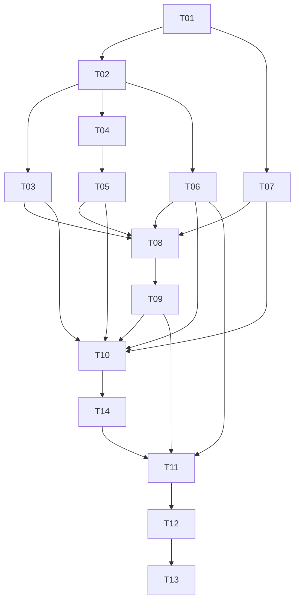

# CodingAgentNeo 任务分解

> 状态：已于 2026-08-30 通过用户变更审阅（新增 T14 前后端解耦）；T01～T10、T14 已接受
> 架构依据：[ARCHITECTURE.md](ARCHITECTURE.md)

本文将需求拆分为可独立验收的纵向任务。任务卡中的命令是目标质量门；只有 T01 实际建立并验证后，才可称为标准命令。

## 协作规则

- 开始任何任务前必须取得用户对当前执行范围的授权；T14 已接受，下一个依赖就绪任务为 T11。
- 编排器一次只选择一个依赖已完成且有证据的未勾选任务；每个任务 ID 必须使用一个全新的专用子 Agent，绝不复用到另一任务。
- Worker 只修改当前任务范围，保留工作区既有和无关变更，不得替未完成依赖发明临时实现。
- 公开接口、数据模型、状态机、安全或部署边界变化时，先更新 `ARCHITECTURE.md`、受影响卡片和必要的 `DECISIONS.md`。
- 只有全部验收项有实际证据且主 Agent 复核后，才可把 `[ ]` 改成 `[x]` 并追加日期、行为和真实验证结果。跳过或失败必须如实记录。

## 依赖总览

## 阶段 A：可验证的项目与运行契约

### [x] T01 — 建立可安装、可检查的 Python 项目骨架

**依赖:** 无  
**范围:** 创建 Python 3.12 `pyproject.toml`、`src/coding_agent_neo/` 与测试目录骨架、CLI 占位帮助入口、开发依赖、示例配置和 `.gitignore`；固化安装、lint、format-check、test、build 命令。仅建立基础设施，不实现 Agent、模型、工具或环境业务。  
**验收:**

- `python -m pip install -e ".[dev]"` 可在干净 Python 3.12 环境安装，且不需要 API Key。
- `python -m coding_agent_neo --help` 和 `coding-agent-neo --help` 均返回 0，只展示已在架构定义的公共选项或清晰标注尚未实现的子能力。
- 空项目的 Ruff、pytest 和 build 质量门均通过；构建产物、虚拟环境、本地配置、session 和凭据模式被忽略。
- 示例配置不含真实凭据；README 开发说明不夸大尚未实现的功能。

**验证:** `python -m pip install -e ".[dev]"`; `python -m ruff check .`; `python -m ruff format --check .`; `python -m pytest`; `python -m build`; `python -m coding_agent_neo --help`。

**完成摘要（2026-08-28）:** 已交付 Python 3.12 `src`-layout 可编辑安装骨架、两种 CLI help 入口、无凭据示例配置、分层测试目录和构建/运行时忽略规则；Agent、模型、工具、Environment、Session 与 Loop 均保持未实现。Worker 与主 Agent 在 Python 3.12.11 `.venv` 中验证 `pip install -e ".[dev]"`、Ruff lint/format、`pytest`（2 passed）、`python -m build`、模块/console-script help 和 `git diff --check` 均通过；隔离安装与构建需要正常访问依赖索引，宿主 Homebrew Python 的全局 pip 仍受 PEP 668 管理。

### [x] T02 — 固化 Runtime、Environment 与事件领域契约

**依赖:** T01  
**范围:** 实现后端无关数据模型、`AgentRuntime`/ContextState/BudgetTracker/CancellationSignal、ExecutionEnvironment Protocol、ToolExecutionContext、EventEnvelope 和 ID/时钟注入点；提供测试 fake environment。排除 Local I/O、JSONL、模型网络和 Agent Loop。  
**验收:**

- 两个 Runtime 默认不共享 context、预算、active tools、取消信号或 Environment 记录；root Runtime 也必须显式提供 agent/session/environment/policy。
- EventEnvelope 强制 schema/session/event/agent/sequence/type/timestamp，并将 parent/correlation/provider ID 语义区分清楚。
- Environment Protocol 覆盖 start/close 和六类操作，request/result 不包含 Local 或 Docker 专属字段。
- 数据模型校验非法 ID、负预算、重复 mutable default 等边界并有单元测试。

**验证:** `python -m pytest tests/unit/test_runtime.py tests/unit/test_models.py tests/unit/test_environment_contract.py`; `python -m ruff check .`; `python -m ruff format --check .`。

**完成摘要（2026-08-28）:** 已交付后端无关请求/结果与工具调用模型、每 Agent 独占的 ContextState/BudgetTracker/active tools/CancellationSignal、显式 AgentRuntime 依赖、ToolExecutionContext、ExecutionEnvironment Protocol、EventEnvelope 及可注入 ID/UTC/单调时钟；fake environment 只记录六类调用，不执行宿主机 I/O。内部 ID 使用受控语义字符串，厂商 tool-call ID 作为非空无 NUL 的不透明值原样保留。明确排除 Local I/O、JSONL、模型网络、工具执行和 Agent Loop。Worker 与主 Agent 在 Python 3.12.11 下验证 T02 定向测试 `17 passed`、全量 `19 passed`，Ruff lint/format、opaque provider ID 检查、workflow validator 和 `git diff --check` 均通过。

## 阶段 B：执行、工具、持久化与模型组件

### [x] T03 — 交付受 workspace 约束的 LocalExecutionEnvironment

**依赖:** T02  
**范围:** 实现 LocalEnvironment 生命周期、read/list/search/write/edit/run_command 六类操作、路径解析、结果限制、`rg` 检测/退化、取消和超时。排除 Tool schema、approval UI、Docker 和命令黑名单。  
**验收:**

- 临时 workspace 内六类操作返回后端无关结构化结果；shell cwd、exit code、stdout/stderr、timeout 和 duration 可观察。
- 绝对路径、`..`、现有 symlink 逃逸、待创建路径经 symlink 父目录逃逸均在副作用前拒绝。
- edit 对旧文本不存在或不唯一返回普通失败且不改文件；list/search/read 有界，超限明确标记。
- cancel、command timeout、close 后调用和缺少 `rg` 均有确定结果；不宣称 shell 被沙箱隔离。

**验证:** `python -m pytest tests/unit/environment/test_local_environment.py tests/security/test_workspace_boundary.py`; `python -m ruff check src/coding_agent_neo/environment tests/unit/environment tests/security`。

**完成摘要（2026-08-28）:** 已交付 workspace 约束的 `LocalExecutionEnvironment`，覆盖生命周期、read/list/search/write/edit/run_command、真实路径与待创建父目录校验、symlink 逃逸拒绝、有界结构化结果、`rg` 检测与显式标准库退化，以及 cancel/timeout/close 进程回收；README 明确 Local shell 继承宿主用户权限而非 OS sandbox。主 Agent 验收时发现并退回修复了 POSIX shell leader 先退出时后台 descendant 未被回收的问题，独立复现确认 `0.1s` 超时约 `0.102s` 返回且延迟 marker 未产生。Python 3.12.11 下定向测试 `11 passed`、全量 `30 passed`，Ruff lint/format、`python -m build`、workflow validator 与 `git diff --check` 均通过；未在 Linux/Windows 上验证。

### [x] T04 — 交付注册/激活分离的内置工具系统

**依赖:** T02  
**范围:** 实现 Tool Protocol、JSON schema 与参数校验、Registry/active tools、六个内置工具及统一 ToolResult/模型可见与持久化输出投影；所有副作用只调用 ToolExecutionContext.environment。排除策略询问、真实 Local 后端和 Agent Loop。  
**验收:**

- Registry 能注册全部工具，但 schema 只暴露 active tools；未知、未激活、非法 JSON、缺字段/类型错误产生结构化协议错误。
- 六个工具在 fake environment 上把参数和 cancellation 正确传递并将成功/失败归一化；测试证明 Tool 模块不直接执行宿主机 I/O/进程。
- ToolResult 保留 correlation/provider ID、status、文本、metadata、truncated、duration、exit/timeout/path；头尾截断报告原始长度。
- 每个工具 schema 可 JSON 序列化，名称稳定且与架构一致。

**验证:** `python -m pytest tests/unit/tools/test_registry.py tests/unit/tools/test_builtin_tools.py tests/unit/tools/test_output_projection.py tests/architecture/test_forbidden_dependencies.py`; `python -m ruff check src/coding_agent_neo/tools tests/unit/tools`。

**完成摘要（2026-08-28）:** 已交付 `Tool` Protocol、JSON-compatible schema 与参数校验、registered/active 分离的 Registry、六个内置工具、后端无关 `ToolResult` 归一化以及模型/持久化头尾输出投影；工具只通过 `ToolExecutionContext.environment` 转发请求与 cancellation，不直接访问宿主文件或进程。主 Agent 验收时发现并退回修复了公开 schema API 可绕过 active set 的缺口，最终所有 schema 枚举/单项查询均只允许 active tools。Python 3.12.11 下定向测试 `14 passed`、全量 `44 passed`，Ruff lint/format、`python -m build`、workflow validator、禁止依赖静态扫描与 `git diff --check` 均通过；明确排除 T05 的策略/approval 生命周期、真实 Local 集成和 Agent Loop。

### [x] T05 — 交付 fail-closed 策略与完整工具执行生命周期

**依赖:** T04  
**范围:** 实现默认 ExecutionPolicy、交互/非交互 approval 端口和 ToolExecutor；负责 correlation ID、校验、策略决定、异常捕获、事件发布和恰好一个 ToolResult。排除 CLI 渲染和 Agent 循环调度。  
**验收:**

- workspace 文件工具默认 allow、交互 bash ask、auto/yolo bash allow、越界/不安全参数 deny；策略抛异常时拒绝且不调用 Environment。
- ask 的批准/拒绝均生成 policy_decision；非交互 ask 立即拒绝，不等待 stdin。
- tool_call、policy_decision、tool_result 共享内部 correlation ID，provider ID 独立保留，不同调用不复用。
- 未注册/未激活/参数错误、用户拒绝、工具普通失败和未预期工具异常都恰好返回一个模型可见 ToolResult 并记录事件。

**验证:** `python -m pytest tests/unit/test_policy.py tests/unit/test_tool_executor.py tests/integration/test_tool_lifecycle.py`; `python -m ruff check src/coding_agent_neo/policy.py src/coding_agent_neo/executor.py tests`。

**完成摘要（2026-08-28）:** 已交付 fail-closed `DefaultExecutionPolicy`、交互/非交互 approval port、`ToolExecutor` 单调用生命周期与可由 T06 适配的最小事件发布端口；覆盖安全相对路径 allow、bash ask/auto/yolo/deny、策略/审批异常拒绝、唯一内部 correlation ID、独立 provider ID、参数校验、拒绝/普通失败/意外异常归一化及每次调用恰好一个 `ToolResult`/`tool_result` 事件。主 Agent 对抗验收时退回修复了不受信任工具名/参数键/validator path 的诊断泄漏，以及 lifecycle event ID 绕过 Runtime ID factory 的问题。Python 3.12.11 下定向测试 `24 passed`、全量 `68 passed`，敏感哨兵与注入 ID 对抗脚本、Ruff lint/format、`python -m build`、workflow validator、依赖边界扫描与 `git diff --check` 均通过；未实现 T06 持久化/扇出、CLI、Agent Loop 或真实 Local 集成。

### [x] T06 — 交付 append-only Session Store 与事件扇出

**依赖:** T02  
**范围:** 实现 EventEmitter、Session Store 的统一 sequence 分配、JSONL append/flush/有界持久化、订阅扇出和安全序列化；可读取完整记录并诊断损坏尾行。排除上下文投影、CLI 展示和业务恢复。  
**验收:**

- 标准事件能写成每行一个 schema v1 JSON object；event ID 唯一、sequence 单调无重复、所有事件含 agent ID。
- 每个关键 append 可被另一文件句柄立即读取；中途异常不会改写既有行。
- 超大 payload 按 session 上限头尾截断并记录原始长度；厂商对象和 secret 字段不能未经处理进入文件。
- 一个 emitter 可同时通知 Store 和 fake renderer；单个订阅者失败不伪造其他订阅者成功，处理语义有测试。
- 尾部不完整行被定位和报告，之前的完整事件仍可读取。

**验证:** `python -m pytest tests/unit/test_events.py tests/unit/test_session_store.py tests/security/test_event_redaction.py`; `python -m ruff check src/coding_agent_neo/events.py src/coding_agent_neo/session.py tests`。

**完成摘要（2026-08-29）:** 已交付 Store-first `EventEmitter`、统一 sequence/event ID 管理、append-only UTF-8 JSONL `SessionStore`、逐事件 flush/默认 `fsync`、安全 JSON 化与敏感字段递归脱敏、UTF-8 字节上限内的 payload 头尾预览、同步订阅扇出和逐订阅者 success/failed/skipped 报告，以及完整记录读取和损坏尾行定位。T05 `ToolLifecycleEvent` 可直接适配为 canonical `EventEnvelope`；主 Agent 审查时修复了 usage 的 `input_tokens`/`output_tokens` 被误判为凭据的问题，同时保持 access/generic token 字段脱敏。Python 3.12.11 下定向测试 `19 passed`、T02/T05 回归矩阵 `41 passed`、全量 `87 passed`；Ruff lint/format、`python -m build`、workflow validator、独立凭据/截断/重开/部分扇出失败对抗脚本与 `git diff --check` 均通过。上下文投影、CLI/renderer 具体展示、业务恢复和 Agent Loop 保持未实现。

### [x] T07 — 交付 OpenAI-compatible 模型访问与有界重试

**依赖:** T01  
**范围:** 实现 ModelClient 接口与 Chat Completions 适配器、请求构造、原生 tool calls/usage/finish reason 归一化、错误分类、退避策略和脱敏。使用 mock transport，不接入 Agent Loop 或 compaction 决策。  
**验收:**

- 标准 messages 和 active schemas 被传给客户端；零/单/多 tool call 按厂商顺序归一化，arguments 原文和 provider ID 保留。
- 瞬时网络、429 和选定 5xx 有上限指数退避；认证/权限/模型/配置错误不重试；context overflow 被单独分类交给调用方。
- 响应缺失/冲突 tool-call ID、非法 arguments 不使适配器崩溃，而以足够信息交由协议边界处理。
- 测试日志、异常和归一化对象中无 API Key、Authorization 或请求头泄漏；不使用 Markdown/正则解析主要工具调用。

**验证:** `python -m pytest tests/unit/model/test_openai_compatible.py tests/unit/model/test_retry.py tests/security/test_model_redaction.py`; `python -m ruff check src/coding_agent_neo/model_client.py tests/unit/model`。

**完成摘要（2026-08-29）:** 已交付同步 `ModelClient` Protocol 与 OpenAI-compatible Chat Completions 适配器，标准 messages、active tool schemas 和 parameters 通过官方 OpenAI client 传输；SDK 内部重试被关闭，项目层仅对网络/超时、429、408 与选定 5xx 做可注入、有限指数退避。新增不含内部 correlation ID 的 `NormalizedAssistantResponse`/`NormalizedToolCall`/`NormalizedUsage`，保持合法 provider ID、非敏感 arguments 原文、tool call 顺序、usage 和 finish reason，并把缺失/重复 ID、非法 arguments 和缺失响应转为稳定诊断；认证、权限、模型、配置与 context overflow 分类明确且不误重试。异常、日志、归一化文本和 arguments 不保留凭据或 provider headers/body。Python 3.12.11 下 T07 定向测试 `25 passed`、T02/T05 回归 `41 passed`、全量 `112 passed`；Ruff lint/format、`python -m build`、workflow validator、官方 SDK + `httpx.MockTransport` 的 429/401/context overflow/凭据对抗脚本与 `git diff --check` 均通过。未执行真实网关调用，也未接入 Agent Loop 或 compaction。

## 阶段 C：可运行核心闭环与上下文管理

### [x] T08 — 交付可独立实例化、有界的 Agent Loop

**依赖:** T03, T05, T06, T07  
**范围:** 通过显式 ModelClient、ToolRegistry、EventEmitter 和 AgentRuntime 实现 LLM→tools→results 循环、状态机、串行多调用、预算、协议错误上限、中断和异常结束。Loop 只面向 active Tool 通用协议，并在组装时保证 Runtime 与 Registry active view 一致。先使用简单未压缩 Context Builder；排除自动 compaction、CLI、session 恢复与任何 Skill/MCP 具体实现。

**验收:**

- scripted fake model 能驱动 read/search/edit/bash 与一个显式注入的非内置 fake Tool、看到失败结果后修正，并以无 tool call assistant 文本完成；Loop 对 Tool 来源无分支，多调用严格保持声明顺序。
- 每轮 user/assistant/tool/turn/error/agent/session 事件顺序、ID 和结果完整；普通工具失败不终止，未捕获系统异常尽力写结束事件并返回 FAILED。
- model steps、tool calls、连续协议错误、墙钟和命令限制命中时给出具体 LIMIT_REACHED，不无限循环。
- Ctrl+C/cancellation 产生 INTERRUPTED 并关闭 Environment；交互 turn 完成不等于 session 强制结束。
- 同进程两个 Loop 使用不同 Runtime 时消息、预算、tools、cancel 和 Environment 记录互不污染，且无模块级当前状态。
- Loop 创建时若 `AgentRuntime.active_tools` 与 Registry active view 不一致则在任何模型或工具副作用前失败，消除两个可变 active 事实源。

**验证:** `python -m pytest tests/integration/test_agent_loop.py tests/integration/test_agent_limits.py tests/integration/test_runtime_isolation.py`; `python -m ruff check src/coding_agent_neo/agent_loop.py tests/integration`。

**完成摘要（2026-08-29）:** 已交付显式注入 `ModelClient`/`ToolRegistry`/`EventEmitter`/`AgentRuntime` 的同步串行 Agent Loop、简单未压缩上下文投影、交互 follow-up 生命周期、预算/连续协议错误/墙钟上限、中断与异常结束、Runtime 隔离及 active-tool 双事实源前置拒绝；内置工具与显式注入的非内置 fake Tool 共用同一协议路径。主 Agent 首轮验收退回了批次终止时未配对 tool call 与 Store-first 失败被吞掉的缺口；修正后，所有已持久化声明调用都有唯一关联结果，未执行调用以 `executed=false` 无副作用闭合，工具生命周期主 Store 写失败则 fail-closed，仅 renderer 失败不否定已持久化事实。Python 3.12.11 `.venv` 中主 Agent 独立复验 T08 定向 `20 passed`、T05/T06 回归 `45 passed`、全量 `134 passed`，Ruff lint/format-check、`python -m build`、workflow validator、配对/Store 失败对抗脚本、静态边界扫描与 `git diff --check` 均通过；证据仅基于 scripted fake model/environment，未执行真实网关、CLI、compaction、resume 或跨平台验证。

### [x] T09 — 交付按 Runtime 隔离的上下文预算与增量压缩

**依赖:** T08  
**范围:** 接收组装层显式提供的 system prompt，实现 token 近似估算、Context Builder、完整工具交互分组、阈值触发 Compactor、一次强制压缩重试和有界失败退化；与 Loop 集成。排除跨 Agent 历史拼接、可执行 compaction tools、Skill 目录发现/解析/加载与 MCP 上下文。

**验收:**

- system prompt 是显式构造参数，Context Builder 不扫描 Skill 或其他外部资源；输入预算覆盖完整 system prompt、tool schemas、summary、有效消息、tool results 和预留输出，并在 API 超窗前触发。
- 小窗口测试中只压缩当前 agent；旧 summary + 较早历史生成新 summary，原始 JSONL 不变，compaction 事件记录 covered sequence。
- assistant tool call 与对应 tool results 始终同组保留/压缩；其他 Agent 内部消息不进入当前 Context。
- compaction 请求无 tools，summary 包含任务、约束、决策、文件、测试、未决项；失败只做有界退化，仍超窗明确 FAILED/LIMIT_REACHED。
- ModelClient 报 context overflow 时最多强制压缩重试一次。
- compaction 前后的每次请求都完整保留同一显式 system prompt；测试可注入任意只读文本，但不实现或声称 Skill 支持。

**验证:** `python -m pytest tests/unit/test_context_builder.py tests/unit/test_compactor.py tests/integration/test_loop_compaction.py`; `python -m ruff check src/coding_agent_neo/context.py src/coding_agent_neo/compactor.py tests`。

**完成摘要（2026-08-29）:** 已交付显式 system prompt 驱动、按 Runtime 隔离的 Context Builder 与增量 Compactor，使用保守 token 估算统一计入 prompt、active tool schemas、summary、有效消息/工具结果和输出预留；压缩只处理完整交互组，以无 tools 模型请求生成包含任务、约束、决策、文件、测试和未决项的增量 summary，并把 covered sequence 追加为 compaction 事件而不改写原 JSONL。普通压缩失败只执行一次完整组退化并注入提示，仍超窗返回 `LIMIT_REACHED(context_window)`；provider context overflow 最多触发一次强制压缩重试，主 Store 写入失败回滚 Runtime 投影并 fail-closed。Python 3.12.11 `.venv` 中主 Agent 独立复验 T09 定向 `17 passed`、T08 回归 `20 passed`、全量 `151 passed`，Ruff lint/format-check、`python -m build`、CLI help、workflow validator 与 `git diff --check` 均通过；未执行真实网关调用，`tests/acceptance` 尚由 T12 建立，当前 0 项并返回 pytest 5，不作为本卡通过证据。

## 阶段 D：用户入口与恢复

### [x] T10 — 交付配置、交互/非交互 CLI 与事件渲染

**依赖:** T03, T05, T06, T07, T09  
**范围:** 实现架构定义的配置来源和校验、显式 system prompt/依赖组装、两种 CLI 模式、approval 交互、Terminal Renderer、统计和进程退出码。排除 session resume 业务、完整 TUI、Skill/MCP 配置或其他具体接入。

**验收:**

- CLI > 环境变量 > 未入库 TOML > 默认值覆盖顺序有测试；API key 只按环境变量名读取，缺失/非法配置在任何副作用前失败且脱敏。
- 交互模式支持初始任务、bash 确认、turn 后 follow-up、Ctrl+C；非交互支持 `--task`/stdin，ask 不阻塞，auto 可无人值守。
- Renderer 展示 assistant、工具关键参数/结果、approval、退出码/耗时、计数、compaction/retry/limit/final state，并对大输出有界展示。
- `--help`、成功、配置失败、FAILED、LIMIT_REACHED、INTERRUPTED 的退出码和 stdout/stderr 契约被文档化并集成测试。
- Session 文件默认生成且可解析；终端展示、模型投影与持久化截断事实一致。

**验证:** `python -m pytest tests/unit/test_config.py tests/unit/test_renderer.py tests/integration/test_cli.py`; `python -m ruff check .`; `python -m ruff format --check .`; `python -m build`。

**完成摘要（2026-08-29）:** 已交付 CLI > `CODING_AGENT_NEO_*` 环境变量 > 未入库 `.coding-agent-neo.toml` > 默认值的配置解析与副作用前校验，API key 只按环境变量名解析且不进入 repr/诊断；完成显式 system prompt、六个内置工具、root Runtime、Local Environment、Store-first EventEmitter/Renderer 和 OpenAI-compatible ModelClient 的组装。交互模式支持初始任务、bash 确认、turn 后 follow-up 与 Ctrl+C，非交互模式支持 `--task`/stdin、ask 立即拒绝与 auto/yolo；stdout/stderr 和退出码契约、默认可解析 JSONL session、有界事件展示、retry/compaction/预算统计均有测试与文档。主 Agent 在 Python 3.12.11 `.venv` 中独立复验定向测试 `17 passed`、全量 `166 passed`，Ruff lint/format-check、`python -m build`、workflow validator、CLI help 与 `git diff --check` 均通过；未执行真实网关调用，session resume、完整 TUI 与 Skill/MCP 具体接入仍明确排除。

### [x] T14 — 交付前端与 Agent 后端的命令/事件解耦

**依赖:** T10

**范围:** 按 `ARCHITECTURE.md` 6.6 实现 `AgentCommand` 与 `AgentBackend` 契约、`assembly.py` 组装入口、`backend.py` 的 `LocalAgentBackend`（单 worker 线程、命令分发、Event Stream 游标缓冲、Channel Approval Port 与 `approval_request` 事件），并把 `cli.py` 改写成只依赖该契约的前端；`renderer.py` 由前端事件循环驱动，不再订阅 EventEmitter。保持现有 CLI 选项、stdout/stderr 与退出码契约不变。排除 Web GUI/HTTP 前端、跨进程传输、运行中 steering 或后台输入队列、session resume 业务、完整 TUI、`agent_loop.py`/`executor.py`/`policy.py`/`events.py` 的行为变更。

**验收:**

- `cli.py` 不再 import `AgentLoop`、`AgentRuntime`、`SessionStore`、`LocalExecutionEnvironment`、`ModelClient` 实现或 `ToolRegistry`；静态检查证明 `backend.py`/`assembly.py` 及其下游不 import `cli.py`/`renderer.py`，也不直接使用 `sys.stdin`/`sys.stdout`/`sys.stderr`。
- 交互模式 bash 确认走完整反转链路：`approval_request` 事件先落盘，前端回 `ApprovalResponse` 后才执行；批准与拒绝都产生同 correlation ID 的 `policy_decision`，行为与 T10 一致。
- approval fail-closed 有测试：等待超时、`Interrupt`、`close()` 和 `request_id` 不匹配四种情况均按拒绝处理且不触发 Environment 副作用；非交互 `ask` 仍在 policy 层直接拒绝，不发出 `approval_request`。
- `events(since=n)` 返回的事件 sequence 连续、无重复、与 JSONL 一致；中途停止迭代后用新游标重新进入可拿到完整后续事件；前端渲染缓慢不阻塞 Loop 与持久化。
- turn 执行期间提交 `SubmitTask` 被明确拒绝；`Interrupt` 能在有界时间内让运行中的 bash 命令停止并以 `INTERRUPTED` 与退出码 130 结束。
- `--help`、成功、配置失败、`FAILED`、`LIMIT_REACHED`、`INTERRUPTED` 的退出码与 stdout/stderr 契约与 T10 完全一致，退出码由 `last_state` 推导；非交互 `--task`/stdin 与 `--yolo` 行为不变。
- T05、T06、T08、T09、T10 的既有测试在不放宽断言的前提下全部通过；线程相关测试通过注入的超时参数保证确定性。

**验证:** `python -m pytest tests/unit/test_backend.py tests/unit/test_renderer.py tests/integration/test_cli.py tests/integration/test_frontend_contract.py tests/architecture/test_forbidden_dependencies.py`; `python -m pytest`; `python -m ruff check .`; `python -m ruff format --check .`; `python -m build`。

**完成摘要（2026-08-30）:** 已交付 `AgentCommand`/`AgentBackend` 契约、`assembly.py` 的 `build_local_backend`、同进程 `LocalAgentBackend`（单 worker 线程、命令分发、Event Stream 游标缓冲、Channel Approval Port），以及只发命令、按 sequence 游标拉事件的 CLI 前端；`renderer.py` 不再订阅 EventEmitter。交互 `ask` 先持久化 `approval_request` 再等待 `ApprovalResponse`；超时/`Interrupt`/`close()`/`request_id` 不匹配 fail-closed 拒绝且无 Environment 副作用；非交互 `ask` 仍在 policy 层拒绝且不发请求。T10 的 CLI 选项、stdout/stderr 与退出码 `0/1/2/3/130` 保持不变，退出码由 `last_state` 推导。未改 `agent_loop.py`/`executor.py`/`policy.py`/`events.py` 行为，未实现 resume。主 Agent 独立复验定向测试 32 passed、T05/T06/T08/T09/T10 回归矩阵 107 passed、全量 `185 passed`，Ruff lint/format-check、`python -m build`、CLI help、workflow validator 与 `git diff --check` 均通过。

### [ ] T11 — 交付线性 Session 恢复与 follow-up

**依赖:** T06, T09, T14

**范围:** 实现 `--resume` 加载、schema/session/sequence 校验、损坏尾行诊断、root Runtime 状态重建、最新 compaction 投影和 follow-up；绝不重放历史工具副作用。恢复在 `assembly.py` 的组装入口完成，`cli.py` 只传递选项并按既有游标语义消费事件。排除 branch/fork/tree 和 child Agent 恢复。

**验收:**

- 正常 session 恢复相同 session/root agent ID、预算计数、active tools、取消合理初值和最新有效 context，随后可接受 follow-up。
- 最后一行不完整时报告并仅使用之前完整事件；中间损坏、schema 不兼容或 ID/sequence 破坏明确拒绝或按文档策略失败。
- 恢复过程中 fake/local environment 均未收到历史写文件或命令调用；只执行新 follow-up 产生的调用。
- 恢复后的事件 sequence 接续且无重复，新的 compaction/turn/session 事件仍可解析。

**验证:** `python -m pytest tests/unit/test_session_recovery.py tests/integration/test_resume_cli.py`; `python -m ruff check src/coding_agent_neo/session.py src/coding_agent_neo/assembly.py src/coding_agent_neo/cli.py tests`。

## 阶段 E：验收、说明与提交准备

### [ ] T12 — 完成全基线验收与真实编程任务演练

**依赖:** T11  
**范围:** 建立 AC-01～AC-14 的聚合验收套件、静态依赖审查、安全/异常场景和一个小型真实缺陷仓库演练；修复仅限已定义契约内缺陷，发现契约缺口先走变更控制。排除 Docker、子 Agent、Skill/MCP 具体实现和未列入首版的增强。

**验收:**

- AC-02～AC-14 均有自动化或明确可复现证据，覆盖协议/工具失败、逃逸、权限、轨迹、resume、compaction、限制、secret、Environment 替换、Runtime 隔离、ID 关联和生命周期。
- AC-01 在小型仓库完成探索、搜索、修改、测试失败后修正和最终总结；若使用真实 API，模型/网关与时间被记录但凭据不落盘。
- 静态检查确认工作区 Tool 无宿主 I/O/进程、只有 LocalEnvironment 含通用宿主文件/命令副作用、Loop 无工具来源分支和进程级可变运行状态、Context Builder 不扫描 Skill 或外部资源、前端不持有 Agent 对象且后端不依赖终端 I/O。
- fake 边界证据只证明显式 system prompt 和通用 Tool 可注入，不得将其表述为已实现或验证 Skill/MCP。
- 全量 lint、format-check、test、build 通过；任何不可用外部服务或平台验证明确保留为限制，不能以 mock 冒充。

**验证:** `python -m ruff check .`; `python -m ruff format --check .`; `python -m pytest`; `python -m pytest tests/acceptance -m acceptance`; `python -m build`; 按 `docs/acceptance-runbook.md` 执行并保存脱敏结果。

### [ ] T13 — 准备可审计的 README、演示与提交清单

**依赖:** T12  
**范围:** 根据真实功能和验证结果完成不超过 1000 汉字的 `README.txt`、运行/安全说明、2 分钟演示脚本与录制清单、公开仓库/zip/截止时间检查表。外部发布、推送、录屏和提交必须由用户明确执行或授权，不在任务中擅自进行。  
**验收:**

- README.txt 包含公开仓库地址占位/最终值、可复现运行步骤、真实特色与限制，不含 API Key，正文满足 1000 汉字限制。
- 演示脚本覆盖真实任务闭环和关键设计解释；最终 mp4 人工确认不超过 2 分钟、200 MB，画面/日志无凭据和私密路径。
- 提交清单核对公开仓库为题目后新建、历史未压缩改写、2026-09-02 24:00（北京时间）后不再推送，以及“姓名.zip”只含 README.txt 和视频。
- 架构、任务、进度和决策描述同一最终系统，所有勾选任务均有验证证据；skill 结构校验通过。

**验证:** `python -m pytest`; `python -m build`; `python /Users/jay/.codex/skills/orchestrate-spec-driven-development/scripts/validate_workflow.py --repo docs/baseline`; README 字数检查；`ffprobe` 检查最终视频时长/大小；人工提交清单审阅。

## 推荐顺序

依赖相同时优先沿关键路径推进：T01 → T02 → T03 → T04 → T05 → T06 → T07 → T08 → T09 → T10 → T14 → T11 → T12 → T13。T14 排在 T11 之前，是为了让 resume 直接建立在解耦后的组装入口上，避免在旧结构上实现一次再返工。实际选择仍以“依赖全部勾选且有证据”为准，不允许因推荐顺序跳过依赖。
