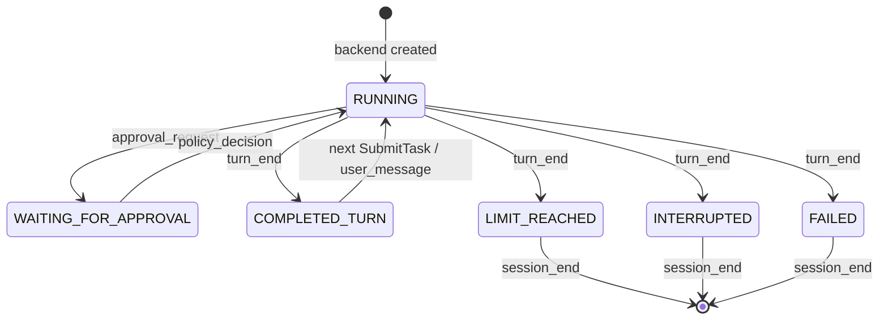

# CodingAgentNeo 前后端交互接口规范

> 规范版本：1.0  
> 事件 schema：1  
> 基线日期：2026-08-31  
> 适用实现：baseline 完成态  
> 规范来源：`backend.py`、`models.py`、`agent_loop.py`、`executor.py`、`assembly.py` 与前端契约测试

本文是替换或新增 CodingAgentNeo 前端时的接口依据。文中的“必须”“不得”“应当”是规范性要求；示例只说明结构，不保证 ID、时间戳或具体文案固定。

当前交付的是**同进程 Python 接口**，不是 HTTP、WebSocket 或 RPC 服务。未来若增加跨进程传输适配层，必须保持本文的命令、事件、游标、状态和授权语义；JSON 表示可直接作为传输层 DTO，但不能据此声称 baseline 已提供网络接口。

## 1. 边界与职责

前端只能：

- 通过组装层取得 `AgentBackend`；
- 用 `send(command)` 发送命令；
- 用 `events(since=sequence)` 拉取事件；
- 读取 `last_state`；
- 在结束时调用 `close()`。

前端负责用户输入、授权界面、事件展示、游标保存和产品层导航。前端不得持有或直接调用 `AgentLoop`、`AgentRuntime`、`SessionStore`、`ExecutionEnvironment`、`ModelClient`、`ToolRegistry`，也不得复制工具策略、路径安全、Agent 决策或持久化逻辑。

后端负责 turn 串行化、模型和工具执行、策略判断、授权等待、取消、事件持久化和状态推导。后端不得读取终端输入、写终端输出或回调前端对象。

## 2. 接入入口

生产前端通过组装层创建本地后端：

```python
from coding_agent_neo.assembly import build_local_backend

backend = build_local_backend(config, interactive=True, resume=None)
```

| 参数 | 类型 | 语义 |
| --- | --- | --- |
| `config` | `AppConfig` | 已解析并校验的后端配置 |
| `interactive` | `bool` | 是否允许通过事件向前端请求交互授权 |
| `resume` | `str \| PathLike \| None` | session ID 或 JSONL 路径；恢复同一线性会话，不重放历史工具副作用 |

`model_client`、`environment`、三个 timeout 和 `fsync` 是测试或受控嵌入场景的注入点，不应成为普通前端设置。

当前 `LocalAgentBackend` 额外暴露 `resume_last_sequence` 和 `resume_diagnostics`，但它们不属于 `AgentBackend` Protocol。baseline CLI 会用前者作为恢复后的初始游标，并展示后者。需要可移植恢复能力的未来传输协议，应先把恢复元数据提升为正式契约，不能假定所有 `AgentBackend` 实现都有这两个属性。

## 3. `AgentBackend` Protocol

```python
class AgentBackend(Protocol):
    @property
    def last_state(self) -> RuntimeState: ...

    def send(self, command: AgentCommand) -> None: ...

    def events(self, *, since: int = 0) -> Iterator[EventEnvelope]: ...

    def close(self) -> None: ...
```

### 3.1 `send(command)`

- 接受且仅接受第 4 节的四种命令。
- 调用是线程安全、非阻塞的；成功返回只表示命令已被接受或信号已送达，不表示 turn 已完成。
- `SubmitTask` 进入唯一 worker 队列；同一时刻最多执行一个 turn。
- `ApprovalResponse` 和 `Interrupt` 在调用线程立即送入授权通道或取消信号，不排队等待当前 turn 结束。
- `CloseSession` 立即关闭命令入口并请求有序停机。

| 异常 | 条件 | 前端处理 |
| --- | --- | --- |
| `TypeError` | 命令不是公开 `AgentCommand` | 编程错误；不得重试原对象 |
| `TurnInProgressError` | turn 执行中再次发送 `SubmitTask` | 保留输入或提示用户稍后重试；不得当作后台排队成功 |
| `BackendClosedError` | 后端关闭后发送任何命令 | 停止发送并结束该后端实例 |

命令构造器还会对非法字段抛出 `TypeError` 或 `ValueError`，见第 4 节。

### 3.2 `events(since=n)`

- `n` 必须是非负整数且不能是 `bool`。
- 返回所有 `sequence > n` 的缓冲事件，然后等待后续事件。
- 每次 yield 后，前端必须把本地游标更新为该事件的 `sequence`。
- 后端关闭且缓冲已排空时，迭代器正常结束。
- 同一后端可多次调用；重新 attach 时传最后成功处理的 sequence。
- 慢消费者不会阻塞 Agent 执行或 JSONL 落盘。

`events()` 是长迭代器，不是“一次请求一个批次”。前端需要停止消费时可结束自身循环；需要停止 Agent 时必须另发 `Interrupt` 或 `CloseSession`。

### 3.3 `last_state`

`last_state` 是事件流派生的只读快照，不是独立事实源。初始值为 `RUNNING`；收到 `approval_request` 后为 `WAITING_FOR_APPROVAL`，对应 `policy_decision` 后回到 `RUNNING`；结束类事件中的合法 `payload.state` 会更新它。

前端必须以 `turn_end` 作为一个 turn 的完成边界，以 `session_end` 或事件流结束作为会话生命周期结束边界。不要只靠轮询 `last_state` 判断某个事件是否已经处理。

| 状态 | 含义 | 是否可提交 follow-up |
| --- | --- | --- |
| `RUNNING` | turn 正在运行或后端等待新 turn 的初始态 | 仅在没有 turn 执行时可提交 |
| `WAITING_FOR_APPROVAL` | 后端正等待一个授权响应 | 否；只能响应授权、中断或关闭 |
| `COMPLETED_TURN` | 最近 turn 正常完成，session 仍保持打开 | 是 |
| `LIMIT_REACHED` | 达到预算或上下文限制 | 否，终止态 |
| `INTERRUPTED` | 用户或前端取消 | 否，终止态 |
| `FAILED` | 不可恢复系统错误 | 否，终止态 |

### 3.4 `close()`

`close()` 是幂等清理操作：请求 worker 停止、在配置上限内等待、关闭 Loop、Session Store 和事件流。所有拥有后端实例的前端都必须在 `finally` 或等价生命周期钩子中调用它。

| 配置 | 默认值 | 含义 |
| --- | ---: | --- |
| approval timeout | 120 s | 后端等待授权响应的上限 |
| worker shutdown timeout | 30 s | `close()` 等待 worker 的上限 |
| event poll timeout | 0.1 s | 事件迭代器内部有界等待，用于保持前端中断响应性 |

## 4. 命令规范

命令对象不可变、可 JSON 化且不得携带 callback、UI 句柄或其他可调用对象。`to_dict()` 的 `type` 使用下列区分大小写的名称。

### 4.1 `SubmitTask`

```json
{"type":"SubmitTask","text":"检查并修复失败的测试"}
```

- `text`：必填字符串；去除空白后不得为空。
- 只允许在没有 turn 执行时发送。
- 成功 turn 结束后可再次发送，形成同一 session 的线性 follow-up。
- baseline 不支持运行中 steering、消息排队、并行 turn 或后台任务。

### 4.2 `ApprovalResponse`

```json
{"type":"ApprovalResponse","request_id":"correlation_ab12","approved":true}
```

- `request_id`：必填非空字符串，必须原样复制 `approval_request.payload.request_id`。
- `approved`：必须是 JSON boolean，不能用 `0`、`1`、`"yes"` 等代替。
- 没有待处理授权时发送该命令不会产生批准效果。
- ID 不匹配时，当前待处理授权按 fail-closed 拒绝；前端不得猜测、缓存复用或改写 request ID。

### 4.3 `Interrupt`

```json
{"type":"Interrupt","reason":"user_cancelled"}
```

- `reason`：非空字符串，默认 `interrupted`。
- 立即设置当前 Runtime 的协作式取消信号，并使挂起授权按拒绝处理。
- 中断是 session 的终止路径，不是暂停；通常会依次看到 `turn_end(INTERRUPTED)`、`agent_end`、`session_end`。

### 4.4 `CloseSession`

```json
{"type":"CloseSession","reason":"frontend_exit"}
```

- `reason`：非空字符串，默认 `session_closed`。
- 立即拒绝后续命令；若 turn 正在运行，同时请求取消。
- 该命令本身不等待完整清理；随后仍须调用 `close()`。

## 5. 事件信封

```json
{
  "schema_version": 1,
  "session_id": "session_...",
  "event_id": "event_...",
  "agent_id": "agent_...",
  "parent_agent_id": null,
  "sequence": 7,
  "type": "assistant_message",
  "correlation_id": null,
  "provider_tool_call_id": null,
  "timestamp": "2026-08-31T08:00:00.123456Z",
  "payload": {}
}
```

| 字段 | v1 约束 |
| --- | --- |
| `schema_version` | 当前固定为 `1` |
| `session_id` | 同一线性 session 内稳定 |
| `event_id` | session 内唯一 |
| `agent_id` | 事件所属 Agent；baseline 只有 root Agent |
| `parent_agent_id` | root Agent 为 `null`；保留给未来层级，不代表 baseline 支持子 Agent |
| `sequence` | Store 分配，从 1 开始严格递增且不重复；游标比较使用 `>` |
| `type` | 第 6 节事件名；消费者应忽略未知事件类型 |
| `correlation_id` | 一次工具生命周期的内部关联 ID，否则通常为 `null` |
| `provider_tool_call_id` | 模型供应方的不透明调用 ID；不得与 correlation ID 混用 |
| `timestamp` | UTC ISO 8601，使用 `Z` 后缀 |
| `payload` | JSON object；按事件类型解释 |

事件采用 Store-first 语义：只有成功分配 sequence 并写入 JSONL 的 canonical event 才会进入前端事件流。因此前端看到的事实与审计轨迹一致。

### 5.1 payload 截断与兼容性

事件进入 Store 前会递归安全 JSON 化并脱敏常见凭据字段和内联 secret。若整个 payload 超过 `session_output_limit`，payload 会被整体替换成以下预览对象：

```json
{
  "truncated": true,
  "original_length": 123456,
  "limit": 1000000,
  "encoding": "utf-8",
  "head": "...",
  "tail": "..."
}
```

因此前端必须容忍 payload 内的业务字段缺失、为 `null`，或因整体截断而不可按原事件结构解析；展示层不得因为单个未知/不完整 payload 崩溃。envelope 的 `payload` 本身始终是 JSON object。`tool_result.result.truncated` 只表示工具文本投影截断，与上述“整个事件 payload 截断”是两个层次。

## 6. 标准事件目录

表中 `?` 表示字段可能缺省或为 `null`。消费者应读取所需字段并忽略新增字段。

| `type` | payload v1 | 前端用途 |
| --- | --- | --- |
| `session_start` | `state` | 标记后端运行环境已启动 |
| `agent_start` | `state`, `active_tools[]` | 展示 Agent 和可用工具 |
| `user_message` | `text` | 回显/记录本 turn 输入 |
| `assistant_message` | `text`, `finish_reason?`, `usage?`, `diagnostics[]`, `tool_calls[]` | 增量展示一次完整模型响应；当前不是 token streaming |
| `tool_call` | `tool_name`, `name`, `argument_keys[]`, `arguments`, `arguments_length?` | 展示工具即将进入执行生命周期；参数值已替换为 `<redacted>` |
| `approval_request` | `request_id`, `tool_name`, `arguments_summary`, `timeout_seconds` | 向用户请求授权并回送 `ApprovalResponse` |
| `policy_decision` | `tool_name`, `name`, `requested`, `requested_decision`, `decision`, `action`, `approved?`, `reason` | 展示最终 allow/deny 审计结果 |
| `tool_result` | `tool_name`, `name`, `status`, `text`, `truncated`, `original_length?`, `result`, `tool_result` | 展示结构化工具结果；`result` 与 `tool_result` 当前为同一投影的兼容别名 |
| `compaction` | `status`, `forced`, `source_start_sequence`, `source_end_sequence`, `covered_through_sequence`, `degraded_through_sequence?`, `summary?`, `error_type?`, `reason?` | 展示上下文压缩或退化 |
| `retry` | 见 6.5 | 展示模型传输重试或 context overflow 强制压缩重试 |
| `turn_end` | `state`, `reason`, `limit_reason?`, `assistant_text`, `budget` | **唯一 turn 完成边界** |
| `error` | 见 6.6 | 展示可恢复协议错误或不可恢复系统错误 |
| `agent_end` | `state`, `reason`, `budget` | Agent 生命周期结束 |
| `session_end` | `state`, `reason`, `budget` | session 生命周期结束 |

### 6.1 `assistant_message.tool_calls[]`

```json
{
  "correlation_id": "correlation_...",
  "provider_tool_call_id": "call_...",
  "name": "read_file",
  "raw_arguments": "{\"path\":\"README.md\"}",
  "diagnostics": []
}
```

`raw_arguments` 是经过模型边界脱敏的 JSON 文本，不保证可解析；无效工具名对前端显示为 `<invalid-tool-name>`。前端不得依据这里的参数自行执行工具。

### 6.2 授权事件

```json
{
  "type": "approval_request",
  "correlation_id": "correlation_...",
  "payload": {
    "request_id": "correlation_...",
    "tool_name": "bash",
    "arguments_summary": "\"python -m pytest\"",
    "timeout_seconds": 120.0
  }
}
```

必须满足：

```text
payload.request_id == envelope.correlation_id
```

`arguments_summary` 是已脱敏、最多约 300 字符的展示字符串；对 `bash`，它是命令字符串的 JSON 编码，而不是可执行参数。前端只能展示它，不能将其当作可信命令重新解析或执行。

同一工具调用的 `tool_call`、可选 `approval_request`、`policy_decision` 和 `tool_result` 使用同一 `correlation_id`。`policy_decision.requested` 是策略初始答案，`decision` 是授权后最终答案，枚举为 `allow | ask | deny`；最终 `decision` 不会保持 `ask`。`approved` 在发生用户授权时为 boolean，未发生授权时通常为 `null`。

非交互后端遇到 `ask` 会直接产生 deny 的 `policy_decision`，不会产生 `approval_request`。

### 6.3 `tool_result.result`

```json
{
  "correlation_id": "correlation_...",
  "provider_tool_call_id": "call_...",
  "status": "success",
  "text": "...",
  "metadata": {},
  "truncated": false,
  "original_length": null,
  "duration_seconds": 0.012,
  "exit_code": 0,
  "timed_out": false,
  "path": null
}
```

`status` 枚举：`success | error | denied | invalid | cancelled | timeout`。普通工具失败仍是 `tool_result`，不会直接结束 Loop；前端不得仅因 status 非 success 就把整个 session 标成 `FAILED`。

### 6.4 `budget`

`turn_end`、`agent_end` 和 `session_end` 的 `budget` 结构为：

```json
{
  "model_steps": 3,
  "tool_calls": 2,
  "protocol_errors": 0,
  "input_tokens": 1200,
  "output_tokens": 240,
  "started_at": 12345.0,
  "deadline": 12465.0,
  "max_steps": 20,
  "max_tool_calls": 40,
  "max_protocol_errors": 3,
  "max_wall_seconds": 120.0,
  "elapsed_seconds": 4.2
}
```

`started_at` 和 `deadline` 是进程内单调时钟值，只适合计算和诊断，不能当作墙钟时间、跨进程时间戳或前端倒计时的持久基准。

### 6.5 `retry`

模型传输重试：

```json
{"reason":"rate_limit","category":"retryable","status_code":429,"attempt":1,"max_attempts":3,"delay_seconds":0.5}
```

context overflow 强制压缩重试：

```json
{"reason":"context_overflow","forced_compaction":true,"attempt":1,"max_attempts":1}
```

前端应按 `reason` 分支并容忍两种结构，不应假定所有 retry 都有 `delay_seconds` 或 `category`。

### 6.6 `error`

可恢复协议错误包含：`state=RUNNING`、`recoverable=true`、`reason=empty_assistant_response`、`diagnostics[]`、`consecutive_protocol_errors`。它只是过程事件，后端会要求模型自行修正。

不可恢复错误包含：`state=FAILED`、`error_type`、安全化 `message`、不含局部变量的 `stack[]`，模型错误时还可含 `model_error`。最终状态仍以随后的 `turn_end` / `session_end` 为准。

## 7. 状态机与事件顺序



典型成功 turn：

```text
首次 turn: session_start → agent_start
每个 turn: user_message
           → assistant_message
           → [tool_call → (approval_request)? → policy_decision → tool_result] × N
           → [assistant_message → ...] × N
           → turn_end(COMPLETED_TURN)
关闭 session: agent_end → session_end
```

- 同一次模型响应中的多个工具严格串行，每个声明调用恰好对应一个 `tool_result`。
- `approval_request` 在等待用户前已经持久化。
- 成功 `turn_end` 不会自动关闭 session，前端可以发送 follow-up。
- `LIMIT_REACHED`、`INTERRUPTED`、`FAILED` 会结束 turn，并尽最大努力追加 `agent_end`、`session_end`。
- resume 进入同一 session 并接续 sequence，但新进程首次 follow-up 会再产生一组 `session_start`、`agent_start`；前端不得假定二者在一个 session 中只出现一次。

## 8. 推荐前端循环

```python
cursor = int(getattr(backend, "resume_last_sequence", 0) or 0)

try:
    backend.send(SubmitTask(user_text))
    for event in backend.events(since=cursor):
        cursor = event.sequence
        render_defensively(event)

        if event.type == "approval_request":
            request_id = str(event.payload.get("request_id") or event.correlation_id or "")
            backend.send(ApprovalResponse(request_id, ask_user(event.payload)))

        if event.type == "turn_end":
            break
except KeyboardInterrupt:
    backend.send(Interrupt("user_cancelled"))
finally:
    try:
        backend.send(CloseSession("frontend_exit"))
    except BackendClosedError:
        pass
    backend.close()
```

生产前端还应：

- 每成功处理一个事件就持久保存 cursor，不能在处理前提前提交游标；
- 对重复事件保持幂等展示，以便传输层至少一次投递时仍安全；
- 对未知 event type、未知 payload 字段、缺失可选字段和截断 payload 使用降级展示；
- 在显示授权界面前校验 `request_id` 非空，并只回应该事件携带的 ID；
- 将用户可见的最终文本优先取自 `turn_end.payload.assistant_text`，必要时回退到最近一个非空 `assistant_message.payload.text`；
- 不根据 `assistant_message.tool_calls`、`tool_call` 或 `arguments_summary` 在前端执行任何副作用。

## 9. 兼容性与变更规则

- 在 schema 1 内新增 event type、payload 可选字段或展示值时，旧前端应忽略未知内容并继续消费。
- 删除字段、改变既有字段类型/语义、改变命令名称、游标比较规则、授权关联规则或事件顺序保证，属于破坏性变更。
- 破坏性事件变更必须提升 `schema_version`，并同步更新本规范、架构基线和契约测试。
- 命令 wire type 当前没有独立版本字段；在引入网络适配层前必须增加显式协议版本协商，不能静默改变现有 JSON 结构。

以下能力不属于本规范：HTTP 路由、WebSocket 帧、认证、跨源策略、网络重连、服务发现、并发 session 控制、运行中 steering、子 Agent、MCP、Skill 或远程代码执行。实现这些能力时必须另写传输或产品层规范，并保持本文件定义的后端语义。

## 10. 实现与验证索引

| 主题 | 实现/证据 |
| --- | --- |
| 命令、Protocol、游标、授权通道 | `src/coding_agent_neo/backend.py` |
| 后端组装与 resume | `src/coding_agent_neo/assembly.py` |
| EventEnvelope、事件名、状态枚举 | `src/coding_agent_neo/models.py` |
| Store-first、脱敏与安全 JSON | `src/coding_agent_neo/events.py`, `src/coding_agent_neo/session.py` |
| turn 生命周期和事件 payload | `src/coding_agent_neo/agent_loop.py` |
| 工具/策略/结果事件 | `src/coding_agent_neo/executor.py` |
| 当前参考前端 | `src/coding_agent_neo/cli.py`, `src/coding_agent_neo/renderer.py` |
| 契约测试 | `tests/unit/test_backend.py`, `tests/integration/test_frontend_contract.py` |
