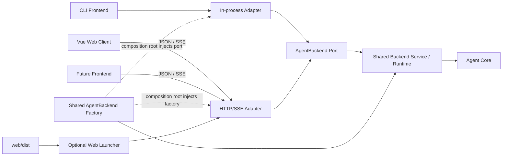

# CodingAgentNeo 前端接入与 Web 前端增量架构

> 状态：T01–T10 已实施并通过最终验收
> 架构版本：0.3
> 日期：2026-09-01
> 需求入口：[requirement.md](requirement.md)
> Agent 后端规范：[../agent-backend-interface.md](../agent-backend-interface.md)
> Agent 适配层规范：[../agent-transport-interface.md](../agent-transport-interface.md)

本增量先把 baseline 中混合在 `backend.py` 的具体执行职责拆为前端无关的共享 Backend Service/Runtime，再在 `AgentBackend` Port 之上提供彼此并列的 Agent 侧 In-process 和 HTTP/SSE Adapter。Vue Web App 只是 HTTP adapter 的第一个客户端，不拥有也不定义 Agent 传输。

既有 baseline 文档继续描述 2026-08-31 已完成的历史状态。本文件和 Agent 传输规范控制后续增量；不得回写历史来声称 baseline 当时已经支持网络前端。

## 1. 目标、用户与边界

### 1.1 成功行为

1. CLI 继续保持原有命令、stdio、退出码、approval、resume 和性能，但明确通过 `InProcessAdapter` 接入 Agent 应用端口。
2. Agent 提供独立于任何 UI 技术的本地 HTTP/SSE Adapter，使 Web 与未来进程外前端平等消费相同命令、事件、状态和授权语义。
3. Vue 用户能提交任务、观察 assistant/工具/重试/压缩/错误、处理授权、主动中断、成功 turn 后 follow-up，并在同一服务进程内刷新重连。
4. 两种 adapter 使用同一 conformance suite，证明语义等价；传输差异不得扩散到 Agent Core。
5. Web 在桌面与窄屏上保持极简、浅色、现代、键盘可用的南大紫金视觉。

### 1.2 强制约束

- `backend.py` 收敛为前端无关的 command/port/exception；`backend_service.py` 拥有共享具体 backend、worker、EventStreamBuffer 和 ApprovalChannel/Port。
- In-process 与 HTTP 均属于 `src/coding_agent_neo/transports/`；HTTP adapter 不 import/定位 Vue、Vite 或 `web/dist`。
- In-process 与 HTTP 只能并列依赖 `AgentBackend` Port；HTTP adapter 不得 import、创建或包装 In-process Adapter。
- CLI 只使用组装层返回的 In-process Adapter，不直接持有 Loop/Runtime/Store/Environment/ModelClient/Registry。
- Web 前端采用 Vue 3 + Vite + TypeScript，不 import Python 源码，只消费版本化 HTTP/SSE wire contract。
- API Key、workspace、模型、session 路径和 approval mode 只在 Agent 进程配置，浏览器不得接收或持久化。
- Adapter 实现以 Agent 后端规范为内部权威；CLI/Web 前端只以各自 adapter binding 为接入权威。

### 1.3 明确排除

多用户认证、公网/局域网部署、并发 transport session、运行中 steering/输入排队、历史 session 浏览器、跨进程 Web resume、分支会话、子 Agent、MCP、Skill、PWA、文件编辑器、终端模拟器、token streaming、国际化和遥测均不在首版。

CLI 不改走 HTTP；“平等接入”指两种 adapter 语义等价，而不是强制所有前端承担网络依赖。服务器重启后的恢复元数据尚未进入可移植 `AgentBackend` Protocol，因此 Web 只承诺刷新重连仍存活的 HTTP transport session。

## 2. 质量属性与技术选择

| 领域 | 选择 | 责任与理由 |
| --- | --- | --- |
| 应用端口 | `AgentBackend` + 四种 command + canonical event | 前端/传输无关的唯一语义边界 |
| 共享后端运行时 | `backend_service.py` | 实现 `AgentBackend` Port，承接 worker、事件缓冲和 Channel Approval Port |
| 同进程接入 | `transports/in_process.py` | 薄 Python binding，供 CLI 使用并可暴露 In-process-only resume 元数据 |
| 网络接入 | FastAPI/uvicorn + JSON command + SSE event | Agent 侧通用 adapter；SSE 匹配单向有序长事件流 |
| Web App | Vue 3、Vite、TypeScript、Composition API | 小型单页客户端；不使用 Router、Pinia 或 UI 组件框架 |
| Web 组合 | 独立 `web_launcher.py` | 可选地组合通用 HTTP ASGI app 与已构建静态资源，避免 adapter 依赖 Vue |
| 部署 | HTTP 服务仅 `127.0.0.1`，单活跃 transport session | 延续本地单用户信任边界，不伪装远程控制平面 |
| 状态 | session composable + 纯 event reducer | 单页单 session 无需重型状态库 |
| 测试 | 共享 adapter conformance + pytest HTTP 契约 + Vitest/Vue Test Utils | 分开证明端口、传输和 UI；mock 不冒充真实模型 |

### 2.1 品牌与可访问性 token

- `--nju-purple: #4D0099`：由南京大学标准紫 CMYK `50/100/0/40` 作屏幕近似换算，用于主操作、标题和焦点。
- `--nju-gold: #C7A34B`：装饰强调；白底正文使用 `--nju-gold-ink: #6B4F00`。
- 大面积背景为 `#F7F5F2`/白色，正文使用深中性色；状态不能只靠颜色。
- 普通文本和控件满足 WCAG 2.2 AA，核心路径有键盘操作、可见 focus 和 reduced-motion。

校方规范只明确标准紫 CMYK；金色是本产品的可访问 Web token，不声称为校方发布的官方 HEX。

## 3. 系统上下文与依赖方向

这里的并列关系同时是接入和代码依赖关系：CLI 经 In-process Adapter，进程外前端经 HTTP/SSE Adapter；两者都只面向 `AgentBackend` Port，由 composition root 注入同一类共享 Backend Service。HTTP 不经过 In-process Adapter，也不因首个 Web 客户端而获得新 Core 耦合。

### 3.1 CLI 路径

1. CLI 解析参数和配置。
2. 组装层建立 `AgentBackendService` 及 Loop、Store、Runtime、Environment 等内部依赖，再将 port 注入 `InProcessAdapter`。
3. CLI 仅调用 `send/events/last_state/close` 及其 binding 明确支持的 resume 元数据。现有 `build_local_backend` 和 `LocalAgentBackend` 可保留兼容 facade，但不作为 HTTP 依赖。

### 3.2 HTTP 路径

1. `coding-agent-neo-http` 在请求到来前解析并校验 Agent 配置，只监听回环地址。
2. session registry 通过注入的共享 `AgentBackendFactory` 取得一个 `AgentBackend` Port，其 composition root 默认使用 `AgentBackendService` 实现；通用 HTTP 包不 import 具体 service、In-process Adapter 或 Vue/Vite。
3. POST JSON 用共享 command decoder 构造四种 command 并调用 `send()`；SSE 对 `events(since)` 的 canonical envelope 只做编码。
4. DELETE 或服务退出调用 `CloseSession`/`close()`；浏览器断线本身不影响 Agent。

### 3.3 Web 路径

1. Web client 通过 Agent 传输规范创建 transport session，并保存非敏感 transport ID/cursor。
2. 每成功处理一条 SSE event 后才推进游标；重复 sequence 幂等忽略，跳号诊断后从最后成功游标重订阅。
3. `approval_request` 只回送事件携带的非空 request ID；`turn_end(COMPLETED_TURN)` 解锁 follow-up；终止事件锁定输入。
4. 可选 `coding-agent-neo-web` launcher 只是部署组合：挂载通用 Agent HTTP app 和静态资源，不改变任一契约。

### 3.4 并发、失败与重试

- 首版 HTTP registry 最多一个未关闭 backend；第二个 session 返回 409，不扩展 Agent 并发语义。
- turn 运行中第二个 SubmitTask 由 port 拒绝，任何 adapter 都不得排队。
- In-process 和 HTTP 都保持 `sequence > cursor`、慢消费者不阻塞和 close 后流结束语义。
- GET/SSE 可有界重连；POST 不自动重放，因为连接失败不能证明命令未被接受。
- tool result 的非成功状态不等同 session FAILED；未知/截断 payload 降级显示。
- adapter 返回安全错误，不泄露 traceback、任务正文、配置、provider 正文或 key。

## 4. 模块所有权

| 模块 | 拥有 | 禁止拥有/依赖 |
| --- | --- | --- |
| `backend.py` | command DTO、`AgentBackend` port、公开异常 | thread/queue、Loop、Store、EventEmitter、CLI、HTTP |
| `backend_service.py` | `AgentBackendService`、worker、EventStreamBuffer、ApprovalChannel/Port | CLI/HTTP I/O、Vue、transport session/route |
| `transports/in_process.py` | `InProcessAdapter`、Python binding、同进程生命周期、resume 元数据暴露 | worker、Agent Core 决策、CLI I/O、HTTP |
| `transports/http/` | wire DTO、ASGI routes、SSE、registry、错误/安全映射 | Vue/Vite/dist、Loop/Runtime/Store/Environment/ModelClient/Registry |
| `assembly.py` | 构建内部依赖、共享 backend factory；在 composition root 组装 adapter | CLI/Web 展示、HTTP route |
| `cli.py` | 终端输入/渲染/退出码，通过 In-process Adapter | Core 内部对象、HTTP |
| `http_cli.py` | Agent HTTP 服务配置与生命周期 | 静态资源、浏览器状态 |
| `web_launcher.py` | 通用 HTTP app + `web/dist` 的部署组合 | transport/core 语义 |
| `web/src/api/` | Agent HTTP wire client、错误归一化 | Python 对象、Agent 决策、密钥 |
| `web/src/domain/` | 防御性 event parser/reducer、展示模型 | 网络和副作用 |
| `web/src/composables/` | Web session/游标/命令互斥 | 后端事实改写 |
| `web/src/components/` | timeline、tool、approval、composer、status | 直接 fetch/localStorage、命令 schema 发明 |

禁止依赖：`transports/http -> transports/in_process`、`transports/http -> web`、`web -> Python 源码`、`backend.py/backend_service.py -> 任何具体 adapter`。只有 composition roots 可以同时看见 port、service factory 和具体 adapter。

## 5. 数据模型与不变量

| 实体 | 关键字段 | 不变量 |
| --- | --- | --- |
| `AgentBackend` | send/events/last_state/close | 两种 adapter 的共同语义权威 |
| `AgentBackendService` | worker、event buffer、approval channel、core dependencies | 实现 Port 且不感知 transport/frontend |
| `AgentCommand` | type + command fields | 不可变、可 JSON 化；adapter 不新增业务命令 |
| `EventEnvelopeV1` | IDs、sequence、type、timestamp、payload | Store-first canonical fact；HTTP 只编码 |
| `TransportSession` | transport ID、backend、cursor、closed | transport ID 与所有 Agent ID 分离；HTTP registry 独占生命周期 |
| `TimelineItem` | event ID、sequence、kind、summary/detail | 纯投影、重复幂等、未知安全降级 |
| `PendingApproval` | request ID、tool、summary、timeout | 同时最多一个；只回送原 ID；断线不批准 |

浏览器文本按纯文本渲染，禁止未清洗 `v-html`。localStorage 只保存 transport ID/cursor，不保存任务、事件、workspace、配置或 secret。

## 6. 公开契约

### 6.1 Agent 应用端口

`AgentBackend` 的 `send()`、`events(since)`、`last_state`、`close()`，四种 command、状态、event schema、approval 和兼容规则完全由 `docs/agent-backend-interface.md` 控制。它只供 adapter 实现者使用；T01 只移动实现所有权，不改变行为。

### 6.2 Agent HTTP/SSE wire contract

In-process Python binding 与 HTTP `/api/v1`、session、JSON 错误、SSE frame、Host/Origin 和关闭语义均由 `docs/agent-transport-interface.md` 控制。CLI/Web 前端分别只参考对应章节，Web 架构不复制另一份可漂移定义。

### 6.3 Adapter conformance

共享场景必须对 In-process 与 HTTP adapter 同时成立：四种 command、turn 互斥、sequence/重新 attach、approval 四条 fail-closed 路径、interrupt、close、follow-up、终止态、脱敏和未知字段兼容。HTTP-only 场景另验证 wire parsing、状态码、SSE、Host/Origin 和断开。

## 7. 安全与隐私

1. Agent HTTP 固定 `127.0.0.1`；无认证版本不得提供公网 host 或通配 CORS。
2. API Key 只在 Agent 进程，不能进入 HTTP/SSE、静态资源、localStorage、日志、fixture、snapshot 或截图。
3. HTTP adapter 不改变 workspace、Policy 或 Environment；Local bash 仍继承宿主用户权限且不是沙箱。
4. approval summary 只展示、不解析执行；超时/中断/关闭/ID 不匹配继续 fail-closed。
5. Web 文本默认转义；状态请求和日志不包含任务正文或完整 payload。
6. 未来远程部署必须先设计认证、TLS、CSRF、会话所有权、速率限制和远程命令安全。

## 8. 部署与验证

### 8.1 拓扑

- CLI：单 Python 进程，直接使用 In-process Adapter，行为与 baseline 相同。
- Agent HTTP：`coding-agent-neo-http` 独立启动，仅提供前端无关 `/api/v1`。
- Web 开发：Vite 把 `/api` 代理到 Agent HTTP；两个进程分别启动。
- Web 演示：`npm run build` 后由独立 `coding-agent-neo-web` composition launcher 同源挂载 API 和 `web/dist`。
- `web/dist`、node_modules、coverage、真实 session、虚拟环境和本地配置不入库。

### 8.2 验证层级

| 层级 | 证明 | 限制 |
| --- | --- | --- |
| Port/Backend Service 单测 | 拆分后接口、worker、approval、游标和关闭不回归 | 不证明任何 adapter |
| In-process Adapter 单测 | 薄委托、resume 元数据和 CLI 生命周期不回归 | 不证明网络 |
| Shared conformance | 两种 adapter 对同一语义场景一致 | 不证明真实模型 |
| HTTP pytest | wire、SSE、错误、安全、断开、registry | fake backend 不证明 core 接合 |
| HTTP + real Backend Service integration | factory/adapter/Store-first 真实接合，且不经 In-process Adapter | scripted model 不证明网关 |
| Vue Vitest | parser/reducer/components/键盘 | 不证明 Python 或浏览器全集 |
| 人工 Web | 桌面/360px、焦点、对比度、reduced-motion | 不替代自动回归 |
| 全量门 | Python baseline + transport + Web lint/type/test/build | 未运行的真实 API/平台必须保留 |

## 9. 需求追踪

| 需求 | 架构落点 | 任务 |
| --- | --- | --- |
| 显式 In-process Adapter、CLI 不回归 | 1、3.1、4、6.1 | T01 |
| 通用 Agent HTTP/SSE Adapter | 1、3.2、4、6.2 | T02 |
| Vite + Vue 轻量前端 | 2、3.3、4 | T03～T05 |
| 授权、中断、follow-up、重连 | 3.3～3.4、5～6 | T06～T07 |
| 极简浅色南大紫金、可访问 | 2.1、7～8 | T08 |
| Web 与 Agent adapter 分离、一键组合 | 3、4、8.1 | T09 |
| 可复现交付与语义一致性 | 6.3、8 | T01、T02、T10 |

## 10. 变更控制

本次架构 0.3 supersede 0.2 中“HTTP factory 创建 In-process AgentBackend”和“In-process Adapter 拥有 worker/事件缓冲/授权通道”的认知；这些共享执行职责现归属 Backend Service/Runtime。架构 0.2 对 0.1 中“HTTP adapter 属于 Web 产品、直接托管 `web/dist`”的废止仍有效。FastAPI/SSE、TypeScript/npm、仅回环和视觉 token 仍是可逆技术选择。

改变应用端口、wire protocol、状态、approval、游标、网络暴露、安全或部署边界时，先更新对应权威规范、本文、任务和决策。若实现需要修改 Agent Loop/Tool/Policy/Environment/Session 语义来迁就 HTTP 或 Vue，停止当前任务并发起跨基线变更控制。
