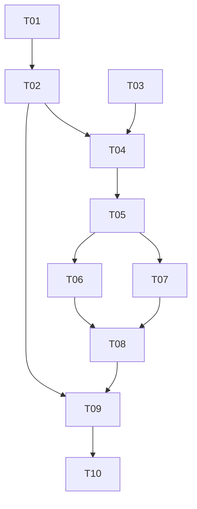

# CodingAgentNeo 前端接入与 Web 前端任务分解

> 状态：已按用户架构澄清重构，全部实现任务待审阅
> 架构依据：[ARCHITECTURE.md](ARCHITECTURE.md)
> Agent 后端契约：[../agent-backend-interface.md](../agent-backend-interface.md)
> Agent 适配层契约：[../agent-transport-interface.md](../agent-transport-interface.md)

## 协作规则

- 一次只派发一个依赖完整的未勾选任务；每个任务 ID 使用一个全新的专用子 Agent，结束后关闭上下文。
- Worker 先读 `AGENTS.md`、两份接口规范、架构、进度、当前卡片和依赖证据，保留无关改动并只修改当前范围。
- 应用端口、wire protocol、状态、approval、安全或部署契约变化时，先更新权威规范、架构、受影响卡片和必要决策。
- baseline 的完成记录是历史证据，不因移动模块而改写；增量任务必须用兼容测试证明没有降低既有行为。
- 全部验收有实际证据且主 Agent 独立复核后，才勾选任务并追加日期、行为、边界与真实结果。

## 依赖总览

## 阶段 A：显式 Agent 端口与并列适配器

### [ ] T01 — 拆分共享 Backend Service 与显式 In-process Adapter

**依赖:** 无
**范围:** 以 `docs/agent-backend-interface.md` 为内部权威，将 `backend.py` 收敛为公开 `AgentCommand`/`AgentBackend`/异常端口；把现有 EventStreamBuffer、ApprovalChannel/ChannelApprovalPort、单 worker 和 `LocalAgentBackend` 具体执行职责移动到 `src/coding_agent_neo/backend_service.py`，形成前端无关的 `AgentBackendService`。再按 `docs/agent-transport-interface.md` 第 3 节在 `transports/in_process.py` 新建薄 `InProcessAdapter`，只委托 port 并暴露 CLI 需要的可选 resume 元数据。组装层提供共享 backend factory 和 in-process composition factory，CLI 改用后者，并保留有测试的旧名称兼容 facade。排除 HTTP、Vue、核心 Loop/Policy/Environment 行为变化和无关重构。

**验收:**

- `backend.py` 不再 import AgentLoop、EventEmitter、SessionStore、ApprovalRequest、threading 或 queue，只保留前端无关端口和 DTO。
- `backend_service.py` 实现 `AgentBackend` Port 并拥有 worker、EventStreamBuffer 和 ApprovalChannel/Port，但不 import CLI、HTTP 或 Web；`transports/in_process.py` 不拥有这些共享执行职责。
- CLI 明确取得 `InProcessAdapter`，但所有 baseline CLI 选项、stdio、退出码、approval、interrupt、resume hint 和 session 行为不变。
- worker、sequence 重新 attach、慢消费者、四种 approval fail-closed 路径、turn 互斥和幂等 close 的既有测试在新模块下继续通过。
- `LocalAgentBackend`/`build_local_backend` 若保留，只是无行为分叉的兼容 facade；新模块和文档使用 `AgentBackendService`、`InProcessAdapter`、`build_agent_backend` 和 `build_in_process_adapter`。
- 新增 backend/adapter conformance 测试夹具，能以同一组场景验证真实 `AgentBackendService` 和通过 `InProcessAdapter` 的 binding，并为 T02 复用；不声称 HTTP 已实现。
- CLI 及其文档只依赖 In-process Adapter binding；不要求 CLI 把 Agent 后端规范当作直接接入 API。

**验证:** `.venv/bin/python -m pytest tests/unit/test_backend.py tests/unit/test_backend_service.py tests/unit/test_in_process_transport.py tests/integration/test_frontend_contract.py tests/integration/test_cli.py tests/integration/test_resume_cli.py`; `.venv/bin/python -m pytest`; `.venv/bin/python -m ruff check .`; `.venv/bin/python -m ruff format --check .`; `.venv/bin/python -m build`; `.venv/bin/python -m coding_agent_neo --help`; 静态依赖扫描与 `git diff --check`。

### [ ] T02 — 交付前端无关的 Agent HTTP/SSE Adapter

**依赖:** T01
**范围:** 以 `docs/agent-backend-interface.md` 为内部映射依据，在 `src/coding_agent_neo/transports/http/` 实现 `docs/agent-transport-interface.md` 第 4 节的 ASGI app、wire DTO、command decoder、SSE、单 session registry、错误/Host/Origin 映射和有序关闭；通过注入的共享 `AgentBackendFactory` 只取得 `AgentBackend` Port，由 composition root 默认组装 `AgentBackendService`，并提供只服务 Agent API 的 `coding-agent-neo-http` 入口。排除对具体 Backend Service 和 In-process Adapter 的任何依赖，以及 Vue、Vite、`web/dist`、静态资源托管、远程监听、认证、多 session 和 Core 行为变化。

**验收:**

- fake backend 证明 health、session、四种 command、状态、DELETE、SSE `since`/`Last-Event-ID`/keepalive 逐项符合 wire contract；data 是 canonical envelope 的无业务改写 JSON。
- HTTP adapter 不 import `backend_service`、`transports.in_process`、Vue/Vite/静态路径，也不 import/持有 AgentLoop、Runtime、Store、Environment、ModelClient、Registry 或 Policy；只依赖 port、wire DTO 和注入的共享 backend factory Protocol。
- 409 turn 进行中、400 非法命令、404/410 session、500 安全错误稳定且不泄露 traceback、任务、配置、provider 正文或 key。
- registry 拒绝第二个活跃 session；SSE 断开不自动批准/中断；DELETE、SIGINT/SIGTERM 和重复 close 有界清理。
- 服务只监听 `127.0.0.1`，拒绝异常 Host/Origin且无通配 CORS；CLI 不启动 HTTP 也不新增网络依赖。
- T01 的共享 conformance suite 对同一 `AgentBackendService` 的 In-process binding 和 HTTP binding 都通过；集成测试证明 HTTP 路径不经 In-process Adapter；fake/HTTP 证据不冒充真实模型。
- HTTP 客户端文档和 schema 只暴露 Adapter binding，不要求任何前端阅读、import 或理解 Agent 后端端口。

**验证:** `.venv/bin/python -m pip install -e ".[dev,http]"`; `.venv/bin/python -m pytest tests/transports/test_http_transport.py tests/transports/test_adapter_conformance.py`; `.venv/bin/python -m pytest`; `.venv/bin/python -m ruff check .`; `.venv/bin/python -m ruff format --check .`; `.venv/bin/python -m build`; `.venv/bin/coding-agent-neo-http --help`; 静态依赖/secret 扫描与 `git diff --check`。

## 阶段 B：独立 Web Client 基础

### [ ] T03 — 建立 Vite + Vue Web 工程与质量门

**依赖:** 无
**范围:** 创建根目录 `web/`，建立 Vue 3 + Vite + TypeScript 单页工程、npm lockfile、Vitest/Vue Test Utils、ESLint、type-check/build 命令和诚实的未连接占位页；更新忽略和开发说明。排除 Agent HTTP 实现、协议客户端、业务 UI 和最终视觉。

**验收:**

- 支持版本的 Node/npm 中 `npm ci` 后可启动占位页，且不需要 Python、API Key 或 Agent 服务。
- lint、type-check、test、production build 均返回 0；`node_modules`、`web/dist`、coverage 不入库。
- Web package 不依赖 Python 源码、Agent 内部包、Router、Pinia 或 UI 组件框架；依赖及用途可解释。
- `AGENTS.md` 的 Web 标准命令经实测后才标为已建立。

**验证:** `npm --prefix web ci`; `npm --prefix web run lint`; `npm --prefix web run type-check`; `npm --prefix web run test`; `npm --prefix web run build`; `git diff --check`。

### [ ] T04 — 交付 Agent HTTP 浏览器客户端与 session 状态核

**依赖:** T02, T03
**范围:** 仅参考 `docs/agent-transport-interface.md` 第 4 节，在 `web/src/api/`、`web/src/domain/` 和 `web/src/composables/` 实现 Agent wire client、防御性 envelope parser/纯 reducer、session/游标/命令互斥；对真实 HTTP adapter 做契约集成。Web 不直接参考或投影 `docs/agent-backend-interface.md` 的 Python Port。排除完整 timeline、approval dialog、静态托管和最终布局。

**验收:**

- API client 的路径、method、body、protocol version、SSE cursor 和稳定错误分类与 Agent 传输规范一致，POST 不自动重放。
- reducer 对合法事件更新状态/游标，对重复 sequence 幂等，对跳号给出诊断，对未知类型/字段、缺失字段和截断 payload 安全降级。
- localStorage 只保存 transport ID/cursor，不保存任务、payload、workspace、配置或 secret。
- command 互斥区分连接中、turn 运行中、等待授权、COMPLETED_TURN 和终止态，不用状态轮询替代规范事件边界。
- Web 包只依赖 wire DTO，不 import Python 或复制 Agent Policy；文本投影不使用 `v-html` 或执行 tool 内容。
- 浏览器 client contract tests 与 T02 HTTP 测试使用同一 fixture/schema 样例，避免两份协议漂移。

**验证:** `npm --prefix web run lint`; `npm --prefix web run type-check`; `npm --prefix web run test -- src/api src/domain src/composables`; `npm --prefix web run build`; `.venv/bin/python -m pytest tests/transports/test_http_transport.py`。

## 阶段 C：Web 核心用户旅程

### [ ] T05 — 交付任务、assistant 回复与事件时间线闭环

**依赖:** T04
**范围:** 将 session 核接入 Vue 页面，交付创建 transport session、任务 composer、用户消息、assistant 文本、通用事件/错误和 turn 完成反馈的首个纵向闭环。排除 approval 操作、精细工具卡、刷新重连和最终视觉。

**验收:**

- 用户可提交非空任务且不能重复发送；HTTP 400/409/410 有安全、可恢复且不误导的提示。
- timeline 按 sequence 显示用户、assistant、运行、错误和结束事件；最终文本优先 `turn_end.assistant_text`，再回退最近 assistant 文本。
- COMPLETED_TURN 后 composer 状态允许后续输入；LIMIT_REACHED/INTERRUPTED/FAILED 锁定。
- 长文本有界且可展开，未知/截断 payload 降级展示；普通 tool failure 不误标 session FAILED。
- scripted fake model 经真实 Backend Service + HTTP adapter 完成一次无授权任务到 `turn_end`；真实 API 未执行则明确记录。

**验证:** `npm --prefix web run lint`; `npm --prefix web run type-check`; `npm --prefix web run test`; `npm --prefix web run build`; `.venv/bin/python -m pytest tests/transports tests/integration/test_frontend_contract.py`。

### [ ] T06 — 交付工具生命周期、授权与主动中断

**依赖:** T05
**范围:** 实现 tool/correlation 生命周期卡片、唯一 pending approval dialog、批准/拒绝、Stop 和相关焦点/状态反馈。排除自动/批量授权、命令编辑和运行中 steering。

**验收:**

- 相同 correlation ID 的 tool/approval/policy/result 聚合展示；只显示后端脱敏摘要，状态、耗时、退出码和截断可辨认。
- dialog 只接受非空原 request ID；批准/拒绝只发一次，提交后锁定并等待 policy event 清除。
- Escape、断线、关闭页面、无效 ID 不等于批准；无效请求提供安全错误和 Interrupt。
- Stop 在 RUNNING/WAITING 时发送 Interrupt，收到 INTERRUPTED 结束链后锁定输入。
- 组件及 adapter conformance 覆盖批准、拒绝、超时、ID 不匹配、断开和普通 tool failure。

**验证:** `npm --prefix web run lint`; `npm --prefix web run type-check`; `npm --prefix web run test`; `npm --prefix web run build`; `.venv/bin/python -m pytest tests/transports tests/unit/test_backend.py tests/integration/test_frontend_contract.py`。

### [ ] T07 — 交付 follow-up、刷新重连与健壮事件消费

**依赖:** T05
**范围:** 完成成功 turn 后线性 follow-up、同进程刷新重连、SSE 有界退避、重复/跳号处理和显式结束。排除服务器重启后的历史 resume、按浏览器失联自动关闭、输入排队和并发 session。

**验收:**

- `turn_end(COMPLETED_TURN)` 后第二条 SubmitTask 进入同一 backend session，已处理 timeline 不丢失。
- 刷新后凭 transport ID/cursor 查询并重订阅；重复不展示，断线期间 canonical events 可补回。
- SSE 仅对连接失败有界退避；POST 不自动重放；跳号从最后成功游标重新订阅并保留诊断。
- Agent HTTP 进程重启或 transport session 不存在时清除陈旧标识并提示新建，不声称恢复历史 session。
- 显式结束或服务关闭后进入 closed/失联状态并禁止命令；unload 不作为关闭证据。

**验证:** `npm --prefix web run lint`; `npm --prefix web run type-check`; `npm --prefix web run test`; `npm --prefix web run build`; `.venv/bin/python -m pytest tests/transports tests/integration/test_frontend_contract.py tests/integration/test_resume_cli.py`。

## 阶段 D：视觉、组合与交付

### [ ] T08 — 完成极简紫金视觉、响应式与可访问性

**依赖:** T06, T07
**范围:** 按架构 token 完成浅色主界面、紫金层级、响应式、空/加载/错误态、键盘、语义和 reduced-motion；只优化既有旅程，不新增业务、校徽或部署耦合。

**验收:**

- 桌面和 360px 窄屏无横向溢出；composer、timeline、approval、Stop 完整可用且大面积背景为浅色。
- 主操作/标题用南大紫，金色只作强调或使用深金文字 token；状态有文字/图标，不只靠颜色。
- 普通文本/控件达到 WCAG 2.2 AA；键盘路径、可见焦点、dialog focus、aria live 和 reduced-motion 有证据。
- 无重型组件库、装饰动画、校徽复制或无关 dashboard；视觉检查记录浏览器、尺寸、发现及修正。

**验证:** `npm --prefix web run lint`; `npm --prefix web run type-check`; `npm --prefix web run test`; `npm --prefix web run build`; 人工桌面/360px/键盘/reduced-motion/对比度检查。

### [ ] T09 — 交付与通用 Agent HTTP 分离的 Web 组合入口

**依赖:** T02, T08
**范围:** 新增独立 `web_launcher.py`/`coding-agent-neo-web` composition root，把已构建 `web/dist` 与通用 Agent HTTP ASGI app 同源组合以便本地一键演示；通用 `transports/http/` 保持完全不知道 Vue/Vite/静态路径。排除修改 wire/core、自动构建 Node 项目和公网部署。

**验收:**

- `coding-agent-neo-http` 仍可不安装/不构建 Web 而独立服务 API；其包和 import graph 不含 `web/dist`、Vue 或静态路由。
- `coding-agent-neo-web` 在 dist 存在时提供 SPA fallback 与 `/api/v1`，API 优先级不被静态路由遮蔽；dist 缺失时副作用前给出明确安全错误。
- Vite dev proxy 与生产同源路径使用同一 wire client，无环境分支复制 Agent 语义。
- 两个入口均只监听回环地址并有幂等关闭；Web launcher 不把 key/config 注入静态 HTML。
- Python 包构建不夹带 `node_modules`/coverage；静态资源是否进入 wheel 由任务内按已写契约实现并验证，不临时发明远程 CDN。

**验证:** `npm --prefix web run build`; `.venv/bin/python -m pytest tests/transports tests/web_launcher`; `.venv/bin/coding-agent-neo-http --help`; `.venv/bin/coding-agent-neo-web --help`; `.venv/bin/python -m pytest`; `.venv/bin/python -m build`; 静态依赖与包内容检查。

### [ ] T10 — 完成端到端验收、运行文档与回归门

**依赖:** T09
**范围:** 建立共享 adapter 与 Web 聚合验收、更新根运行/安全说明、核对 secret/生成物/依赖边界，完成 scripted 本地端到端；只修复既有契约内缺陷。真实网关仅在用户提供未入库环境变量时执行。

**验收:**

- 文档分别说明 CLI/In-process、独立 Agent HTTP、两进程 Web 开发和 Web composition launcher 的安装、启动、停止、限制与安全边界。
- shared conformance 对 In-process/HTTP 通过；scripted Web 覆盖 task、tool success/failure、approval 批准/拒绝、interrupt、follow-up、断线补回、未知/截断 payload 和终止态。
- 静态审查确认 `backend.py` 是纯端口、`backend_service.py` 不依赖 adapter、HTTP 不依赖 In-process/Web、Web 不含 key/不执行 tool/不用 `v-html`、所有服务只监听回环。
- Web 全量 lint/type/test/build、Python Ruff/test/build、baseline acceptance 和 workflow validator 均通过；未运行的真实 API/浏览器/平台明确保留。
- 架构、接口、任务、进度和决策描述同一完成态；所有勾选卡有真实摘要与证据。

**验证:** `npm --prefix web ci`; `npm --prefix web run lint`; `npm --prefix web run type-check`; `npm --prefix web run test`; `npm --prefix web run build`; `.venv/bin/python -m pytest`; `.venv/bin/python -m pytest tests/acceptance -m acceptance`; `.venv/bin/python -m ruff check .`; `.venv/bin/python -m ruff format --check .`; `.venv/bin/python -m build`; `python /Users/jay/.codex/skills/orchestrate-spec-driven-development/scripts/validate_workflow.py --repo docs/web-frontend`; secret/依赖/包内容扫描与人工运行说明复核。

## 推荐顺序

优先走 Agent 接入关键路径 T01 → T02，再与独立 Web 基础 T03 在 T04 汇合；之后 T05 → T06/T07 → T08 → T09 → T10。虽然 T01 与 T03 都无依赖，一次仍只派发一个任务，默认先完成 T01 以尽早稳定 Port、Backend Service 与 adapter 边界。
