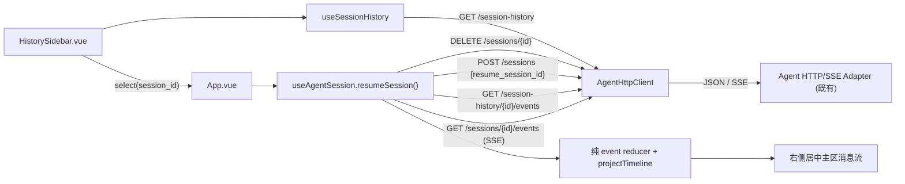

# CodingAgentNeo Web GUI 历史侧边栏架构

> 状态：已实现并验收（T01–T07）
> 架构版本：0.1
> 日期：2026-09-02
> 需求入口：[requirement.md](requirement.md)
> 前端唯一接入权威：[../agent-transport-interface.md](../agent-transport-interface.md)（第 4 节 HTTP/SSE binding、4.2 history resources、4.5.1 resume、4.7 事件目录、第 6 节共享规则）
> 复用的既有 Web 架构：[../web-frontend/ARCHITECTURE.md](../web-frontend/ARCHITECTURE.md)

本增量在既有 Vue Web App 上新增「可 resume session 侧边栏」和「切换/恢复 session」用户旅程，并把单栏对话布局改为「侧边栏 + 右侧居中主区」。后端与传输适配层的历史/恢复能力已由 `docs/backend-history-discover/` 交付；本架构只描述 Web 客户端如何消费既有 HTTP wire 契约，不改变任何 Port、wire、事件、状态、授权、安全或部署边界。

## 1. 目标、用户与边界

### 1.1 成功行为

1. 用户在侧边栏看到当前 Workspace 的历史 session 列表（首条用户消息摘要、时间、状态、是否可恢复），可有界翻页，并有加载中/空/错误态。
2. 点击某个 session：先终结当前 transport session，再以 `resume_session_id` 创建恢复 session，随后用有限历史读取补齐并按 turn 重现目标 session 的全部历史消息，最后从 resume cursor 起接续 live SSE。
3. 页面为「侧边栏 + 右侧居中主区」布局；页面标题位于侧边栏顶部；原有对话流、composer、授权、消息尾部动态入口迁移到右侧主区并水平居中。
4. 桌面与窄屏均可用（窄屏侧边栏可折叠/抽屉化），键盘可达、焦点可见、`aria` 语义完整、对比度达标、reduced-motion 生效，延续南大紫金浅色视觉与 Codex 式信息层级。
5. 历史列表/事件读取/resume 创建全部防御性消费：稳定错误码映射安全提示，未知/截断/坏 candidate 安全降级，POST 不自动重放。

### 1.2 强制约束

- 只修改 `web/`。不 import Python 源码，不改 `transports/`、`assembly.py`、wire/事件/状态/授权/安全/部署契约或既有 `docs/agent-*.md` 权威规范。
- Web 只消费 `docs/agent-transport-interface.md` 第 4 节 binding；历史读取是有限 JSON，不是第二条 SSE 流；resume 创建遵守单活跃 session 规则。
- 浏览器不接收/持久化 workspace 路径、session 目录、文件名、模型或凭据；仅使用不透明 `session_id` 与有界摘要，恢复只回送不透明 `resume_session_id`。
- `resumable` 与 list/event cursor 都不是恢复授权；恢复以后端重验证为唯一权威，失败按 fail-closed 处理。
- localStorage 仍只保存 live transport session 的不透明 transport ID 与最后成功 cursor；不新增持久化历史列表、历史 session ID、任务正文或 workspace。

### 1.3 明确排除

任意工作区文件浏览器、原始 JSONL 下载、按文本搜索、历史删除/重命名/导出、并发或多活跃 session、跨 workspace 控制平面、运行中 steering、输入排队、子 Agent、MCP、Skill、token streaming、远程/公网部署与认证均不在本轮。跨进程「服务器重启后恢复历史 session」正是本轮要交付的能力，但仍严格通过既有有限历史读取 + resume 创建实现，不新增后端契约。

## 2. 质量属性与技术选择

| 领域 | 选择 | 责任与理由 |
| --- | --- | --- |
| 历史列表数据 | 复用 `AgentHttpClient` 扩展 `GET /api/v1/session-history` | 有界分页、不透明 cursor、防御性 DTO；与既有 wire client 同源，避免第二份协议 |
| 历史事件补齐 | `GET /api/v1/session-history/{id}/events` 有限分页 | resume + SSE 不 replay 历史，历史消息只能由有限读取重现 |
| 恢复创建 | 扩展 `POST /api/v1/sessions` 支持 `resume_session_id` | 沿用既有 session 创建端点，返回 resume cursor 作为 live SSE 起点 |
| 历史列表状态 | 新增 `useSessionHistory` composable | 分页/加载/错误/刷新集中管理，与 live session 状态解耦 |
| 切换/恢复旅程 | 扩展 `useAgentSession` 增加 `resumeSession()` + 历史事件 hydration | 复用既有 reducer 与命令互斥，把「终结→创建→补齐→接续」封装为单一受控操作 |
| 侧边栏视图 | 新增 `HistorySidebar.vue` 展示型组件 | 只渲染列表与 emit 选择，不直接 fetch，符合 components/composables 分层 |
| 布局 | `App.vue` 改为 sidebar + 右侧居中主区，标题移入侧边栏 | 满足需求布局；主区复用既有整页对话流与固定 composer |
| 视觉 | 原生 CSS + 既有紫金 token，新增侧边栏与响应式布局 token | 不引入 Router/Pinia/UI 框架，延续既有视觉与可访问性策略 |
| 测试 | Vitest/Vue Test Utils + 共享 wire fixtures | 复用 T02 HTTP 契约样例，防止两份协议漂移；fake 不冒充真实模型 |

品牌与可访问性 token 沿用 [../web-frontend/ARCHITECTURE.md 第 2.1 节](../web-frontend/ARCHITECTURE.md)（`--nju-purple`、`--nju-gold`、`--nju-gold-ink`、浅色背景、WCAG 2.2 AA、键盘/焦点/reduced-motion）。

## 3. 系统上下文与数据流

### 3.1 侧边栏列表流

1. 侧边栏挂载或用户刷新时，`useSessionHistory` 调用 `client.listSessionHistory({limit, cursor})`。
2. 首页 `cursor` 缺省；`next_cursor` 非空时「加载更多」原样回送 provider token（不解码为 offset/ID/路径）。
3. 每项按 `(updated_at, session_id)` 降序展示；`first_user_message` 是有界 `BoundedText`，`resumable=false` 或含 diagnostics 的项作降级展示（可标记不可恢复但不隐藏健康项）。
4. 列表读取不创建/改变 transport session，也不与 live session 命令互斥。

### 3.2 切换 / 恢复流（`resumeSession(historySessionId)`）

按下列稳定顺序执行；任一步失败都不得让页面留在不确定的活跃态：

1. 若存在活跃 transport session，先 `DELETE /api/v1/sessions/{transport_id}` 终结它（满足单活跃规则；DELETE 幂等，404/410 视为已关闭）。
2. `dispatch(RESET)` 清空当前投影（events/timeline/cursor/状态），使目标 session 从干净状态重建。
3. `POST /api/v1/sessions {"resume_session_id": historySessionId}` 创建恢复 session，得到 `transport_session_id`、`state` 和 `cursor`（= 恢复文件最后 canonical sequence）。
4. 历史 hydration：从 `since=0` 起分页调用 `GET /api/v1/session-history/{historySessionId}/events`，把每个 canonical envelope 按 sequence 升序经 `EVENT` action 送入既有 reducer，直到 `has_more=false`；reducer 幂等去重、跳号安全降级、未知/截断安全保留，cursor 随之推进到最后 sequence。
5. hydration 完成后，从 reducer 当前 cursor 起 `startEvents()` 接续 live SSE，用于恢复后的 follow-up；SSE 只送 `sequence > cursor`，不重复历史。
6. 成功后持久化的仍只是新 transport ID/cursor；historySessionId 不写入 localStorage。

历史 hydration 使用的是目标 session 的 canonical `session_id`（列表返回值），与 `transport_session_id` 严格区分；两者不得混用（见 wire 规范 4.2.3）。

### 3.3 并发、失败与 fail-closed 规则

- 单活跃 session：必须先 DELETE 再 POST resume；不得为并发切换构造第二个 backend。切换进行中锁住侧边栏选择与 composer，避免重入。
- 先终结后创建的窗口：DELETE 成功但 resume 创建失败（400/404 `history_not_found`/422 `history_unavailable`/`invalid_resume`）时，当前 session 已被终结、没有活跃 session；UI 显示安全错误并进入「新建 session」入口，不自动重建、不自动重放。
- turn 保护：若当前 session 有活跃 turn 或等待授权，切换会中止正在进行的工作。默认行为是终结当前并切换；实现层在活跃 turn 时应给出一次显式确认以防误触（见 DECISIONS 的可逆假设），但不改变「默认终结」语义。
- hydration 幂等：历史事件按 sequence 升序送入 reducer；重复 sequence 幂等忽略，跳号保留诊断并不产生崩溃。历史 read 是快照，并发追加只影响 `has_more`/摘要，不破坏 cursor 语义。
- resume 后 live SSE 可能产生新的 `session_start`/`agent_start`（不代表历史被 replay）；reducer 已对重连 RUNNING 快照 fail-closed，hydration 后终态/turn 边界仍以 canonical `turn_end`/`session_end` 为准。
- POST（DELETE/create/command）永不自动重放；连接失败不能证明命令未被接受。

## 4. 模块所有权

本轮只在 `web/` 内新增或修改下列模块；Python 侧全部冻结。

| 模块 | 拥有 | 禁止拥有/依赖 |
| --- | --- | --- |
| `web/src/api/client.ts` | 新增 `listSessionHistory`、`readSessionHistoryEvents`、`createSession(resumeSessionId?)`；新增历史/恢复稳定错误码归一化 | Python 对象、Agent 决策、密钥、路径拼接、自动重放 |
| `web/src/domain/protocol.ts` / 新增 `web/src/domain/history.ts` | 历史 DTO 类型与防御性 parser（`SessionHistoryPage`/`SessionHistoryItem`/`SessionEventPage`/`BoundedText`） | 网络与副作用、命令 schema 发明 |
| `web/src/composables/useSessionHistory.ts` | 历史列表分页/加载/错误/刷新状态 | 直接 fetch 以外的后端事实改写、live session 命令互斥 |
| `web/src/composables/useAgentSession.ts` | 扩展 `resumeSession()`：终结→RESET→resume 创建→历史 hydration→接续 SSE；批量 EVENT 注入入口 | Agent Loop/Policy/持久化复制、historySessionId 持久化 |
| `web/src/components/HistorySidebar.vue` | 侧边栏列表渲染、选择 emit、当前项指示、加载中/空/错误/加载更多 | 直接 fetch/localStorage、resume 副作用、命令发送 |
| `web/src/App.vue` | sidebar + 右侧居中主区组合、标题移入侧边栏、把 select 接到 `resumeSession`、切换态/错误态展示 | 直接 fetch、命令 schema 发明、后端事实改写 |
| `web/src/style.css` | 侧边栏 + 主区布局、响应式折叠、紫金 token 复用与可访问性 | 重型组件库、校徽复制、部署耦合 |

禁止依赖（延续既有）：`web -> Python 源码`、组件直接 `fetch`/`localStorage`、绕过 wire client 或 reducer 改写后端事实、把 `transport_session_id` 与 canonical `session_id`/history ID 混用。

## 5. 数据模型与不变量

| 实体 | 关键字段 | 不变量 |
| --- | --- | --- |
| `SessionHistoryItem` | `session_id`、`first_user_message`(BoundedText)、`created_at`、`updated_at`、`last_sequence`、`last_state`、`resumable`、`diagnostics[]` | 无文件系统路径；文本有界并标记截断；坏 candidate 只降级不使整表失败；只读展示事实 |
| `SessionHistoryPage` | `sessions[]`(≤100)、`next_cursor?` | `(updated_at, session_id)` 降序；cursor 不透明、≤256 ASCII、原样回送、不解码 |
| `SessionEventPage` | `session_id`、`events[]`(≤limit)、`next_cursor?`、`has_more`、`diagnostics[]` | 事件按 sequence 升序、保持 canonical envelope；`next_cursor` 为整数 sequence 用作下次 `since`；不 replay 命令 |
| live `SessionState`（复用） | 见 `web-frontend` reducer | 切换前 `RESET`；hydration 逐事件推进 cursor；重复幂等、跳号降级；终态一次性 |
| `PersistedTransportSession`（复用） | transport ID、cursor | 只持久化新恢复 session 的 transport ID/cursor；不持久化 history session ID |

浏览器文本按纯文本渲染，禁止未清洗 `v-html`；historySessionId 与 transport ID 分离，不混用于任何请求。

## 6. 公开契约

### 6.1 前端消费的 HTTP wire 契约

历史列表、历史事件读取、resume 创建、live SSE、命令、状态、错误、Host/Origin、关闭语义完全由 [../agent-transport-interface.md](../agent-transport-interface.md) 第 4 节控制，本架构不复制第二份定义。Web 只按其字段、状态码和稳定错误码分支。

### 6.2 本轮新增的前端内部接口（Web 内部，不是 wire 契约）

- `AgentHttpClient.listSessionHistory(options): Promise<SessionHistoryPage>`
- `AgentHttpClient.readSessionHistoryEvents(sessionId, options): Promise<SessionEventPage>`
- `AgentHttpClient.createSession(resumeSessionId?): Promise<SessionCreatedResponse>`（扩展既有签名，缺省即新建）
- `useSessionHistory(): { items, loading, error, hasMore, refresh, loadMore }`
- `useAgentSession().resumeSession(historySessionId): Promise<void>`（封装 §3.2 全流程）
- `HistorySidebar` props：`items`、`loading`、`error`、`hasMore`、`activeSessionId`、`switching`；emits：`select`、`loadMore`、`refresh`

这些是 Web 内部 API，可在实现中细化命名/形态；变更它们不需要跨工作流变更控制，但仍须遵守本架构的模块边界与不变量。

### 6.3 稳定错误码归一化

前端在既有错误码基础上新增历史/恢复稳定码：`invalid_history_id`、`invalid_history_cursor`、`invalid_history_limit`、`history_not_found`、`history_unavailable`、`invalid_resume`（分别对应 400/400/400/404/422/422），以及 resume 创建复用 `session_exists`(409)。未知/缺省码回退安全提示，message 不透传后端正文。

## 7. 安全与隐私

1. 浏览器只发不透明 `session_id`/`resume_session_id` 与不透明 list cursor；绝不提供或读取 workspace、目录、文件名、模型或凭据。
2. 历史列表/事件/摘要属于本地私有内容，只经回环 adapter 获取；前端不落盘（localStorage 仍只存 transport ID/cursor）、不日志化任务正文或完整 payload。
3. 历史文本与事件按纯文本转义渲染，禁止未清洗 `v-html`，不执行 tool/arguments/summary（它们只是展示事实）。
4. resume 不信任列表元数据：`resumable`/cursor 不是授权，恢复以后端重验证为准；先终结后创建失败时 fail-closed 不残留活跃 session。
5. Host/Origin 仍由 Agent HTTP adapter 覆盖所有 `/api/v1` 路由（含 history）；前端不绕过、不新增网络暴露。
6. `transport_session_id` 与 canonical `session_id`/history ID/event ID/cursor 严格分离，不混用于任何请求或持久化。

## 8. 部署与验证

### 8.1 拓扑

- 沿用既有：CLI 用 In-process；Agent HTTP `coding-agent-neo-http` 提供 `/api/v1`（含 history 路由）；Web 开发用 Vite `/api` 代理；Web 演示用 `coding-agent-neo-web` 同源组合已构建 `web/dist`。本轮不改动任何入口或组合方式。
- `web/dist`、node_modules、coverage、真实 session、虚拟环境和本地配置不入库。

### 8.2 验证层级

| 层级 | 证明 | 限制 |
| --- | --- | --- |
| Web 单测（api client） | 历史列表/事件/ resume 创建的路径、method、参数、DTO 解析与稳定错误分类符合 wire 规范 | 不证明真实后端接合 |
| Web 单测（domain parser） | 历史 DTO 防御性解析：未知/缺失/截断/坏 diagnostics/超界安全降级 | 不证明真实数据分布 |
| Web 单测（useSessionHistory） | 分页、加载/错误/空、`next_cursor` 原样回送、刷新 | 不证明视图 |
| Web 单测（useAgentSession.resumeSession） | 终结→RESET→resume→hydration→接续 SSE 顺序；先终结后创建失败 fail-closed；hydration 幂等/跳号；不自动重放 | fake fetch 不证明真实模型 |
| Web 组件（HistorySidebar/App） | 选择/加载更多/当前项/错误态、键盘与 aria、布局切换 | 不证明真实浏览器全集 |
| 视觉/可访问性人工检查 | 桌面/360px、侧边栏折叠、焦点、对比度、reduced-motion | 不替代自动回归 |
| 共享 wire fixture | Web 历史/事件解析与 Python HTTP 历史测试同源样例，防协议漂移 | 不证明真实网关 |
| 聚合对照 | [acceptance.md](acceptance.md) 把 T07 旅程映射到既有 Vitest 用例；`tests/acceptance/test_webgui_history_sidebar_acceptance.py` 扫描静态边界 | 不证明真实浏览器/模型 |
| 回归门 | Web lint/type/test/build 通过；既有 Python 全量/acceptance 与前序工作流验证不回归 | 未运行的真实 API/浏览器/平台明确保留 |

模拟/离线证据不冒充真实模型网关、真实浏览器或公网部署。

## 9. 需求追踪

| 需求 | 架构落点 | 任务 |
| --- | --- | --- |
| 历史 wire client 与防御性 DTO 解析 | 2、3.1、4、6.1–6.3 | T01 |
| 切换/恢复旅程（终结→resume→hydration→接续 SSE） | 3.2–3.3、4、5 | T02 |
| 历史列表状态与分页 | 3.1、4、6.2 | T03 |
| 可 resume session 侧边栏视图 | 1.1、4 | T04 |
| sidebar + 右侧居中布局、标题移入侧边栏、旅程接线 | 1.1、3、4 | T05 |
| Codex 式视觉、响应式与可访问性 | 2、7、8 | T06 |
| 端到端验收、运行文档与回归门、契约一致性 | 6、8 | T07 |

## 10. 变更控制

本架构 0.1 只新增 Web GUI 对既有历史/恢复 wire 契约的消费与布局改造。它 supersede `docs/web-frontend/` 中「首版不提供历史 resume UI / 不实现历史 session 浏览器」的排除项，落地 `docs/backend-history-discover/` 与 `docs/agent-transport-interface.md` 明确延期的 Web UI；被 supersede 的历史条目仍保留为当时事实。

若实现中发现需要改变 wire protocol、事件/状态/授权/游标、网络暴露、安全或部署边界，或需要后端新增历史/恢复能力，停止当前任务并回到 `docs/backend-history-discover/` 与 `docs/agent-transport-interface.md` 的跨工作流变更控制，先更新对应权威规范、本架构、任务与决策后再实现。Web 内部接口（§6.2）的细化不属于跨工作流变更，但须遵守本架构边界与不变量。
