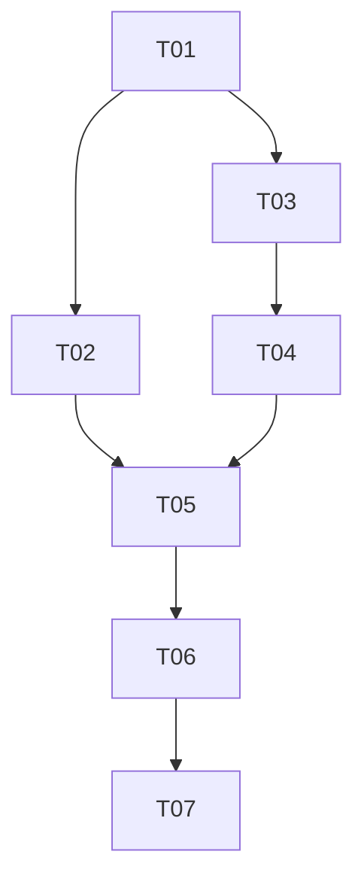

# CodingAgentNeo Web GUI 历史侧边栏任务分解

> 状态：Execute（T01–T03 已验收；其余任务串行派发中）
> 架构依据：[ARCHITECTURE.md](ARCHITECTURE.md)
> 前端唯一接入权威：[../agent-transport-interface.md](../agent-transport-interface.md)

## 协作规则

- 一次只派发一个依赖完整的未勾选任务；每个任务 ID 使用一个全新的专用子 Agent，结束后关闭其上下文。
- Worker 先读 `AGENTS.md`、本文件当前卡片与依赖证据、`ARCHITECTURE.md`、`PROGRESS.md`，以及 `../agent-transport-interface.md` 中适用的 HTTP binding；不读取 Python 后端 Port 文档来补充前端契约，也不修改 `web/` 以外内容。
- 保留无关改动，只修改当前任务范围。发现需要改变 wire/事件/状态/授权/安全/部署契约或后端历史能力时，停止实现并回到 `../backend-history-discover/` 与 `../agent-transport-interface.md` 的跨工作流变更控制。
- 全部验收有实际证据且主 Agent 独立复核后，才勾选任务并追加日期、行为、边界与真实结果；随后关闭该任务专用 Agent。

## 依赖总览

## 阶段 A：历史 wire 客户端与领域解析

### [x] T01 — 交付历史列表/事件/恢复的 wire client 与防御性 DTO

**依赖：** 无
**范围：** 仅参考 `../agent-transport-interface.md` 第 4.2 节（history resources）、4.5.1 节（resume 创建）和第 6 节共享规则，在 `web/src/api/client.ts` 新增 `listSessionHistory({limit?, cursor?})`、`readSessionHistoryEvents(sessionId, {since?, limit?})` 与扩展 `createSession(resumeSessionId?)`，并在 `web/src/domain/`（`protocol.ts` 或新增 `history.ts`）新增 `SessionHistoryItem`/`SessionHistoryPage`/`SessionEventPage`/`BoundedText` 类型与防御性 parser、历史/恢复稳定错误码归一化。复用既有 wire fixture 机制，新增历史/事件/ resume 样例并与 Python HTTP 历史测试共享同一 fixture。排除 composable、侧边栏、App 布局与视觉。

**验收：**

- `listSessionHistory` 请求 `GET /api/v1/session-history`，`limit`(1..100，默认 50)/`cursor`(不透明、原样回送、不解码为 offset/ID/路径) 校验与 wire 规范一致；成功解析 `sessions[]`(≤100)、`next_cursor?`，字段结构与 4.2.1 一致。
- `readSessionHistoryEvents` 请求 `GET /api/v1/session-history/{session_id}/events`，`session_id` 经 `session_...` 安全 token 校验（拒绝 `/`、`\`、`.` 后缀、NUL、控制符、路径成分、`.jsonl`）、`since`(0..2^63-1)/`limit`(1..200，默认 200) 校验，解析 `events[]`(canonical envelope、sequence 升序)、`next_cursor?`、`has_more`、`diagnostics[]`；空页 `has_more=false`。
- `createSession(resumeSessionId?)`：缺省发送空 `{}`（新建）；带值时 body 恰好只含 `resume_session_id`(非空 opaque `session_...`)，返回 `{transport_session_id, state, cursor}` 解析正确；POST 不自动重放。
- 稳定错误码 `invalid_history_id`/`invalid_history_cursor`/`invalid_history_limit`/`history_not_found`/`history_unavailable`/`invalid_resume`/`session_exists` 映射到对应 HTTP status 分类，message 不透传后端正文；未知/缺省码回退安全默认。
- DTO parser 对未知/缺失/截断/坏 diagnostics/超界/非法类型安全降级，`first_user_message` 与截断 payload 按 `BoundedText`/预览结构处理，不抛未捕获异常；`transport_session_id` 与 canonical `session_id` 类型上不混用。
- 浏览器契约测试与 Python `tests/transports`/`tests/integration/test_http_history.py` 使用同一 wire fixture 样例，避免协议漂移。

**验证：** `npm --prefix web run lint`；`npm --prefix web run type-check`；`npm --prefix web run test -- src/api src/domain`；`npm --prefix web run build`；`git diff --check`。

**完成摘要（2026-09-01）：** 已交付 `listSessionHistory`、`readSessionHistoryEvents` 与向后兼容的 `createSession(resumeSessionId?)`；历史 DTO 防御性解析与七个稳定错误码使用客户端自有短句。主 Agent 复跑 `npm --prefix web run lint`、`type-check`、`test -- src/api src/domain`（42 passed）、`build`、`git diff --check` 均通过。未实现 composable/侧边栏/布局。浏览器 `since` 上限为 JS 安全整数（见 DECISIONS）。

## 阶段 B：状态核（列表 + 恢复旅程）

### [x] T02 — 交付 resume 旅程与历史事件 hydration

**依赖：** T01
**范围：** 在 `web/src/composables/useAgentSession.ts` 新增 `resumeSession(historySessionId)`：按 `ARCHITECTURE.md` §3.2 顺序执行「终结当前 transport session（DELETE，幂等，404/410 视为已关闭）→ `RESET` 投影 → `POST /sessions {resume_session_id}` 创建恢复 session → 从 `since=0` 分页 `readSessionHistoryEvents` 把 canonical envelope 逐条经 `EVENT` action 送入既有 reducer 直至 `has_more=false` → 从 reducer 当前 cursor 起 `startEvents()` 接续 live SSE」。复用既有 reducer/命令互斥/持久化，只持久化新 transport ID/cursor。排除侧边栏视图、`useSessionHistory` 与 App 布局。

**验收：**

- `resumeSession` 严格按「终结→RESET→创建→hydration→接续 SSE」顺序执行；先 DELETE 满足单活跃规则，不为切换构造第二个 backend；切换进行中暴露 `switching` 态并阻止重入。
- 历史 hydration 按 sequence 升序把事件送入 reducer：重复 sequence 幂等忽略，跳号保留诊断不崩溃，未知/缺失/截断安全降级；hydration 完成后 reducer cursor 等于恢复文件最后 sequence，live SSE 从该 cursor 起只接收 `sequence > cursor`。
- resume 创建失败（400/404 `history_not_found`/422 `history_unavailable`/`invalid_resume`/409 `session_exists`）时，当前 session 已终结且不残留活跃 session、不自动重建、不自动重放；state 进入安全失联/可新建态并携带安全错误。
- resume 成功后 `finalAssistantText`/timeline 投影可由既有 `projectTimeline` 正确重现历史消息；恢复后可在同一 session 提交 follow-up；localStorage 只写新 transport ID/cursor，不写 historySessionId。
- 新增 composable 级测试覆盖：正常切换、hydration 幂等/跳号、多页历史、先终结后创建失败 fail-closed、DELETE 幂等、POST 不重放、historySessionId 与 transport ID 不混用。

**验证：** `npm --prefix web run lint`；`npm --prefix web run type-check`；`npm --prefix web run test -- src/composables`；`npm --prefix web run build`。

**完成摘要（2026-09-01）：** 已交付 `resumeSession(historySessionId)`：先校验 canonical ID，再 `stopEvents` → DELETE 当前 transport（404/410 幂等）→ RESET → resume 创建 → 从 cursor 0 hydration → 从 reducer cursor 接续 SSE。`switching` 防重入；创建失败 fail-closed 不自动重建。主 Agent 复跑 lint/type-check/`test -- src/composables`（30 passed）/build 通过。未实现列表 composable 与视图。

### [x] T03 — 交付历史列表状态与分页 composable

**依赖：** T01
**范围：** 新增 `web/src/composables/useSessionHistory.ts`，管理历史列表的加载、分页（`next_cursor` 原样回送）、刷新、加载中/空/错误态，暴露 `items`、`loading`、`error`、`hasMore`、`refresh()`、`loadMore()`。只调用 T01 的 `listSessionHistory`，与 live session 状态解耦。排除历史事件读取、resume、视图与布局。

**验收：**

- 首次加载调用 `listSessionHistory()`（无 cursor）；`loadMore()` 用上次 `next_cursor` 原样翻页并追加 `items`，`hasMore` 反映 `next_cursor` 是否为 null；`refresh()` 从头重载并清除旧错误。
- 加载中、空列表、错误三态可辨认且互斥；错误使用 T01 的稳定错误分类映射为安全提示，不透传后端正文。
- 坏 candidate 的 `diagnostics` 不使整表失败；`items` 只保留有界安全展示模型；重复触发 `loadMore` 不产生并发重入或重复项。
- composable 不直接 fetch（只经 wire client）、不改写后端事实、不与 live session 命令互斥、不持久化历史列表。

**验证：** `npm --prefix web run lint`；`npm --prefix web run type-check`；`npm --prefix web run test -- src/composables`；`npm --prefix web run build`。

**完成摘要（2026-09-01）：** 已交付 `useSessionHistory`：首次无 cursor 加载、`next_cursor` 原样翻页并按 session_id 去重追加、refresh 清错误、loading/空/错误三态互斥。`loading` 仅覆盖首页/刷新；失败保留上一页。主 Agent 复跑 lint/type-check/`test -- src/composables`（42 passed）/build 通过。未实现侧边栏视图。

## 阶段 C：侧边栏视图与布局整合

### [ ] T04 — 交付可 resume session 侧边栏组件

**依赖：** T03
**范围：** 新增 `web/src/components/HistorySidebar.vue` 展示型组件：接收 `items`、`loading`、`error`、`hasMore`、`activeSessionId`、`switching` props，渲染历史 session 列表（首条用户消息摘要、时间、状态、是否可恢复），emit `select`/`loadMore`/`refresh`；提供当前项指示、加载中/空/错误态与「加载更多」控件。组件只渲染与 emit，不直接 fetch、不发命令、不做 resume 副作用。排除 App 布局改造、resume 接线与最终视觉细节。

**验收：**

- 列表按传入顺序渲染每个 session 的有界摘要（`first_user_message`、`created_at`/`updated_at`、`last_state`、`resumable`）；不可恢复项作降级标记但不隐藏；文本纯文本渲染不使用 `v-html`。
- 点击某项 emit `select(session_id)`；`activeSessionId` 高亮当前项；`switching=true` 时禁用选择避免重入；「加载更多」在 `hasMore` 时可用并 emit `loadMore`。
- 加载中/空/错误三态可辨认；错误提供安全提示与 `refresh` 入口。
- 组件级测试覆盖渲染、选择 emit、当前项高亮、加载更多、空/错误态、键盘可达与基本 aria（列表语义、按钮名称）。

**验证：** `npm --prefix web run lint`；`npm --prefix web run type-check`；`npm --prefix web run test -- src/components`；`npm --prefix web run build`。

### [ ] T05 — 交付 sidebar + 右侧居中布局与恢复旅程接线

**依赖：** T02, T04
**范围：** 改造 `web/src/App.vue` 为「侧边栏 + 右侧居中主区」布局：把页面标题移到侧边栏顶部，挂载 `HistorySidebar`（数据来自 `useSessionHistory`），把 `select` 接到 `useAgentSession.resumeSession`，原有对话流、composer、授权、消息尾部动态入口迁移到右侧主区并居中。处理切换态、切换成功后历史消息重现、切换失败的安全错误与新建入口、活跃 turn 时的显式确认（见 DECISIONS 可逆假设）。排除最终视觉打磨与响应式细化（留 T06）。

**验收：**

- 页面呈现侧边栏（含顶部标题与 session 列表）与右侧居中主区；原有对话/ composer/授权/尾部入口在主区正常工作且水平居中。
- 点击侧边栏 session 触发 `resumeSession`：当前 session 被终结、目标 session 被恢复、历史消息按 turn 正确重现、可继续 follow-up；切换进行中锁定侧边栏与 composer 防重入。
- 切换失败时显示安全、可恢复、不误导的提示并提供新建 session 入口，不残留活跃 session、不自动重放；当前项指示与列表在切换后保持一致（成功后可刷新列表）。
- 活跃 turn/等待授权时切换给出一次显式确认再终结（默认仍终结当前）；确认取消则不改变当前 session。
- 新增/更新 App 级测试覆盖布局结构、select→resume 接线、切换态锁、成功重现、失败 fail-closed 与确认路径；既有 App 行为不回归。

**验证：** `npm --prefix web run lint`；`npm --prefix web run type-check`；`npm --prefix web run test`；`npm --prefix web run build`。

## 阶段 D：视觉、可访问性与交付

### [ ] T06 — 完成 Codex 式侧边栏视觉、响应式与可访问性

**依赖：** T05
**范围：** 在 `web/src/style.css`（及必要的组件样式）完成侧边栏 + 主区的浅色紫金视觉、Codex 式信息层级、桌面/窄屏响应式（窄屏侧边栏折叠/抽屉化）、加载/空/错误态样式、键盘路径、可见焦点、`aria` 语义与 reduced-motion。只优化布局与视觉，不新增业务、校徽或部署耦合。

**验收：**

- 桌面与 360px 窄屏无横向溢出；窄屏侧边栏可折叠/抽屉化且主区仍可用；主区内容在侧边栏右侧居中。
- 标题位于侧边栏顶部；主操作/标题用南大紫，金色仅作强调或深金文字；当前项、可恢复/不可恢复、切换态、加载/空/错误不只靠颜色区分。
- 普通文本/控件达到 WCAG 2.2 AA；侧边栏列表与「加载更多」有键盘路径、可见焦点、列表/按钮 aria 与 `aria-live` 反馈；reduced-motion 生效。
- 无重型组件库、装饰动画滥用、校徽复制或无关 dashboard；视觉检查记录浏览器、尺寸、发现与修正。

**验证：** `npm --prefix web run lint`；`npm --prefix web run type-check`；`npm --prefix web run test`；`npm --prefix web run build`；人工桌面/360px/键盘/reduced-motion/对比度检查。

### [ ] T07 — 完成端到端验收、运行文档与回归门

**依赖：** T06
**范围：** 补齐历史侧边栏 + 恢复旅程的聚合/脚本化验收与运行说明，核对 secret/生成物/依赖边界与契约一致性，确认既有 Python 与前序工作流质量门不回归。只修复本工作流 T01–T06 引入的集成缺陷；不改 Python 契约、不实现新后端能力。真实模型/真实浏览器仅在用户提供未入库环境时执行并如实标注。

**验收：**

- scripted Web 验收覆盖：列出历史、分页、点击切换（终结当前 + resume + 历史消息重现）、切换失败 fail-closed、hydration 幂等/跳号、follow-up、未知/截断 payload 降级、historySessionId 与 transport ID 不混用。
- 运行说明覆盖侧边栏使用、切换语义（先终结后创建）、单活跃 session 限制与安全边界；不提交 API Key、真实 session、私有路径或构建产物。
- 静态审查确认只改 `web/`、不 import Python、不用 `v-html`、不执行 tool 内容、不持久化 historySessionId、不绕过 wire client 或 reducer。
- Web 全量 lint/type-check/test/build 通过；既有 Python 全量测试、acceptance、baseline/web-frontend/backend-history-discover 回归与 workflow validator 通过或如实报告仅环境限制；架构、任务、进度、决策描述同一完成态。

**验证：** `npm --prefix web run lint`；`npm --prefix web run type-check`；`npm --prefix web run test`；`npm --prefix web run build`；`.venv/bin/python -m pytest`；`.venv/bin/python -m pytest tests/acceptance -m acceptance`；`python /Users/jay/.codex/skills/orchestrate-spec-driven-development/scripts/validate_workflow.py --repo docs/webgui-history-sidebar`；secret/依赖/包内容扫描与人工运行说明复核。

## 推荐顺序

先做 T01 稳定历史/恢复 wire client 与 DTO；随后 T02（恢复旅程状态核）与 T03（列表 composable）都只依赖 T01，一次仍只派发一个，建议先 T02 再 T03；T04 依赖 T03 交付侧边栏视图；T05 在 T02+T04 汇合完成布局与接线；最后 T06 视觉/可访问性、T07 验收与回归门。
